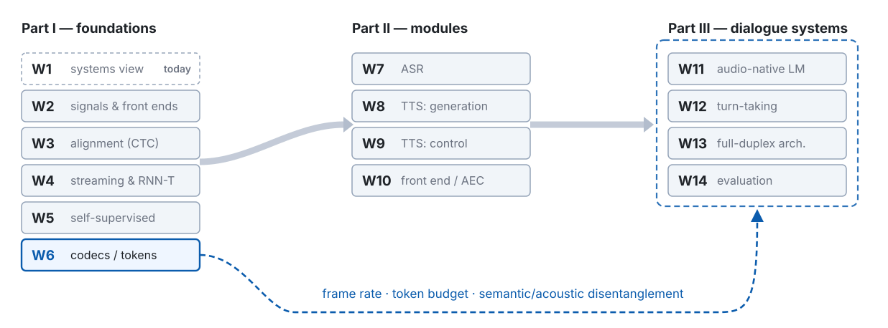

## Before anything else, listen {.smaller}

Two recordings. Same pre-recorded user, same benchmark task, same model family.

I will not tell you what to listen for yet.

::: {.audio-label}
Recording 1
:::
<audio controls preload="auto">
  <source src="assets/w01/interruption-moshi-base.m4a" type="audio/mp4">
  <source src="assets/w01/interruption-moshi-base.opus" type="audio/ogg; codecs=opus">
</audio>

::: {.audio-label}
Recording 2
:::
<audio controls preload="auto">
  <source src="assets/w01/interruption-moshi-fisher.m4a" type="audio/mp4">
  <source src="assets/w01/interruption-moshi-fisher.opus" type="audio/ogg; codecs=opus">
</audio>

::: {.footer}
Audio: Ohashi et al., EMNLP 2026 · CC-BY-4.0 · stereo: left = user, right = model
:::

::: {.notes}
**這一張不要講解，只播。** 兩段各 28 秒，加上你的操作大約一分半。

播放前只說一句話：「左耳是使用者，右耳是系統。兩段的使用者輸入完全一樣。」然後就按播放。**不要說要聽什麼**——這一張的全部價值就在於學生自己發現問題。

播完不要立刻解釋，問一個問題：**「你聽到什麼不對？」** 讓三、四個人講。

預期反應：多數人會先說第一段裡「系統沒有停下來」「兩個人一直疊在一起」。**「後面那段長沉默」通常沒人主動提**——那正好是本週的第二個重點，如果沒人講，你可以說「還有一件事，我們下一張看」，把它留給時間軸圖去揭露，效果比你直接講好。

如果有人問「這是什麼模型」，先不要回答型號，說「是同一個模型的兩個版本，差別在訓練，等一下會講」。過早給名字會讓學生轉進「哪個模型比較強」的框架，而今天要建立的是「什麼叫做壞掉」。

**硬體注意**：這兩段是左右聲道分離的立體聲。如果教室音響只有單聲道或喇叭位置太近，重疊感會消失——那就改用耳機示範，或先在自己筆電上確認過再上課。
:::

## The user started speaking at 9.6 s. The system did not stop. {.smaller}

{width="100%"}

::: {.metrics}
::: {.metric .bad}
[2.90 s]{.num}[the model kept talking over the user]{.lab}
:::
::: {.metric .bad}
[10.2 s]{.num}[then said nothing at all]{.lab}
:::
:::

::: {.footer}
Energy-based VAD, 25 ms / 10 ms hop — an estimate, not a reference VAD
:::

::: {.notes}
現在把剛才聽到的東西畫出來，讓耳朵的印象變成可指的證據。

先解釋讀法：上排是使用者、下排是模型，**紅色斜線區代表兩軌同時有聲**。然後指著時間軸講一遍事件順序：使用者說到 2.6 秒停下，模型從 2.6 秒開始回答，使用者在 **9.6 秒插話**——而模型一路講到 12.5 秒才停。

停在這裡，強調：**這兩個數字是同一段 28 秒裡的兩種相反錯誤。** 學生幾乎只會記住前者（蓋過使用者），所以要把第二個明確點出來：使用者 12.6 秒說完，模型到 22.7 秒才開口，中間**十秒鐘什麼都沒有**。

一句可以用的話：「如果你只想修好第一個問題，最簡單的做法是讓模型更容易停下來、更快回應——但那會讓它更容易在不該說話的時候說話。這門課有一半在處理這個矛盾。」

**誠實說明（不要省略）**：這裡的區段是能量式 VAD 估出來的，不是標準 VAD 模型。門檻與最小時長會影響邊界，所以**量級可信、個別毫秒不可信**。這個習慣要從第一週建立——之後每次看到論文的時序數字，都要先問是怎麼量的。
:::

## Same input, same architecture. Only the post-training differs. {.smaller}

{width="100%"}

::: {.metrics}
::: {.metric .good}
[0.00 s]{.num}[simultaneous speech]{.lab}
:::
::: {.metric .good}
[60 ms]{.num}[from the user finishing to the model replying]{.lab}
:::
:::

::: {.notes}
上一張是 Moshi base，這張是**同一個模型**經過互動性 RL 後訓練（Fisher 對話資料）。

關鍵在於 **ch0 完全相同**——同一段預錄輸入。所以差異可以直接歸因到後訓練，不是換了模型、也不是換了測試題。這是很乾淨的對照，值得明說：「在論文裡看到兩個系統的比較時，先確認輸入是不是同一份。」

指出三件事：模型在使用者插話**之前**就停了、重疊為零、以及使用者說完後 60 ms 回應。

**那個 60 ms 要加註兩句**：它落在我們 10 ms hop 的解析度邊緣，而且模型起始時間恰好等於使用者結束時間，所以它可能是切分邊界的假象。但如果是真的——那正是 W12 的核心：**預測型 turn-taking**。模型不是等對方講完才開始想，而是在對方還在講的時候就已經在預測落點、準備好回應。人類就是這樣做的。

**這裡可以停下來問**：60 ms 是好事嗎？先不要給答案，讓他們猜。這是給第四節「Misconception 2」埋的伏筆——晚一點會回來推翻「越快越好」。
:::

## Two opposite failures, one recording

::: {.claim}
A spoken dialogue system can fail by **speaking when it should listen**, and by **staying silent when it should speak**. Both happened in those 28 seconds.
:::

Minimising response latency fixes the second failure and makes the first one worse.

This course is about the machinery that lets a system get both right at once — and about how to measure whether it did.

::: {.notes}
這是 cold open 的收束，也是全課的問題陳述。講得慢一點。

核心那句話值得停三秒：**把回應延遲最小化，會修好第二種錯誤、同時讓第一種變嚴重。** 學生的預設直覺幾乎都是「越快越好」，這一句先製造懷疑，第四節才用 Stivers 的資料正式推翻。

可以補一句把兩種錯誤命名，方便之後引用：說得太早叫「搶話」，說得太晚叫「死寂」。後面講四種行為分類時會再用到。

然後交代今天的路線：「先講這門課要教什麼，再看三種架構怎麼各自失敗，然後把延遲拆開來算，最後看四種只有全雙工做得到的互動行為。」

到這裡大約第 10 分鐘。
:::

# What this course is {.section-title}

## By week 14 you should be able to build one of these, and to argue about it {.smaller}

Not "know about" — **read the papers critically, measure the systems, defend design choices.**

| Part | Weeks | What it gives you |
|---|---|---|
| **I — Foundations** | W2–W6 | front ends · alignment · streaming · SSL · neural codecs |
| **II — Modules** | W7–W10 | ASR · TTS · controllability and evaluation · the front end |
| **III — Dialogue** | W11–W14 | audio-native LMs · turn-taking · full duplex · evaluation |

::: {.notes}
先講那句反話：不是「知道有這些東西」，而是**能讀懂論文、能量測系統、能為設計選擇辯護**。研究所的課如果只做到第一項，學生畢業後遇到新論文還是不會判斷。

三個 Part 的分工快速講過就好，重點是讓他們知道**現在在哪裡、往哪裡去**。

**先修填「無」這件事要明說**，不要讓學生自己焦慮：W2 後半與 W3 前半承擔補課責任，今天結束會發一份兩頁的數學前置清單（線性代數的內積與投影、機率的條件獨立與邊際化、梯度下降）。W3、W6、W8 是三個數學高峰，會各花一小時以上在白板上推。

也要說清楚**這門課沒有評量**——沒有作業、沒有考試。所以讀論文完全自願，但每週的「若只讀一篇」清單就在課程網站上，那是我幫你們篩過的。
:::

## Fourteen weeks, and which week holds up which {.smaller}

{width="100%"}

::: {.notes}
這張是**依賴結構**，不是週次清單——週次清單是上一張的表格在做的事。

先讓他們看整體形狀：左邊六週是地基（今天那一格是虛線框，標著 today），中間四週是模組，右邊四週是對話系統。灰色的匯總箭頭表示「前面撐後面」，這部分符合直覺。

**重點是那條藍色虛線。** 它從 W6 出發、繞過整個 Part II、指進框住 Part III 的那個虛線框——注意它指的不是某一週，而是**整欄**。因為 Part III 的三條路線全部建立在 frame rate、token budget、以及語意／聲學解耦這三個概念上。這是全課唯一一條跨 Part 的依賴。

可以說：「W7 到 W10 缺一週，你還是聽得懂 W13。W6 缺了，W11 之後全部聽不懂。」

也順便告訴他們地圖的用法：每週開場我都會回到這張，指出今天在哪裡。如果他們某週缺課，看這張圖就知道會影響到哪幾週。
:::

## W6 is the hinge. If you skip one week, do not skip that one.

All of Part III rests on three ideas from W6:

- **frame rate** — tokens per second, and therefore decoder steps per second
- **token budget** — what a 30-minute conversation costs in context
- **semantic / acoustic disentanglement** — must meaning and timbre share one representation?

::: {.claim}
Every latency and quality ceiling downstream follows from how you turned speech into tokens.
:::

::: {.notes}
這張是課程地圖裡最重要的依賴關係，值得把話說重一點：**Part III 完全建立在 W6 之上。**

三個概念各給一句人話：
frame rate 決定每秒要跑幾個 decoder step——那是延遲的硬下限。
token budget 決定一段 30 分鐘的對話會吃掉多少 context——W6 會實際算一次，數字比多數人預期的糟。
語意與聲學的解耦決定模型要不要在同一個表徵裡同時學「說什麼」和「誰在說」——沒解耦的話，語言能力會被音色資訊擠掉。

那句 claim 可以這樣講：「延遲與品質的天花板，在你決定怎麼把語音變成 token 的那一刻就已經定了。之後不管模型多大都突破不了。」

如果進度落後，可壓縮的是 W7（ASR 三範式可以講快）與 W10（本來就是整併掃描週）。**不要壓 W6。**
:::

## What you should be able to do by the end of today {.smaller}

1. **Draw** the data flow of a cascade, an end-to-end speech-to-speech model, and a native full-duplex model — and point at the place where each one narrows the channel.
2. **Decompose** a target end-to-end latency into a per-module budget, and say which entries are algorithmic delay and which are computational.
3. **Define** half duplex versus full duplex operationally, and name four interaction behaviours a half-duplex system cannot have.
4. **Explain** why making the VAD faster does not solve turn-taking.

::: {.claim}
These four are the hooks that the next thirteen weeks attach to.
:::

::: {.notes}
把今天的四個目標唸一遍，語氣是「這是你走出教室時該帶走的東西」，不是形式上的宣讀。

四條刻意都用**可檢驗的動詞**：畫得出來、拆得出來、定義得出來、解釋得出來。可以直接說：「如果下課時第 4 條你講不出來，那今天有一段我沒講清楚，請當場問我。」

第 4 條（為什麼把 VAD 調快不等於解決 turn-taking）是四條裡最容易被低估的。它今天只會被建立成一個直覺，真正的處理在 W12——那裡會用一張 ROC 圖證明**單一靜音門檻不可能同時最佳化反應速度與誤觸發率**。今天先讓他們知道這是個問題。

如果時間緊，這一張可以只唸第 1 與第 4 條，其餘讓他們自己看投影片。
:::

## Three questions we ask every single week {.smaller}

| Axis | The question |
|---|---|
| **Representation** | What representation does this layer use — waveform, spectrogram, continuous SSL feature, discrete token? What sets the frame rate? |
| **Latency** | How much of the budget does this module consume? Is that algorithmic delay (lookahead) or computational delay? |
| **Supervision** | Where does this capability come from — labels, self-supervision, synthetic data, or human preference? |

These three are the coordinate system for the whole course. Slides in every later week come back to them.

::: {.notes}
這三軸是全課的座標系，今天只要建立「每週都會回到這三個問題」的預期。

逐條給一個今天已經出現過的例子，讓它不抽象：
表徵軸——剛才那兩張時間軸，橫軸的解析度就是 10 ms，那是我們選的 frame shift。
延遲軸——base 模型那 10.2 秒的沉默，是哪個模組造成的？今天第四節會拆。
監督軸——base 與 post-trained 的差別不在架構，在**人類偏好從哪裡進到模型裡**。這一軸在 W9 與 W14 最重要。

第三軸值得多說一句：整個領域這兩年最大的變化，是「能力從哪來」的答案從「更多標註資料」變成「自監督 + 合成資料 + 人類偏好」。今天 cold open 那個對照就是它的例子。

期末的期望是：拿任何一個模組給他們，他們能自己回答這三個問題。
:::

## Practicalities

- Slides in English, taught in Mandarin. Speaker notes are in Mandarin; you get the slides, not the notes.
- **No assessment.** No homework, no exam. Attend because it is worth attending.
- Demos are written for the free Colab tier. Real-time interaction does not fit there, so demos run offline and we align timelines afterwards.
- Everything lives at the course site: weekly pages, reading lists, these slides.

::: {.tag}
course site → hungshinlee.github.io/Speech-AI/
:::

::: {.notes}
講快，但有兩件事要交代清楚。

**投影片與講稿**：投影片是英文，我講中文。投影片課後會放上課程網站。（若你選擇課後才發佈，這裡就說「課後會放」；若已經公開，就說「現在就在網站上」，並提醒他們講者備註也看得到。）

**Colab 的現實**：所有 demo 都是為免費版設計的，但即時語音互動在免費版跑不動——吞吐量不夠。所以 demo 都是「離線推論 + 事後對齊時間軸」，即時性我用預錄的官方 demo 呈現。這不是偷懶，是算力條件下的正確取捨；而且事後對齊時間軸其實比即時 demo 更能看清發生了什麼。

最後把網站位址寫在白板上，之後每週的閱讀清單都在那裡。
:::

# Three architectures {.section-title}

## From walkie-talkie to face to face {.smaller}

**Walkie-talkie** — one party at a time, and the handover has to be announced out loud.

**Telephone** — both channels are open the whole time, but people still take turns.

**Face to face** — speakers overlap, interrupt, hum agreement, and adjust a sentence while it is still coming out.

Spoken dialogue systems climbed this ladder in the same order. We are somewhere between the second rung and the third.

::: {.claim .warn}
Where the metaphor breaks: two people talking are not two independent tracks that happen to overlap. Each is **continuously adjusting to the other**. That coupling is the hard part — and it is what W12 and W13 are about.
:::

::: {.notes}
這個比喻要**刻意建立成整學期共用的資產**，所以講的時候把三個階段的差別說準，不要只是打個比方就過。

對講機：一次只有一個人能說，而且交棒必須明講（「over」）。這對應到 push-to-talk 的語音助理。
電話：兩個方向的通道全程開著，技術上可以同時說——但社會習慣讓人還是輪流。這對應到現在多數的 VAD-based 系統：**通道是雙向的，行為是輪流的。**
面對面：重疊、打斷、附和、以及最關鍵的——**句子講到一半還能根據對方的反應改口**。

問學生一個問題：「現在的語音助理在哪一階段？」多數人會說第二階段，這是對的，而且正是本課要往第三階段推的原因。

**比喻在哪裡失效，這句一定要講**：面對面對話不是「兩條剛好重疊的獨立音軌」。兩個人是**持續互相調整**的耦合系統——我因為看到你皺眉而改口，你因為我停頓而接話。所以「把兩軌各自建模好再疊起來」是行不通的，這正是 W12、W13 的難點。

之後 W12 講 backchannel、W13 講雙串流架構時，都可以回到這張圖，說「我們現在在第三階段的哪一部分」。
:::

## Cascade survives because every module can be debugged separately {.smaller}

{width="100%"}

Thick line = audio. **Thin line = text.** The thickness is the information rate.

::: {.notes}
先講它**為什麼還活著**，不要一開始就批評。這很重要——學生對「舊架構」容易輕視，但 2023–2024 的產品幾乎都是這個，理由非常實際。

三個理由：每個模組可以獨立訓練（各自有成熟的資料集與 benchmark）、可以獨立監控（線上出事時你知道要看哪一段的指標）、可以獨立換掉（換 ASR 不必重訓 TTS）。加一句：「如果你要在三個月內上線一個能用的語音客服，今天我還是會選它。」

**視覺語彙在這裡建立**，要明確說出來：線的粗細代表資訊量。粗＝音訊、細＝純文字。後面兩張架構圖用同一套編碼，學生看第二、三張時就不需要重新解圖。

底下的圖例只有 audio 與 text only，因為 cascade 裡沒有 token 串流——下一個架構才會出現紫色。

過場：「所以它的代價在哪裡？看同一張圖。」
:::

## Everything the transcript cannot carry is gone at the ASR output {.smaller}

{width="100%"}

The LLM receives a string. Hesitation, amusement, shouting, speaking rate — and whether the user had finished — are all gone.

::: {.claim .warn}
A better ASR cannot fix this. The channel is simply **too narrow for the signal**.
:::

::: {.notes}
**同一張圖再放一次，這是刻意的。** 學生已經解過一次圖，注意力可以全部放在論點上，而不是重新找哪個框是什麼。這個手法之後幾週會重複用。

指著那條紅色虛線講：ASR 的輸出是一個字串。字串裡沒有猶豫、沒有笑意、沒有音量、沒有語速——**也沒有「這句話說完了沒有」**。最後那一項最關鍵，因為它正是 turn-taking 需要的資訊，而它在這裡被丟掉了。

**「更好的 ASR 救不了」這句要明說。** 學生的第一反應通常是「那就用更強的 ASR」。回答：這不是準確率問題，是**通道容量**問題。WER 降到 0，笑聲與語速還是傳不過去，因為文字這個表示法裡沒有那些維度的欄位。

可以用一個具體例子：使用者說「這個……嗯……可以嗎？」——轉錄成 "Is this okay?" 之後，那兩個猶豫消失了，而它們正是判斷「他還沒想清楚，不要急著回答」的依據。

這裡是下一張提問的鋪陳，講完直接翻頁不要總結。
:::

## Stop. What does a transcript throw away? {.smaller}

::: {.ask}
Write down everything you can think of. Two minutes.
:::

. . .

emotion · laughter · sighs · hesitation and filled pauses · speaking rate · loudness · pitch range · accent and dialect · who is speaking · how many people are speaking · overlap · whether the utterance is finished · background environment · whether the speech is even addressed to the system

::: {.notes}
**這一張一定要真的停下來，不要自己講完。** 給兩分鐘，讓學生寫或直接喊。

我的做法：先讓他們安靜寫 60 秒（避免只有敢講的人主導），再點四、五個人講，我在白板上記。

他們幾乎一定會講出：情緒、笑聲、語速、音量、口音、誰在說話。這些都對。

**幾乎一定會漏掉最後兩項**：「這句話說完了嗎」與「這句話是對我說的嗎」。等他們講完再翻出完整清單，指著那兩項說：「這兩個我們會各花一整週處理——W12 與 W13。」

漏掉不要當成錯誤，當成伏筆。這是全課少數幾個「學生自己發現缺口」的時刻，比我直接列出來有效得多。

如果班上很安靜、沒人開口，備用做法：自己先給一個明顯的（笑聲），再問「還有嗎」，通常就會鬆動。

到這裡大約第 25 分鐘。
:::

## End-to-end keeps the paralinguistics, and keeps text as a planning channel {.smaller}

{width="100%"}

Nothing is forced through a transcript. But text does not disappear — it moves *inside* the model as an inner monologue.

::: {.notes}
先講收益：沒有任何東西被迫穿過文字這個窄通道。音訊進去、音訊出來，情緒與語速在整條路上都還在。

**然後講那個反直覺的重點：end-to-end 不等於沒有文字。** 學生最常誤解這一點。指著下方那個橘色框說：文字沒有消失，它**從介面變成了規劃通道**——模型在生成語音的同時，內部也在生成對應的文字，用文字來組織要說什麼。這叫 inner monologue，W11 會拆 Moshi 的做法。

一句可以用的話：「把文字從『兩個模組之間的接線』改成『模型自己的草稿紙』。」

如果有人問「那有沒有純語音、完全不用文字的模型」——有，那是研究路線（W11 會講 GSLM 那一系列），但語意能力目前明顯落後。不要在這裡展開。
:::

## What end-to-end costs {.smaller}

- **Semantic degradation.** Speech token sequences are one to two orders of magnitude longer than text for the same content. Training a language model on them erodes the language ability. `[W11]`
- **Context cost.** Frame rate × codebooks × conversation length. We will compute this in W6 and it is worse than people expect.
- **Controllability and auditability.** Tool calls, long-term memory, and "why did it say that" are all harder when there is no transcript to inspect.

::: {.claim}
The field's current answer is neither pure cascade nor pure end-to-end. It is **keeping text in the loop while never forcing audio through it.**
:::

::: {.notes}
不要把 end-to-end 講成純粹的進步，三個代價都是真的。

**語意退化**這一項要說清楚機制，不然聽起來像藉口：語音 token 大約每秒 12.5 到 50 個，文字大約每秒 3 到 4 個 token。同樣的內容，語音序列長一到兩個數量級。拿這種序列去做 next-token prediction，模型的容量會被大量用在「怎麼把音發對」而不是「說什麼」。**這是資料分布與序列長度的結構性問題，加大模型解決不了。** W6 會實際算這個數字。

**Context 成本**：frame rate × codebook 數 × 對話秒數。W6 會算 30 分鐘對話要多少 context，數字比多數人預期的糟。

**可控性與可稽核**：工具呼叫、長期記憶、以及「它為什麼那樣說」——沒有轉錄稿可以檢查時，這些都更難。這一項在產品上往往是決定性的。

最後那句 claim 是本節的立場，值得停一下：**現在的答案既不是純 cascade 也不是純 end-to-end，而是「把文字留在迴路裡，但不強迫音訊穿過它」。**
:::

## Full duplex is sequence modelling: silence is a token {.smaller}

{width="100%"}

::: {.claim}
Once the model emits *something* every frame — including "say nothing" — turn-taking becomes ordinary next-token prediction.
:::

::: {.notes}
**這是全週最重要的一句話之一，值得單獨停三十秒。**

先解圖：使用者的音訊持續進來，模型每一個 frame 都要輸出一個 token。然後講關鍵轉折：**如果「什麼都不說」也是一個 token，那 turn-taking 就不再是一個需要外掛控制器的調度問題，而是一個標準的 next-token prediction 問題。**

這句話為什麼重要：它把一個看起來需要「規則、狀態機、門檻」的問題，變成了模型可以從資料裡學的問題。W13 會看到三條架構路線，其中兩條就是這句話的直接實作。

可以問學生：「那模型要怎麼知道現在該輸出靜音還是語音？」答案是——從資料裡學，而資料就是真人雙軌對話。這也解釋了 W13 為什麼有一整段在講資料問題。

順帶指出圖上那條虛線回饋：**模型會聽到自己的聲音。** 麥克風收到的是使用者＋喇叭播出的自己，所以真實部署一定要 AEC。學術資料集通常假設乾淨的雙軌，這是 sim-to-real 最大的落差之一，W10 會處理。
:::

## Which failure can you afford?

| | Cascade | End-to-end S2S | Native full duplex |
|---|---|---|---|
| Paralinguistics | lost at ASR output | preserved | preserved |
| Turn-taking | external VAD | external, usually | per frame |
| Semantic ability | full text LLM | degrades | degrades |
| Control, tools, audit | strongest | weaker | weakest today |
| Training cost | lowest | high | highest; needs two-track data |
| Debugging | per module | end to end only | end to end only |

::: {.claim}
No ranking here — **"end-to-end must be better" is a misconception.** Pick the architecture whose failure mode your application can survive.
:::

::: {.notes}
**不要把這張表講成「越往右越先進」。** 2026 年三條路線都在活躍發展，因為它們的取捨不同，不是世代關係。

逐列講太慢，挑三列講：
Paralinguistics 這一列解釋了為什麼有人要做 end-to-end。
Training cost 那一列解釋了為什麼 cascade 還沒死——最右邊那格「需要雙軌對話資料」是目前最稀缺的資源。
Debugging 那一列是產品團隊真正在意的，但論文幾乎不談。

**「end-to-end 一定比較好」是一個誤解**，這張表就是破解。點名它，因為學生讀完幾篇 2025–2026 的論文後很容易得到這個印象。

**停下來討論**：客服系統與陪伴型系統各該選哪一欄？為什麼？答案不唯一，重點是他們必須用表格裡的維度來論證，而不是憑「哪個比較新」。客服通常需要工具呼叫與可稽核（偏左），陪伴型需要 paralinguistics 與自然的 turn-taking（偏右）。
:::

## Misconception 1 — "full duplex means it supports interruption" {.smaller}

Interruption handling is a *behaviour*. It can be faked: detect user speech with a VAD, stop the TTS. That system is still half duplex.

::: {.claim .warn}
The test is architectural: **while the model is speaking, does the input stream still enter the computation and still change the next decision?**
:::

A VAD-gated cascade and a native full-duplex model can look identical on a clean interruption — and diverge completely on a mid-utterance pause, a backchannel, or two people talking.

::: {.notes}
這是 W1 最容易誤解的一點，也是 W12、W13 的入口。

先說破解：打斷是一個**行為**，而行為可以造假。用 VAD 偵測到使用者開始說話、然後把 TTS 停掉——這個系統在「乾淨的打斷」場景表現可以跟原生全雙工一樣好，但它仍然是 half-duplex。

**然後給出真正的判準**，這句要慢慢講：模型在說話的時候，輸入串流有沒有進入計算、有沒有改變它下一步的決策？如果沒有，它只是在等一個外部訊號叫它停。

差異在哪裡出現？三個場景：
句中停頓——使用者只是在想，VAD 系統會誤判成講完。
Backchannel——使用者只是說「嗯」，VAD 系統會誤判成要搶話。
多人場景——VAD 根本不知道那句話是不是對系統說的。

這裡順便回收 Learning objective 第 4 條：**把 VAD 的門檻調快，只是在「反應慢」與「搶話」之間換位置，不會讓曲線整體變好。** W12 會用一張 ROC 圖證明這件事。
:::

# The latency budget {.section-title}

## Humans aim at a target, not at a minimum {.smaller}

Across 10 languages from 5 continents, informal conversation follows one norm: **minimal gap, minimal overlap.** Most turn transitions land near zero.

- Cross-language means differ by at most **±250 ms**
- Responses that do not answer the question, or that go against its bias, are delayed by **up to about 1 s** — and listeners read that delay as meaning

::: {.claim}
Delay is a signal, not just a cost. A system that always answers instantly is not maximally natural — it is uniformly ignoring one of the channels people use.
:::

::: {.footer}
Stivers et al., PNAS 106(26): 10587–10592, 2009 · open access
:::

::: {.notes}
這是本節的立論基礎，也是我唯一從語言學文獻取數字的地方，所以講得精確一點。

Stivers 等人 2009 年那篇 PNAS 收了**十種語言、五大洲**的自然對話錄影，包含從傳統原住民社群到主要世界語言。結論是：所有語言都遵守同一個規範——**minimal gap, minimal overlap**，而且轉換點的分布是單峰的，**眾數落在接近零**。

第二點更有工程意義：**跨語言的平均值差異最多在 ±250 ms 之內。** 也就是說「北歐人講話慢、紐約人愛搶話」那類民族誌說法，在量化之後只是同一個系統上的小幅偏移，不是不同的系統。

第三點是今天的重點：**不回答問題的回應、或與問題預設相反的回應，會被延遲達一秒左右**，而聽者會把那個延遲解讀成意義——「他在猶豫」「他不想答」。

所以那句 claim：**延遲是訊號，不只是成本。** 一個永遠瞬間回答的系統不是最自然的，它是把人類用來傳遞意義的一個通道整個忽略了。

**我刻意沒有放那個常被引用的單一均值（例如「約 200 ms」）**——我沒在論文正文讀到那個數字。如果你要放，請自己從 Fig. 1 或 Table 1 讀出來再補。這個習慣值得在課堂上示範一次：引用要引自己讀過的東西。
:::

## Misconception 2 — "lower latency is always better" {.smaller}

::: {.ask}
If a system answered every question in 40 ms, how would that feel?
:::

. . .

Like it was not listening. Like it had prepared the answer before you finished. In human conversation, an instant response to a question that deserves thought is itself informative.

Remember Recording 2: **60 ms**. Is that good? We genuinely do not know from the number alone — it depends on whether the content was worth 60 ms.

::: {.notes}
**先問，不要先答。** 問完等幾秒，通常會有人說「那不是很好嗎」。

然後給答案：像沒在聽。像早就準備好答案，根本沒等你講完。人類對話裡，對一個需要思考的問題瞬間回答，本身就傳遞了「我沒認真想」的訊息。

**這裡回收 cold open 的 60 ms。** 提醒他們：Recording 2 的回應是 60 ms。那是好事嗎？

正確答案是「要看內容」——如果那 60 ms 之後說的是一句有內容的回答，那是了不起的預測；如果只是「嗯嗯我知道了」，那就是敷衍。**單看數字判斷不了。**

這正是為什麼 W14 的評估必須同時報告語意品質與時序：只看任何一邊，都會獎勵取巧的模型。只看延遲，最快的贏；只看語意，最慢最囉嗦的贏。

如果有學生說「但預測型 turn-taking 本來就會讓延遲接近零」——很好，那是 W12 的內容，記下他的名字，那一週請他先講。
:::

## The budget we will refill every week {.smaller}

{width="100%"}

::: {.notes}
**這張紙本要真的發下去**，不是看過就算。

先解釋五個格子分別是什麼：
endpoint detection——判斷使用者說完了沒有，等待的時間。
ASR tail——最後一段音訊送進去、文字出來的時間。
LLM prefill + first token——讀完 prompt 到吐出第一個 token。
TTS first packet——文字進去到第一段音訊出來（不是全部合成完）。
playout buffer——為了避免破音而預留的緩衝。

**強調兩件事**：一、寬度是佔位用的，不代表比例，真實比例每個系統都不同。二、右上那個綠色標記是人類的基準——你的**總和**必須落在那個範圍附近才會自然。

然後說明玩法：之後 W4、W6、W8、W10、W13 各自回填自己那一格，**版面完全相同**。學期末他們手上會有六張同版面、逐步長出來的圖，那是全課唯一橫跨 14 週的活動。

這件事的價值在於：它讓「延遲」從一個抽象的抱怨變成一個可以被分解、被歸因的量。
:::

## Two kinds of delay, and only one of them is a hardware problem {.smaller}

Write the streaming system as $y_{1:t} = f(x_{1:t+\ell})$, where $\ell$ is the lookahead in frames and $\Delta$ is the frame shift.

- **Algorithmic delay** $= \ell \cdot \Delta$. Present even with infinitely fast hardware. It is a modelling choice.
- **Computational delay** $=$ RTF $\times$ audio duration $+$ queueing. Buy a faster GPU, or make the model smaller.

For chunk-based processing with chunk size $C$, the mean algorithmic delay sits between $\tfrac{C}{2}\Delta$ and $C\Delta$, while attention cost per chunk grows with $C$.

::: {.claim}
Chunk size is a three-way trade-off between latency, quality and compute. You will meet it again in W4 (streaming ASR), W8 (streaming TTS) and W13 (per-frame decoding).
:::

::: {.notes}
本週唯一的公式，故意極簡。白板上寫就好，不用投影片。

寫 $y_{1:t} = f(x_{1:t+\ell})$，解釋 $\ell$ 是 lookahead——模型在輸出第 t 個結果時，允許偷看到未來第 $t+\ell$ 個 frame。

**兩種延遲一定要分清楚，很多論文只報後者。**
演算法延遲 = $\ell \times \Delta$。即使硬體無限快也躲不掉，因為模型的定義就是要等那些 frame。**這是建模選擇。**
計算延遲 = RTF × 音訊長度 + 排隊。買更快的 GPU、把模型變小、加大 batch，都能改善。**這是工程選擇。**

**算一次給他們看**：frame shift 是 10 ms，lookahead 從 2 個 frame 加到 8 個，延遲從 20 ms 變 80 ms。在 300 ms 的預算裡那是 20%。值得嗎？取決於品質增益——而 lookahead 的品質增益是遞減的，加到某個點之後幾乎不動，但延遲是線性成本。

chunk 大小是同一件事的另一個面貌：chunk 越大，演算法延遲越高，但每個 chunk 內的 attention 看得越完整、算力效率越好。**這是延遲、品質、算力的三方權衡**，W4、W8、W13 會各遇到一次。
:::

## Misconception 3 — "latency is an engineering problem, not a research problem" {.smaller}

The streaming constraint does not sit on top of a model. It reaches inside and changes it.

- **The loss function.** RNN-T exists because an attention-based encoder–decoder cannot emit anything before it has seen the whole utterance. `[W4]`
- **The representation.** Low frame-rate neural codecs exist because decoder steps per second is a hard budget. `[W6]`
- **The architecture.** Causal masks and chunk-wise attention exist because the model is not allowed to look at the future. `[W4, W8]`

::: {.claim}
Each of those is a **modelling** decision forced by a timing requirement. Latency is not downstream of the research — it is one of its inputs.
:::

::: {.notes}
這一張是為了打掉一個很常見的輕視：「延遲是工程師的事，研究者只要把品質做好。」

三個例子都要講出**因果方向**，不然聽起來像三個不相干的技術名詞：

RNN-T 為什麼存在？因為 AED（attention-based encoder-decoder）在看完整句話之前吐不出任何東西。**是時序要求逼出了一個新的損失函數。** W4 會完整推導它的 lattice。

低 frame rate 的 codec 為什麼存在？因為每秒的 decoder step 數是硬預算。12.5 Hz 與 50 Hz 差四倍的解碼成本。**是時序要求逼出了一個新的表徵。** W6 會算。

因果 mask 與 chunk-wise attention 為什麼存在？因為模型不准看未來。**是時序要求逼出了一個新的架構。**

然後收束：這三個都是**建模**決策，而不是把模型做完之後的最佳化。**延遲不是研究的下游，它是研究的輸入之一。**

這張投影片同時是給 W4、W6、W8 的預告——之後那三週講到這些設計時，可以回頭指這張。
:::

## The number that hurts is p95, not the mean {.smaller}

Treat each module as a queue. Mean latency can be comfortable while the tail is not.

- A pipeline that averages 320 ms but hits 1.4 s twice a minute feels **broken**, not fast
- Tail latency compounds across modules; means do not
- Users do not experience a distribution, they experience the bad turns

::: {.claim}
Report distributions. In W14 we will make this precise: the goal is to *match* the human latency distribution, measured with a distributional distance — not to minimise a mean.
:::

::: {.notes}
這一點在工程上比任何架構選擇都常見，但論文幾乎只報平均值。

把每個模組當成一個排隊系統。平均延遲 320 ms 聽起來很好，但如果每分鐘有兩次跳到 1.4 秒，使用者的感受是「**這東西壞了**」，不是「這東西很快」。

原因值得講一句：尾端延遲會沿著模組**累積**（任何一個模組卡住，整條鏈就卡住），而平均值不會這樣累積。所以模組越多，p95 與平均的差距越大——這也是 cascade 的一個隱性代價。

一句可以用的話：**使用者感受不到分布，他們只感受到壞掉的那幾次。**

然後接到 W14 的觀念轉換：既然要報分布，那評估的目標就不該是「把平均壓低」，而是**讓延遲的分布去匹配人類的分布**——W14 會用 Wasserstein 或 KL 對人類語料的 latency 分布來定義這個指標。這是今天第二次埋 W14 的伏筆（第一次是 Misconception 2）。
:::

## Live: measure your own pipeline {.smaller}

We run a cascade and an end-to-end model on the same utterance, record both, and fill in the budget from the recording.

1. Record one utterance that ends with a **mid-utterance pause** ("I'd like a ticket to … Tainan, next Wednesday")
2. Run it through the cascade; log timestamps at each module boundary
3. Run it through the end-to-end model; log first-audio-out
4. Plot both on one time axis and fill in the sheet

::: {.ask}
Prediction before we run it: which module will dominate?
:::

::: {.notes}
這是課堂 demo 的骨架。**數字要當場量，不要用我預先填的**——自己機器上跑出來的數字比任何論文引用都有說服力，而且學生會記住那個過場的尷尬。

錄音的設計很重要：那句話必須**在中間停頓**，例如「我想訂一張……嗯……下週三去台南的票」。中間停 700 毫秒左右。這樣才能同時測到 endpoint 的誤判與回應延遲。

**先讓他們預測再跑。** 多數人會猜 LLM 是瓶頸（因為那是最大的模型）。實際上 endpoint 的等待時間經常最大——因為它是一個保守設定的靜音門檻，通常 500–800 ms。這個反差是這個 demo 最有價值的部分，也正是 W12 要做語意 endpointing 的動機。

工具：`scripts/analyze_duplex_audio.py` 可以直接吃雙軌 WAV 產生時序；單軌的 cascade 則靠各模組自己的 log。

**如果當天 demo 環境失敗**（網路、API、權重下載），退路是直接用第一節那兩段音訊做時序標註練習——讓學生自己在紙上畫時間軸、填預算表。效果不差，而且不會開天窗。
:::

# Four behaviours a half-duplex system cannot have {.section-title}

## The taxonomy

| Behaviour | The user is… | The system must… | Week |
|---|---|---|---|
| **Backchannel** | still speaking; says "mm-hm" | recognise that no turn is being claimed, and keep going | W12 |
| **Interruption** | taking the floor mid-answer | stop quickly, and keep what it had planned | W12, W13 |
| **Barge-in** | speaking over the system's own audio | separate its own voice from the user's — AEC | W10 |
| **Overlap continuation** | briefly overlapping, not taking the floor | continue rather than yield | W12 |
| **Proactive turn** | silent | decide whether to open its mouth at all | open problem |

::: {.notes}
這張表是 W12 的骨架，今天只要讓四種行為**在腦裡分開**就好，不必展開機制。

逐列給一句人話：
Backchannel——使用者還在講，只是「嗯」了一聲。系統要認出**這不是要接話**，然後繼續講自己的。
Interruption——使用者要接手。系統要**快速停下來**，而且最好記住自己原本要說什麼（W13 的 latent reasoning 就在處理這件事）。
Barge-in——使用者的聲音疊在系統自己的音訊上。麥克風收到的是兩個聲音相加，所以要先把自己的聲音扣掉，這是 AEC，W10。
Overlap continuation——短暫重疊但不是要接手。系統應該**繼續講**而不是讓位。

**前四種需要四種不同的反應——把它們當成同一件事處理，是現有系統最常見的缺陷。** 這句要說。

第五列刻意留在最後：**Proactive turn。使用者沉默，系統要不要主動開口？** 現有系統幾乎全是 reactive，這一格是 open problem。可以說：「如果你想找論文題目，這一格是空的。」W14 會再提。
:::

## A base model can be a competent talker and a useless listener {.smaller}

{width="100%"}

Forty-two seconds of narration. The model speaks three times, all within the first seven seconds, then nothing.

::: {.audio-label}
PersonaPlex (base) — first 20 s
:::
<audio controls preload="auto">
  <source src="assets/w01/backchannel-ppx-base.m4a" type="audio/mp4">
  <source src="assets/w01/backchannel-ppx-base.opus" type="audio/ogg; codecs=opus">
</audio>

::: {.footer}
Audio: Ohashi et al., EMNLP 2026 · CC-BY-4.0
:::

::: {.notes}
先讓他們看時間軸，再播音訊。

指出這裡的失敗**不是回應得太慢**，而是**完全不參與**。使用者講了 42 秒，模型只在前 7 秒說了三次話，之後 35 秒像斷線一樣。

這一點值得強調，因為它打破一個隱含假設：學生通常以為對話系統的問題是「回應品質」與「回應速度」。但這裡的問題是**它根本沒有在扮演聽者**。人類聽者不會這樣——你聽別人講 40 秒的故事，中間一定會出聲。

播前 20 秒就夠。播的時候可以說：「注意右耳從第 7 秒之後就沒有聲音了。」

如果有學生說「安靜不是很好嗎，至少不會打擾」——很好的問題，下一張就是答案。
:::

## The same model, post-trained: eleven short utterances spread across the whole clip {.smaller}

{width="100%"}

::: {.metrics}
::: {.metric}
[0.88 → 4.20 s]{.num}[simultaneous speech]{.lab}
:::
::: {.metric}
[3 → 11]{.num}[model utterances, same 42 s]{.lab}
:::
:::

::: {.audio-label}
PersonaPlex + interactivity post-training — first 20 s
:::
<audio controls preload="auto">
  <source src="assets/w01/backchannel-ppx-fisher.m4a" type="audio/mp4">
  <source src="assets/w01/backchannel-ppx-fisher.opus" type="audio/ogg; codecs=opus">
</audio>

::: {.notes}
同一個模型、同一段輸入，經過互動性後訓練之後：模型段數從 3 變成 11，散布在整段 42 秒裡，而且段落長度多在 0.4 到 0.9 秒之間。

**那個長度分布就是 backchannel 的聲學特徵**——短、頻繁、且與使用者重疊。指出來：這些不是「插話」，因為它們太短、而且之後使用者繼續講他自己的內容。

重疊量從 0.88 秒變成 4.20 秒。**先不要評價這個變化是好是壞**，讓它懸著，下一張再處理。

播前 20 秒，跟上一張同一個片段，學生可以直接比對。如果教室音響允許，也可以只放右聲道，backchannel 會更明顯。
:::

## The same measurement is a defect in one task and a requirement in the other

::: {.claim}
Simultaneous speech: **2.90 s was the failure** in Recording 1. **4.20 s was the improvement** here.
:::

There is no metric you can minimise to get good turn-taking. The target depends on what the user is doing — which means the system has to *classify the situation* before it decides.

::: {.notes}
**如果整堂課只有一張投影片被記住，我希望是這張。** 講慢，讓數字先落地。

把兩個數字並排唸出來：Recording 1 裡，2.90 秒的重疊是**失敗**；這裡，4.20 秒的重疊是**進步**。同一個量測、同一個單位、相反的評價。

然後推出結論，這是本節真正的收穫：**沒有一個可以單向最佳化的指標。** 不存在「把重疊降到最低」這種目標，因為正確的重疊量取決於使用者當下在做什麼。

再推一步：這表示系統必須**先判斷情境**，才能決定行為。「使用者是在打斷我，還是在附和我？」——這個判斷本身就是一個模型要學的任務，而不是一個可以用門檻寫死的規則。W12 的決策理論框架、W14 的多維評估，都是從這一句話長出來的。

順便一次砍掉兩個誤解：
「backchannel 就是短的 turn」——不是，它不索取發言權，時機比內容重要。
「overlap 越少越好」——不是，在 backchannel 情境重疊是必要的。

如果時間允許，回頭把兩張時間軸並排再看一次，讓「同一個指標、相反意義」變成視覺記憶。
:::

## Misconception 4 — "the user should always win an interruption" {.smaller}

Interruptions have different functions: clarification, correction, agreement, seizing the floor. Yielding unconditionally means the system can never finish a necessary long answer — reading out an address, a dosage, a confirmation number.

::: {.claim .warn}
"Always yield" is not politeness. It is a controllability failure, and it is measurable: W14's benchmarks score both premature yielding and failure to yield.
:::

::: {.notes}
這一點在產品上很實際，而且反直覺。

先講反例：如果把「使用者永遠贏」寫死，系統就永遠無法唸完一個地址、一組藥物劑量、一個確認碼。使用者中途「嗯？」一聲，系統就中斷——然後使用者得重問一次。

然後把打斷的功能分類：澄清（「等等，你說幾號？」）、更正（「不是那家」）、附和（「對對」）、以及真正的搶奪發言權。**只有最後一種需要讓位。**

所以「永遠讓位」不是禮貌，而是**可控性的失敗**——系統失去了完成必要任務的能力。

**停下來問**：什麼情況下系統應該堅持講完？學生通常會想到安全相關的資訊——藥物、金額、確認碼。那正是 Full-Duplex-Bench v2 裡 Safety 那個 task 的動機，W14 會看到。

補一句時效：這一項現有的 benchmark 已經開始同時評「過早讓位」與「該讓位卻不讓」，兩個方向都會被扣分。
:::

# Where we go from here {.section-title}

## Each Part fills in part of the budget {.smaller}

| Week | What it adds to the sheet |
|---|---|
| W2 | frame shift — the smallest unit of delay there is |
| W4 | lookahead and chunk size; ASR emission delay |
| W6 | frame rate and token budget → decoder steps per second |
| W8 | TTS first-packet latency; NFE versus quality |
| W10 | AEC and front-end cost; why enhancement can raise WER |
| W13 | per-frame decoding cost for a full-duplex model |

::: {.claim}
Bring the sheet every week. By W14 you will have one diagram that explains where every millisecond of a spoken dialogue system goes.
:::

::: {.notes}
明確告訴學生**這張紙要留著**，這是全課唯一橫跨 14 週的活動（雖然沒有評量）。

逐列快速講過，重點是讓他們看到每一週都會有一個具體的、可以填進格子裡的量：
W2 的 frame shift 是延遲的最小單位——你不可能比一個 frame 更快。
W4 的 lookahead 與 chunk size 直接對應演算法延遲。
W6 的 frame rate 決定每秒 decoder 步數，那是計算延遲的來源。
W8 的 first-packet latency——注意是「第一段音訊出來」，不是「全部合成完」。
W10 的 AEC 與前端成本，以及一個反直覺的結果：增強有時會讓 WER 上升。
W13 是把整條全雙工鏈的每 frame 成本算清楚。

一句收束：**到 W14，他們手上會有一張圖，能解釋一個語音對話系統的每一毫秒去了哪裡。**
:::

## Some of the gaps are yours to fill {.smaller}

Full-duplex research runs on **two-track conversational recordings** — one channel per speaker. English has corpora for this. Mandarin has some.

For **Taiwanese Hokkien, Hakka and the Formosan languages**, publicly available two-track dialogue data is close to non-existent — and the text side that interleaving depends on has no single settled orthography.

- The data does not exist, so even a small, well-designed corpus is a contribution.
- The orthography question is research, not preprocessing. `[W6, W11]`
- Almost nothing in Part III has been tested outside English and Mandarin.

::: {.claim}
When we reach W14's open problems, this one has your name on it more than mine.
:::

::: {.notes}
這一張的目的是**告訴他們有空間**。碩博班的學生最需要知道的不是「這個領域多成熟」，而是「哪裡還沒有人做」。

事實部分要講準：全雙工的訓練與評估都依賴**雙軌**錄音（一個聲道一個說話人）。英文有 Switchboard、Fisher、CANDOR 這類語料；中文有一些。**台語、客語、原住民族語幾乎沒有公開的雙軌對話資料。**

第二點是比較深的：interleaving 需要文字側，而台語的書寫系統本身沒有定論（漢字、白話字、台羅並存），所以「先把文字準備好」這件事在這些語言上不是前處理，而是要做決定、而那個決定會影響模型。這是真的研究問題。

第三點可以說得直接一些：Part III 那些漂亮的結果，幾乎沒有一個在英文與中文之外測過。所以「把某個方法搬到台語」不是練習題，是尚未有答案的問題。

**不要把這張講成愛國動員。** 論證是資源與位置：資料在這裡、語言能力在這裡、而國際上沒有人有動機做。這是結構性優勢，不是情感訴求。

W14 的 open problems 會再回到這一格。
:::

## Four questions to ask of every paper in this course {.smaller}

1. **Was the input the same?** Today's two recordings shared one pre-recorded user track, so the difference was attributable. Most system comparisons do not have that property.
2. **How was the timing measured?** Energy VAD, a reference VAD, forced alignment, or the model's own logs? Our 2.90&nbsp;s and 60&nbsp;ms came from an energy VAD — the magnitudes hold, the milliseconds do not.
3. **What was normalised away?** WER depends on text normalisation; MOS depends on the rater pool and the scale anchors. Numbers from two different papers are usually not comparable at all.
4. **What does the metric reward?** A benchmark that scores only latency rewards a system that interrupts.

::: {.claim}
You will use these four every week — and they are also how you avoid writing a paper that someone else has to ask them about.
:::

::: {.notes}
這一張是把這門課的目標**變成可操作的工具**。課程目標寫的是「能讀懂論文、能量測系統、能為設計選擇辯護」——這四個問題就是那句話的具體版本。

四個問題各給一個今天已經出現過的例子，這樣它們不抽象：

一、輸入是否相同——今天那兩段的 ch0 完全一樣，所以差異可以歸因到後訓練。**這是罕見的乾淨對照**，多數論文比較兩個系統時，測試集、前處理、甚至取樣率都不同。

二、時序怎麼量的——我們的 2.90 秒與 60 ms 是能量式 VAD 估的。我在課堂上說過兩次「量級可信、毫秒不可信」，這裡把它變成一條通用的檢查。

三、什麼被標準化掉了——WER 受文字標準化影響（數字、縮寫、標點、大小寫），MOS 受評分者群體與量表錨定影響。**跨論文比 MOS 幾乎沒有意義**，這一點 W9 會展開。

四、指標獎勵什麼——只評延遲的 benchmark 會獎勵搶話的模型。這是今天第三次碰到這個想法（Misconception 2、p95、這裡），刻意重複。

最後那句話值得說出來：這四個問題不只是讀論文用的，**寫論文的時候自己先問一遍**，可以避免審稿人替你問。

如果時間不夠，這一張可以只講第一與第四個問題，其餘讓他們看投影片。
:::

## Next week, and what to read {.smaller}

**W2 — Signals, auditory front ends, and the physics of representation.** The only systematic DSP week. Come with the maths sheet.

If you read one thing this week:

- Lu et al., **A Survey of Full-Duplex Spoken Dialogue Systems: Architectural Hierarchy, Interaction Ontology, and Decision State Machine**, arXiv:2606.19453 (2026)

Two more, if you have time:

- Ji et al., **WavChat: A Survey of Spoken Dialogue Models**, arXiv:2411.13577 (2024) — the half-duplex era, for contrast
- Jurafsky & Martin, *Speech and Language Processing*, 3rd ed. draft (19 Aug 2026), **Ch 26 — Conversation and its Structure**

::: {.notes}
W2 是全課唯一一次系統性的 DSP，而且是唯一為「無先修」設計的補課週。提醒他們帶那份數學前置清單來。

閱讀的部分要說清楚**優先順序**，不然「三篇」聽起來像作業：
第一篇（Lu 等人 2026 的全雙工 survey）只要讀**架構分類那一節**就好，它是 W12–W13 的骨幹文獻，現在先建立詞彙。
WavChat 是半雙工時代的整理，價值在對照——讀它可以看出這兩年變了什麼。
JM3 第 26 章是對話結構的語言學基礎，讀起來最輕鬆，但它是 W12 的地基。

**JM3 是 draft，章節編號會隨版本改動。** 本課程固定引用 2026-08-19 那一版，投影片與網站都用同一版。這件事要講一次，否則學生下載到不同版本會找不到章節。

如果他們問「不讀會怎樣」——沒有評量，不會怎樣。但下週的白板推導假設你知道什麼是 turn transition。
:::

## Sources {.smaller}

**Audio and derived figures**
: Ohashi, Zeghidour, Défossez & Kharitonov, *Multi-Faceted Interactivity Alignment in Full-Duplex Speech Models*, EMNLP 2026 (arXiv:2606.11167). Samples: `kyutai/interactivity-alignment-samples`, licensed **CC-BY-4.0**. Clips were trimmed and re-encoded; timelines were computed from the released stereo WAVs.

**Turn-taking timing**
: Stivers, Enfield, Brown, … Levinson, *Universals and cultural variation in turn-taking in conversation*, PNAS 106(26): 10587–10592, 2009.

**Architecture taxonomy**
: Lu et al., arXiv:2606.19453 (2026).

Analysis and figure code: `scripts/analyze_duplex_audio.py`, `scripts/make_duplex_timeline.py`, `scripts/make_figs_w01.py` in the course repository.

::: {.notes}
這一張是 CC-BY 的標註義務，不能省。停三秒讓想抄的人抄，然後說「網站上的 W1 頁面有同一份出處，不用抄」。

值得多說一句的是最後一行：分析與畫圖的程式碼都在課程 repo 裡。**今天你們看到的每一個數字，都可以自己重跑一次驗證。** 這是我對這門課的一個要求——我不會給你們無法查證的數字。

如果有學生想拿那些腳本去分析自己的音訊，鼓勵他們。`analyze_duplex_audio.py` 吃任何雙軌 WAV（ch0 = 一方、ch1 = 另一方），W12 量化 turn-taking 行為時會再用到。
:::
