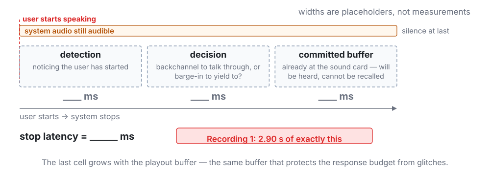

<!-- 此檔由 bin/publish_slides.py 從投影片正本產生（中文講稿區塊已剝除），請勿直接編輯。正本在 private repo 的 <course>/slides/。 -->

## Before anything else, listen

Two recordings. Same pre-recorded user, same benchmark task, same model family.

I will not tell you what to listen for yet.

::: {.audio-label}
Recording 1
:::
<audio controls preload="auto">
  <source src="assets/w01/interruption-moshi-base.m4a" type="audio/mp4">
  <source src="assets/w01/interruption-moshi-base.opus" type="audio/ogg; codecs=opus">
</audio>

::: {.audio-label}
Recording 2
:::
<audio controls preload="auto">
  <source src="assets/w01/interruption-moshi-fisher.m4a" type="audio/mp4">
  <source src="assets/w01/interruption-moshi-fisher.opus" type="audio/ogg; codecs=opus">
</audio>

::: {.footer}
Audio: Ohashi et al., EMNLP 2026 · CC-BY-4.0 · stereo: left = user, right = model
:::

## The user started speaking at 9.6 s. The system did not stop.

{width="100%"}

::: {.metrics}
::: {.metric .bad}
[2.90 s]{.num}[the model kept talking over the user]{.lab}
:::
::: {.metric .bad}
[10.2 s]{.num}[then said nothing at all]{.lab}
:::
:::

::: {.footer}
Energy-based VAD, 25 ms / 10 ms hop — an estimate, not a reference VAD
:::

## Same input, same architecture. Only the post-training differs.

{width="100%"}

::: {.metrics}
::: {.metric .good}
[0.00 s]{.num}[simultaneous speech]{.lab}
:::
::: {.metric .good}
[60 ms]{.num}[from the user finishing to the model replying]{.lab}
:::
:::

## Two opposite failures, one recording

::: {.claim}
A spoken dialogue system can fail by **speaking when it should listen**, and by **staying silent when it should speak**. Both happened in those 28 seconds.
:::

Minimising response latency fixes the second failure and makes the first one worse.

This course is about the machinery that lets a system get both right at once — and about how to measure whether it did.

# What this course is {.section-title}

## By week 14 you should be able to build one of these, and to argue about it

Not "know about" — **read the papers critically, measure the systems, defend design choices.**

| Part | Weeks | What it gives you |
|---|---|---|
| **I — Foundations** | W2–W6 | front ends · alignment · streaming · SSL · neural codecs |
| **II — Modules** | W7–W10 | ASR · TTS · controllability and evaluation · the front end |
| **III — Dialogue** | W11–W14 | audio-native LMs · turn-taking · full duplex · evaluation |

## Fourteen weeks, and which week holds up which

{width="100%"}

## W6 is the hinge. If you skip one week, do not skip that one.

All of Part III rests on three ideas from W6:

- **frame rate** — tokens per second, and therefore decoder steps per second
- **token budget** — what a 30-minute conversation costs in context
- **semantic / acoustic disentanglement** — must meaning and timbre share one representation?

::: {.claim}
Every latency and quality ceiling downstream follows from how you turned speech into tokens.
:::

## What you should be able to do by the end of today

1. **Draw** the data flow of a cascade, an end-to-end speech-to-speech model, and a native full-duplex model — and point at the place where each one narrows the channel.
2. **Decompose** a target end-to-end latency into a per-module budget, say which entries are algorithmic delay and which are computational — and say what each entry actually measures.
3. **Define** half duplex versus full duplex operationally, and name four interaction behaviours a half-duplex system cannot have.
4. **Argue**, from human timing data, that turn-taking is prediction rather than detection — and therefore that a faster VAD does not solve it.
5. **Interrogate** a paper with four questions: is the input the same, how was the timing measured, what was normalised away, and what is the metric rewarding.

::: {.claim}
These five are the hooks that the next thirteen weeks attach to.
:::

## Three questions we ask every single week

::: {.prose}
| Axis | The question |
|---|---|
| **Representation** | What representation does this layer use — waveform, spectrogram, continuous SSL feature, discrete token? What sets the frame rate? |
| **Latency** | How much of the budget does this module consume? Is that algorithmic delay (lookahead) or computational delay? |
| **Supervision** | Where does this capability come from — labels, self-supervision, synthetic data, or human preference? |
:::

These three are the coordinate system for the whole course. Slides in every later week come back to them.

# Three architectures {.section-title}

## From walkie-talkie to face to face

**Walkie-talkie** — one party at a time, and the handover has to be announced out loud.

**Telephone** — both channels are open the whole time, but people still take turns.

**Face to face** — speakers overlap, interrupt, hum agreement, and adjust a sentence while it is still coming out.

Spoken dialogue systems climbed this ladder in the same order. We are somewhere between the second rung and the third.

::: {.claim .warn}
Where the metaphor breaks: two people talking are not two independent tracks that happen to overlap. Each is **continuously adjusting to the other**. That coupling is the hard part — and it is what W12 and W13 are about.
:::

## Cascade survives because every module can be debugged separately

{width="100%"}

Thick line = audio. **Thin line = text.** The thickness is the information rate.

## Everything the transcript cannot carry is gone at the ASR output

{width="100%"}

The LLM receives a string. Hesitation, amusement, shouting, speaking rate, whether the user had finished — and **the timing of all of it** — are gone.

::: {.claim .warn}
A better ASR cannot fix this. The channel is simply **too narrow for the signal**. And note what a string has no field for at all: **a clock**.
:::

## Stop. What does a transcript throw away?

::: {.ask}
Write down everything you can think of. Two minutes.
:::

. . .

emotion · laughter · sighs · hesitation and filled pauses · speaking rate · loudness · pitch range · accent and dialect · who is speaking · how many people are speaking · overlap · whether the utterance is finished · background environment · whether the speech is even addressed to the system

## ...and the one almost nobody writes down

**The clock.** When each word landed. How long that pause in the middle was. How long ago the user stopped.

::: {.claim .warn}
A string has no timestamps. Not one.
:::

## End-to-end keeps the paralinguistics, and keeps text as a planning channel

{width="100%"}

Nothing is forced through a transcript. But text does not disappear — it moves *inside* the model as an inner monologue.

## What end-to-end costs

- **Semantic degradation.** Speech token sequences are one to two orders of magnitude longer than text for the same content. Training a language model on them erodes the language ability. `[W11]`
- **Context cost.** Frame rate × codebooks × conversation length. We will compute this in W6 and it is worse than people expect.
- **Controllability and auditability.** Tool calls, long-term memory, and "why did it say that" are all harder when there is no transcript to inspect.

::: {.claim}
The field's current answer is neither pure cascade nor pure end-to-end. It is **keeping text in the loop while never forcing audio through it.**
:::

## Full duplex is sequence modelling: silence is a token

{width="100%"}

$$y_t \;=\; f\!\left(x_{1:\,t+\ell},\; y_{1:\,t-1}\right), \qquad y_t \in \mathcal{V} \cup \{\varnothing\}$$

::: {.claim}
Once the model emits *something* every frame — including $\varnothing$, "say nothing" — turn-taking becomes ordinary next-token prediction.
:::

## Which failure can you afford?

| | Cascade | End-to-end S2S | Native full duplex |
|---|---|---|---|
| Paralinguistics | lost at ASR output | preserved | preserved |
| Turn-taking | external VAD | external, usually | per frame |
| Semantic ability | full text LLM | degrades | degrades |
| Control, tools, audit | strongest | weaker | weakest today |
| Training cost | lowest | high | highest; needs two-track data |
| Debugging | per module | end to end only | end to end only |

::: {.claim}
No ranking here — **"end-to-end must be better" is a misconception.** Pick the architecture whose failure mode your application can survive.
:::

## Misconception 1 — "full duplex means it supports interruption"

Interruption handling is a *behaviour*. It can be faked: detect user speech with a VAD, stop the TTS. That system is still half duplex.

::: {.claim .warn}
The test is architectural: **while the model is speaking, does the input stream still enter the computation and still change the next decision?**
:::

A VAD-gated cascade and a native full-duplex model can look identical on a clean interruption — and diverge completely on a mid-utterance pause, a backchannel, or two people talking.

## The same test, drawn as two clocks



A VAD-gated cascade **decides once** — when the endpoint fires — and then plays a string. Between that decision and the external "stop", $x_t$ is not read and no $y_t$ is chosen. Its output clock is **broken**; the frame clock of the model above it never stops.

# The latency budget {.section-title}

## Humans aim at a target, not at a minimum

Across 10 languages from 5 continents, informal conversation follows one norm: **minimal gap, minimal overlap.** Most turn transitions land near zero.

- Cross-language means differ by at most **±250 ms**
- Responses that do not answer the question, or that go against its bias, are delayed by **up to about 1 s** — and listeners read that delay as meaning

::: {.claim}
Delay is a signal, not just a cost. A system that always answers instantly is not maximally natural — it is uniformly ignoring one of the channels people use.
:::

::: {.footer}
Stivers et al., PNAS 106(26): 10587–10592, 2009 · open access
:::

## Misconception 2 — "lower latency is always better"

::: {.ask}
If a system answered every question in 40 ms, how would that feel?
:::

. . .

Like it was not listening. Like it had prepared the answer before you finished. In human conversation, an instant response to a question that deserves thought is itself informative.

Remember Recording 2: **60 ms**. Is that good? We genuinely do not know from the number alone — it depends on whether the content was worth 60 ms.

## Humans answer faster than they can plan

Two numbers that do not fit together:

| Quantity | Order of magnitude |
|:--|:--|
| Gap at a turn transition | clusters near **zero** — most transitions land within a couple of hundred ms |
| Planning one word for production | **hundreds of ms** before articulation even begins — call it 600 ms |

If planning only started when the other person stopped, the earliest anyone could speak would be roughly 600 ms later. People do not take 600 ms.

::: {.claim}
So planning is already under way **while the other person is still talking**. The listener is predicting *when* the turn will end, and *how*. Turn-taking in humans is a **prediction** problem, not a detection problem.
:::

Anything that only starts thinking after the user stops has already lost the race — and that is exactly what an endpoint threshold does.

::: {.footer}
Gap statistics: Stivers et al., PNAS 106(26), 2009. Production timing: word-production chronometry — an order of magnitude, not a measurement of this task.
:::

## Detection would reply 600 ms late. Prediction lands on time.



Put the two numbers on one axis and the conclusion is forced: the planning box has to start **before** the other speaker stops. Nothing else fits the observed gap.

## Misconception 3 — "just make the VAD faster"

A VAD answers **is someone speaking right now?** — detection, answerable from the current frame.

Turn-taking asks **is this person about to finish, and does what I just heard count as an interruption?** — prediction, not answerable from the current frame at all.

| Silence threshold | What you get |
|:--|:--|
| 700 ms | safe, and the system feels slow |
| 300 ms | fast, and it cuts people off mid-sentence |
| any value | one failure traded for the other |

::: {.claim .warn}
Tuning a threshold trades one failure for the other. It never creates the ability to predict, because a silence timer has no access to **what was being said**.
:::

That is why W12 is about *semantic* endpointing — deciding from the words and the prosody, not from the length of the silence.

## One sentence, two thresholds



The 500 ms pause inside the sentence and the silence after it are **the same signal** to a timer. Only the words tell them apart — and the timer never sees the words.

## The budget we will refill every week

{width="100%"}

## Two rules before you fill in a single cell

**1 — Every cell holds only what happens *after* the user stops speaking.**

Not the module's total processing time. A streaming ASR has already consumed most of the utterance by the time the user stops; counting that work again inflates the whole budget by an order of magnitude. The ASR cell is the *tail*, not the transcription.

**2 — This template is cascade-shaped.**

A native full-duplex model has no endpoint-detection cell and no ASR tail. It emits on every frame, so there is nothing to wait for and nothing to flush.

::: {.claim}
In W13 this sheet will not fit the system we are studying. That failure is not a flaw in the sheet — **it is the definition of full duplex**, drawn in negative space.
:::

## Two kinds of delay, and only one of them is a hardware problem

A streaming model is a function that may peek $\ell$ frames into the future:

$$\hat{y}_{1:t} \;=\; f\!\left(x_{1:\,t+\ell}\right)$$

$\Delta$ frame shift (s) · $\ell$ lookahead (frames) · $L$ layers · $r_k$ right context of layer $k$ · $C$ chunk size (frames)

**Algorithmic delay** — still there on infinitely fast hardware:

$$D_{\text{alg}} \;=\; \underbrace{\ell\,\Delta}_{\text{lookahead}} \;+\; \underbrace{\alpha\,C\,\Delta}_{\text{waiting for the chunk}},
\qquad \ell \;=\; \sum_{k=1}^{L} r_k, \qquad \alpha \in [\tfrac{1}{2},\,1]$$

**Computational delay** — the one you can buy your way out of:

$$D_{\text{comp}} \;=\; \mathrm{RTF}\cdot C\Delta \;+\; T_{\text{queue}}$$

Two claims hide in the first line: $\ell$ is a *sum*, and $\alpha$ is a *range*. The next two slides derive them.

## Why $\ell$ is a sum: right context stacks



Layer $k$ at time $t$ needs layer $k-1$ up to $t + r_k$. Apply that $L$ times:

$$t^{(k)} \;=\; t^{(k-1)} + r_k \qquad\Longrightarrow\qquad t^{(L)} \;=\; t + \sum_{k=1}^{L} r_k \;=\; t + \ell$$

## Why $\alpha \in [\tfrac12, 1]$: waiting for the chunk to fill



The user's last frame lands at position $j$ in its chunk and waits $(C-1-j)\,\Delta$. Averaged over where it lands:

$$\frac{1}{C}\sum_{j=0}^{C-1} (C-1-j)\,\Delta \;=\; \frac{C-1}{2}\,\Delta \;\approx\; \tfrac12\,C\Delta, \qquad\text{worst case } (C-1)\,\Delta \;\approx\; C\Delta$$

The mean is $\alpha = \tfrac12$; the tail is $\alpha = 1$. The p95 slide makes that distinction bite.

## Add them up — every term after the user stops speaking

$$D_{\text{e2e}} \;=\; D_{\text{alg}} \;+\; D_{\text{comp}} \;+\; D_{\text{net}} \;+\; D_{\text{buf}}$$

| Term | What it is | What moves it |
|:--|:--|:--|
| $D_{\text{alg}}$ | $\ell\Delta + \alpha C\Delta$ | the model's *definition* |
| $D_{\text{comp}}$ | $\mathrm{RTF}\cdot C\Delta + T_{\text{queue}}$ | hardware, model size, batching |
| $D_{\text{net}}$ | round trip to wherever the model runs | deployment — on-device makes it zero |
| $D_{\text{buf}}$ | audio held back so playback never stutters | the same buffer we meet again in the stop budget |

::: {.claim}
A faster GPU moves exactly **one** of the four.
:::

## The arithmetic that eats the whole budget

A 15-layer encoder, each layer looking **two frames** to the right, at $\Delta = 10$ ms:

$$\ell \;=\; \sum_{k=1}^{15} r_k \;=\; 15 \times 2 \;=\; 30 \text{ frames}
\qquad\Longrightarrow\qquad \ell\,\Delta \;=\; 30 \times 10\,\text{ms} \;=\; 300\,\text{ms}$$

With a chunk of $C = 32$ frames and $\alpha = \tfrac{1}{2}$:

$$D_{\text{alg}} \;=\; 300\,\text{ms} \;+\; \tfrac{1}{2}\times 32 \times 10\,\text{ms} \;=\; 300 + 160 \;=\; \mathbf{460\ \text{ms}}$$

::: {.claim .warn}
The whole budget was 300 ms. We are at 460 ms **before a single multiplication has happened** — and $D_{\text{comp}}$ has not been added yet.
:::

The obvious counter-move — *just shrink $C$* — is the next slide.

## Why not just shrink $C$?



Chunks arrive at $1/(C\Delta)$ per second; each is $C$ queries against $C+H$ keys ($H$ = cached history):

$$\text{cost per second} \;\propto\; \frac{1}{C\Delta}\cdot C\,(C+H)\,d \;=\; \frac{(C+H)\,d}{\Delta}$$

Halving $C$ halves the wait but removes only $C$ from $C+H$: **smaller chunks are more often and less efficient, not cheaper.**

## Misconception 4 — "latency is an engineering problem, not a research problem"

The streaming constraint does not sit on top of a model. It reaches inside and changes it.

- **The loss function.** RNN-T exists because an attention-based encoder–decoder cannot emit anything before it has seen the whole utterance. `[W4]`
- **The representation.** Low frame-rate neural codecs exist because decoder steps per second is a hard budget. `[W6]`
- **The architecture.** Causal masks and chunk-wise attention exist because the model is not allowed to look at the future. `[W4, W8]`

::: {.claim}
Each of those is a **modelling** decision forced by a timing requirement. Latency is not downstream of the research — it is one of its inputs.
:::

## The number that hurts is p95, not the mean



- Means **add** along a pipeline. Probabilities of being on time **multiply**: five modules each inside its own p95 leave the chain inside its budget only $0.95^5 \approx 77\%$ of the time (assuming independence).
- Averaging 320 ms but hitting 1.4 s twice a minute feels **broken**, not fast. Users experience the bad turns, not the distribution.

::: {.claim}
Report distributions. In W14 the goal becomes *matching* the human latency distribution with a distributional distance — not minimising a mean.
:::

## Live: measure your own pipeline

We run a cascade and an end-to-end model on the same utterance, record both, and fill in the budget from the recording.

1. Record one utterance that ends with a **mid-utterance pause** ("I'd like a ticket to … Tainan, next Wednesday")
2. Run it through the cascade; log timestamps at each module boundary
3. Run it through the end-to-end model; log first-audio-out
4. Plot both on one time axis and fill in the sheet

::: {.ask}
Prediction before we run it: which module will dominate?
:::

# Four behaviours a half-duplex system cannot have {.section-title}

## The taxonomy

| Behaviour | The user is… | The system must… | Week |
|---|---|---|---|
| **Backchannel** | still speaking; says "mm-hm" | recognise that no turn is being claimed, and keep going | W12 |
| **Interruption** | taking the floor mid-answer | stop quickly, and keep what it had planned | W12, W13 |
| **Barge-in** | speaking over the system's own audio | separate its own voice from the user's — AEC | W10 |
| **Overlap continuation** | briefly overlapping, not taking the floor | continue rather than yield | W12 |
| **Proactive turn** | silent | decide whether to open its mouth at all | open problem |

## A base model can be a competent talker and a useless listener

{width="100%"}

Forty-two seconds of narration. The model speaks three times, all within the first seven seconds, then nothing.

::: {.audio-label}
PersonaPlex (base) — first 20 s
:::
<audio controls preload="auto">
  <source src="assets/w01/backchannel-ppx-base.m4a" type="audio/mp4">
  <source src="assets/w01/backchannel-ppx-base.opus" type="audio/ogg; codecs=opus">
</audio>

::: {.footer}
Audio: Ohashi et al., EMNLP 2026 · CC-BY-4.0
:::

## The same model, post-trained: eleven short utterances spread across the whole clip

{width="100%"}

::: {.metrics}
::: {.metric}
[0.88 → 4.20 s]{.num}[simultaneous speech]{.lab}
:::
::: {.metric}
[3 → 11]{.num}[model utterances, same 42 s]{.lab}
:::
:::

::: {.audio-label}
PersonaPlex + interactivity post-training — first 20 s
:::
<audio controls preload="auto">
  <source src="assets/w01/backchannel-ppx-fisher.m4a" type="audio/mp4">
  <source src="assets/w01/backchannel-ppx-fisher.opus" type="audio/ogg; codecs=opus">
</audio>

## The same measurement is a defect in one task and a requirement in the other

::: {.claim}
Simultaneous speech: **2.90 s was the failure** in Recording 1. **4.20 s was the improvement** here.
:::

There is no metric you can minimise to get good turn-taking. The target depends on what the user is doing — which means the system has to *classify the situation* before it decides.

## The other budget: how long it takes to stop

The last section measured *user stops → system starts*. Interruption runs the other way.

{width="100%"}

::: {.claim .warn}
The third cell is the trap: a larger playout buffer protects you from glitches **and** makes you slower to shut up. One parameter, two faces — only one of them shows up in the usual latency number.
:::

## Misconception 5 — "the user should always win an interruption"

Interruptions have different functions: clarification, correction, agreement, seizing the floor. Yielding unconditionally means the system can never finish a necessary long answer — reading out an address, a dosage, a confirmation number.

::: {.claim .warn}
"Always yield" is not politeness. It is a controllability failure, and it is measurable: W14's benchmarks score both premature yielding and failure to yield.
:::

And the cost of getting it wrong is now a number you can put on the sheet: every false yield costs one stop budget, committed buffer included.

# Where we go from here {.section-title}

## Each Part fills in part of the budget

| Week | What it adds to the sheet |
|---|---|
| W2 | frame shift — the smallest unit of delay there is |
| W4 | lookahead and chunk size; ASR emission delay |
| W6 | frame rate and token budget → decoder steps per second |
| W8 | TTS first-packet latency; NFE versus quality |
| W10 | AEC and front-end cost; why enhancement can raise WER |
| W13 | per-frame decoding cost for a full-duplex model |

::: {.claim}
Bring the sheet every week. By W14 you will have one diagram that explains where every millisecond of a spoken dialogue system goes.
:::

## Some of the gaps are yours to fill

Full-duplex research runs on **two-track conversational recordings** — one channel per speaker. English has corpora for this. Mandarin has some.

For **Taiwanese Hokkien, Hakka and the Formosan languages**, publicly available two-track dialogue data is close to non-existent — and the text side that interleaving depends on has no single settled orthography.

- The data does not exist, so even a small, well-designed corpus is a contribution.
- The orthography question is research, not preprocessing. `[W6, W11]`
- Almost nothing in Part III has been tested outside English and Mandarin.

::: {.claim}
When we reach W14's open problems, this one has your name on it more than mine.
:::

## Four questions to ask of every paper in this course

1. **Was the input the same?** Today's two recordings shared one pre-recorded user track, so the difference was attributable. Most system comparisons do not have that property.
2. **How was the timing measured?** Energy VAD, a reference VAD, forced alignment, or the model's own logs? Our 2.90&nbsp;s and 60&nbsp;ms came from an energy VAD — the magnitudes hold, the milliseconds do not.
3. **What was normalised away?** WER depends on text normalisation; MOS depends on the rater pool and the scale anchors. Numbers from two different papers are usually not comparable at all.
4. **What does the metric reward?** A benchmark that scores only latency rewards a system that interrupts.

::: {.claim}
You will use these four every week — and they are also how you avoid writing a paper that someone else has to ask them about.
:::

## Next week, and what to read

**W2 — Speech Signals, Auditory Front-Ends, and the Physics of Representation.** The only systematic DSP week. It opens with a short refresher — inner products and projections — and uses them three times.

If you read one thing this week:

- Lu et al., **A Survey of Full-Duplex Spoken Dialogue Systems: Architectural Hierarchy, Interaction Ontology, and Decision State Machine**, arXiv:2606.19453 (2026)

Two more, if you have time:

- Ji et al., **WavChat: A Survey of Spoken Dialogue Models**, arXiv:2411.13577 (2024) — the half-duplex era, for contrast
- Jurafsky & Martin, *Speech and Language Processing*, 3rd ed. draft (19 Aug 2026), **Ch 26 — Conversation and its Structure**

## Sources

**Audio and derived figures**
: Ohashi, Zeghidour, Défossez & Kharitonov, *Multi-Faceted Interactivity Alignment in Full-Duplex Speech Models*, EMNLP 2026 (arXiv:2606.11167). Samples: `kyutai/interactivity-alignment-samples`, licensed **CC-BY-4.0**. Clips were trimmed and re-encoded; timelines were computed from the released stereo WAVs.

**Turn-taking timing**
: Stivers, Enfield, Brown, … Levinson, *Universals and cultural variation in turn-taking in conversation*, PNAS 106(26): 10587–10592, 2009.

**Architecture taxonomy**
: Lu et al., arXiv:2606.19453 (2026).

Audio analysis code (energy VAD, overlap / response / stop latency, the two-track timeline): `slides/scripts/analyze_duplex_audio.py`, `slides/scripts/make_duplex_timeline.py` in the course repository.
