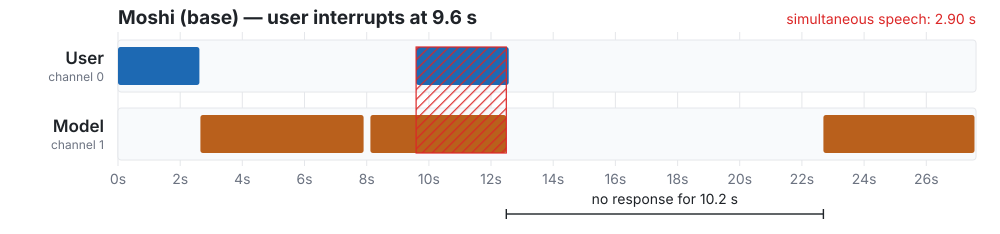
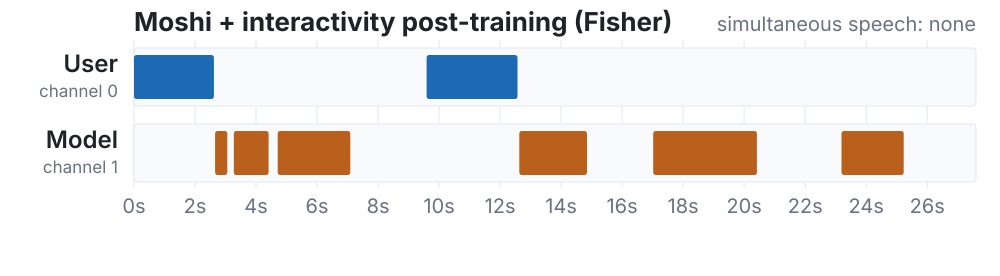
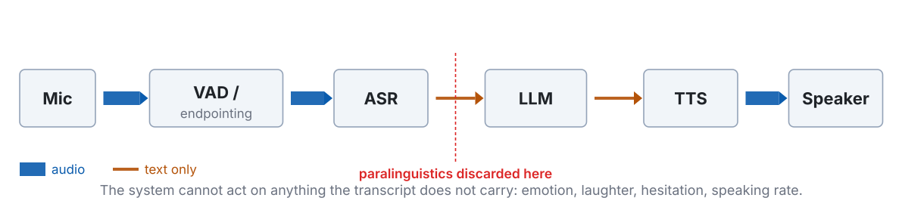
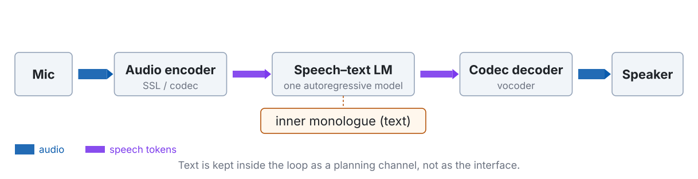
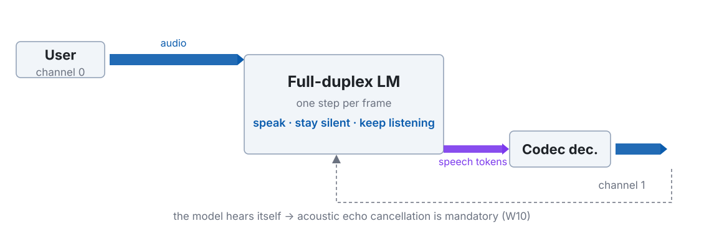
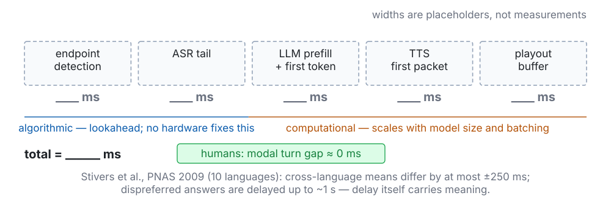
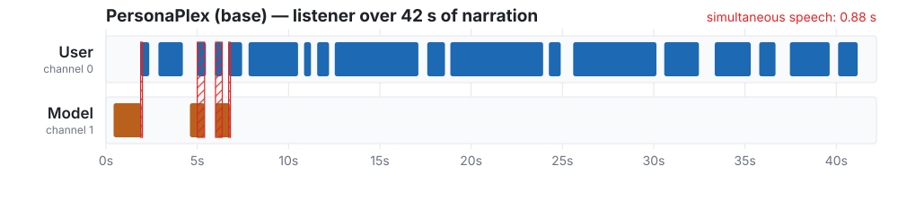
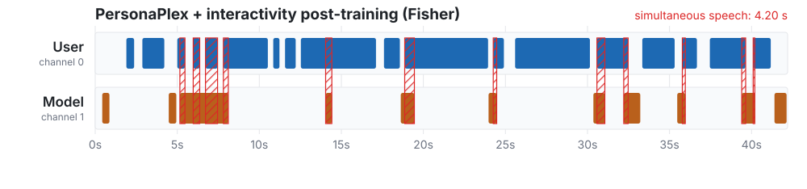

## Before anything else, listen {.smaller}

Two recordings. Same pre-recorded user, same benchmark task, same model family.

I will not tell you what to listen for yet.

::: {.audio-label}
Recording 1
:::
<audio controls preload="auto">
  <source src="assets/w01/interruption-moshi-base.m4a" type="audio/mp4">
  <source src="assets/w01/interruption-moshi-base.opus" type="audio/ogg; codecs=opus">
</audio>

::: {.audio-label}
Recording 2
:::
<audio controls preload="auto">
  <source src="assets/w01/interruption-moshi-fisher.m4a" type="audio/mp4">
  <source src="assets/w01/interruption-moshi-fisher.opus" type="audio/ogg; codecs=opus">
</audio>

::: {.footer}
Audio: Ohashi et al., EMNLP 2026 · CC-BY-4.0 · stereo: left = user, right = model
:::

::: {.notes}
先播，不要先解釋。兩段各 28 秒，共約一分鐘。

播放前只說一句：「左耳是使用者，右耳是系統。」不要說要聽什麼。

播完問一個問題就好：**你聽到什麼不對？** 讓學生自己講。多數人會先注意到第一段裡系統沒有停下來；「後面那段長沉默」通常要提示才會被說出來——那正好是本週的第二個重點。

如果教室音響只有單聲道，改用耳機示範，或先播原始檔的左右聲道分離版本。
:::

## The user started speaking at 9.6 s. The system did not stop. {.smaller}

{width="100%"}

::: {.metrics}
::: {.metric .bad}
[2.90 s]{.num}[the model kept talking over the user]{.lab}
:::
::: {.metric .bad}
[10.2 s]{.num}[then said nothing at all]{.lab}
:::
:::

::: {.footer}
Energy-based VAD, 25 ms / 10 ms hop — an estimate, not a reference VAD
:::

::: {.notes}
現在把剛才聽到的東西畫出來。紅色斜線區是**兩軌同時有聲**。

強調兩個數字是**同一段 28 秒裡的兩種相反錯誤**：先是蓋過使用者，接著是十秒不回應。學生容易只記住前者。

要誠實說明：這裡的區段是能量式 VAD 估出來的，不是標準 VAD 模型。門檻與最小時長會影響邊界，量級可信、個別毫秒不可信。這個習慣要從第一週建立。
:::

## Same input, same architecture. Only the post-training differs. {.smaller}

{width="100%"}

::: {.metrics}
::: {.metric .good}
[0.00 s]{.num}[simultaneous speech]{.lab}
:::
::: {.metric .good}
[60 ms]{.num}[from the user finishing to the model replying]{.lab}
:::
:::

::: {.notes}
上一張是 Moshi base，這張是同一個模型經過互動性 RL 後訓練（Fisher 資料）。**輸入完全相同**，可以直接歸因。

那個 60 ms 要加註：它落在我們 10 ms hop 的解析度邊緣，而且模型起始時間恰好等於使用者結束時間。所以它可能是切分邊界的假象，也可能是模型幾乎同步開口。若是後者——那正是 W12 要講的**預測型 turn-taking**：模型在對方講完之前就已經準備好了。

這裡可以停下來問：60 ms 是好事嗎？先不給答案，第四節會回來。
:::

## Two opposite failures, one recording

::: {.claim}
A spoken dialogue system can fail by **speaking when it should listen**, and by **staying silent when it should speak**. Both happened in those 28 seconds.
:::

Minimising response latency fixes the second failure and makes the first one worse.

This course is about the machinery that lets a system get both right at once — and about how to measure whether it did.

::: {.notes}
這是 cold open 的收束，也是全課的問題陳述。

關鍵句：**把延遲最小化會修好第二種錯誤、同時讓第一種變嚴重。** 學生的直覺幾乎都是「越快越好」，這一句先埋下懷疑，第四節用 Stivers 的資料正式推翻。

講到這裡約第 10 分鐘。
:::

# What this course is {.section-title}

## By week 14 you should be able to build one of these, and to argue about it {.smaller}

Not "know about" — **read the papers critically, measure the systems, defend design choices.**

| Part | Weeks | What it gives you |
|---|---|---|
| **I — Foundations** | W2–W6 | front ends · alignment · streaming · SSL · neural codecs |
| **II — Modules** | W7–W10 | ASR · TTS · controllability and evaluation · the front end |
| **III — Dialogue** | W11–W14 | audio-native LMs · turn-taking · full duplex · evaluation |

::: {.notes}
先修填「無」，所以要明說：W2 後半與 W3 前半承擔補課責任，第一週結束會發兩頁數學前置清單（內積與投影、條件獨立與邊際化、梯度下降）。

也要說清楚這門課**沒有評量**——所以閱讀論文是自願的，但每週的「若只讀一篇」清單就在課程網站上。
:::

## W6 is the hinge. If you skip one week, do not skip that one.

All of Part III rests on three ideas from W6:

- **frame rate** — tokens per second, and therefore decoder steps per second
- **token budget** — what a 30-minute conversation costs in context
- **semantic / acoustic disentanglement** — must meaning and timbre share one representation?

::: {.claim}
Every latency and quality ceiling downstream follows from how you turned speech into tokens.
:::

::: {.notes}
這張是課程地圖裡最重要的依賴關係。W11–W14 完全建立在 W6 之上。

如果進度落後，可壓縮的是 W7（ASR 三範式可以講快）與 W10（本來就是整併掃描週），**不要壓 W6**。
:::

## Three questions we ask every single week {.smaller}

| Axis | The question |
|---|---|
| **Representation** | What representation does this layer use — waveform, spectrogram, continuous SSL feature, discrete token? What sets the frame rate? |
| **Latency** | How much of the budget does this module consume? Is that algorithmic delay (lookahead) or computational delay? |
| **Supervision** | Where does this capability come from — labels, self-supervision, synthetic data, or human preference? |

These three are the coordinate system for the whole course. Slides in every later week come back to them.

::: {.notes}
每週投影片都要回扣一次這三軸。學期末學生應該能拿任何一個模組，自己回答這三個問題。

第三軸（監督）在 W9 與 W14 特別重要，因為 RL 後訓練改變了「能力從哪來」的答案——今天 cold open 那個對照就是它的例子。
:::

## Practicalities

- Slides in English, taught in Mandarin. Speaker notes are in Mandarin; you get the slides, not the notes.
- **No assessment.** No homework, no exam. Attend because it is worth attending.
- Demos are written for the free Colab tier. Real-time interaction does not fit there, so demos run offline and we align timelines afterwards.
- Everything lives at the course site: weekly pages, reading lists, these slides.

::: {.tag}
course site → hungshinlee.github.io/Speech-AI/
:::

::: {.notes}
提醒：投影片會在課後才放上網站（cold open 的效果依賴學生沒有預先看過）。

Colab 那一點要老實講：即時語音互動在免費版跑不動，所以所有 demo 都是離線推論 + 事後對齊時間軸，即時性用預錄 demo 呈現。
:::

# Three architectures {.section-title}

## Cascade survives because every module can be debugged separately {.smaller}

{width="100%"}

Thick line = audio. **Thin line = text.** The thickness is the information rate.

::: {.notes}
先講它為什麼還活著，不要一開始就批評它。2023–2024 產品幾乎都是這個架構，原因很實際：每個模組可以獨立訓練、獨立監控、獨立換掉，出事時知道要看哪裡。

視覺語彙在這裡建立：**線的粗細 = 資訊量**。三張架構圖共用這套編碼，學生看第二、三張時就不需要重新解讀。
:::

## Everything the transcript cannot carry is gone at the ASR output {.smaller}

{width="100%"}

The LLM receives a string. Hesitation, amusement, shouting, speaking rate — and whether the user had finished — are all gone.

::: {.claim .warn}
A better ASR cannot fix this. The channel is simply **too narrow for the signal**.
:::

::: {.notes}
同一張圖再放一次，這次只講瓶頸。重複用同一張圖是刻意的——學生的注意力可以放在論點而不是重新解圖。

要明說「更好的 ASR 救不了」：這不是準確率問題，是通道容量問題。WER 降到 0 也不會把笑聲、猶豫、語速傳過去。

這裡是下一張提問的鋪陳。
:::

## Stop. What does a transcript throw away? {.smaller}

::: {.ask}
Write down everything you can think of. Two minutes.
:::

. . .

emotion · laughter · sighs · hesitation and filled pauses · speaking rate · loudness · pitch range · accent and dialect · who is speaking · how many people are speaking · overlap · whether the utterance is finished · background environment · whether the speech is even addressed to the system

::: {.notes}
**這裡一定要真的停下來。** 讓學生列，不要自己講完。他們幾乎一定會漏掉最後兩項——「這句話說完了嗎」與「這句話是對我說的嗎」——而那兩項正好是 W12 與 W13 的核心。

漏掉的部分不要當成錯誤，當成伏筆：「這兩個我們第 12、13 週會花整週處理。」

約第 25 分鐘。
:::

## End-to-end keeps the paralinguistics, and keeps text as a planning channel {.smaller}

{width="100%"}

Nothing is forced through a transcript. But text does not disappear — it moves *inside* the model as an inner monologue.

::: {.notes}
關鍵反直覺點：**end-to-end 不等於沒有文字。** 幾乎所有成功的 audio-native 系統內部都保留文字，只是把它從介面變成規劃通道（W11 會拆 Moshi 的 inner monologue）。

學生常以為 end-to-end 是「純語音」。純語音 LM 是研究路線，不是目前的產品架構。
:::

## What end-to-end costs {.smaller}

- **Semantic degradation.** Speech token sequences are one to two orders of magnitude longer than text for the same content. Training a language model on them erodes the language ability. `[W11]`
- **Context cost.** Frame rate × codebooks × conversation length. We will compute this in W6 and it is worse than people expect.
- **Controllability and auditability.** Tool calls, long-term memory, and "why did it say that" are all harder when there is no transcript to inspect.

::: {.claim}
The field's current answer is neither pure cascade nor pure end-to-end. It is **keeping text in the loop while never forcing audio through it.**
:::

::: {.notes}
不要把 end-to-end 講成純粹的進步。三個代價都是真的，而且第一個是結構性的（序列長度 + 資料分布），不是加大模型能解決的。

「一到兩個數量級」這個說法要說清楚依據：語音 token 大約每秒 12.5–50 個，文字大約每秒 3–4 個字元/詞元級單位，取決於 tokenizer 與語言。精確數字 W6 會算。
:::

## Full duplex is sequence modelling: silence is a token {.smaller}

{width="100%"}

::: {.claim}
Once the model emits *something* every frame — including "say nothing" — turn-taking becomes ordinary next-token prediction.
:::

::: {.notes}
這是全週最重要的一句話，值得單獨停三十秒。

「靜音也是一個 token」——一旦接受這件事，full duplex 就從一個需要外掛控制器的工程問題，變成一個標準的序列建模問題。W13 會看到三條架構路線，其中兩條就是這句話的直接實作。

順帶指出圖上那條虛線回饋：模型會聽到自己的聲音，所以真實部署一定要 AEC。學術資料集通常假設乾淨雙軌，這是 sim-to-real 最大的落差之一（W10）。
:::

## Which failure can you afford?

| | Cascade | End-to-end S2S | Native full duplex |
|---|---|---|---|
| Paralinguistics | lost at ASR output | preserved | preserved |
| Turn-taking | external VAD | external, usually | per frame |
| Semantic ability | full text LLM | degrades | degrades |
| Control, tools, audit | strongest | weaker | weakest today |
| Training cost | lowest | high | highest; needs two-track data |
| Debugging | per module | end to end only | end to end only |

::: {.claim}
No ranking here. Pick the architecture whose failure mode your application can survive.
:::

::: {.notes}
不要把這張表講成「越往右越先進」。2026 年三條路線都在活躍發展，因為它們的取捨不同。

可以問學生：客服系統與陪伴型系統各該選哪一欄？為什麼？答案不唯一，重點是他們得用表格裡的維度來論證。
:::

## Misconception 1 — "full duplex means it supports interruption" {.smaller}

Interruption handling is a *behaviour*. It can be faked: detect user speech with a VAD, stop the TTS. That system is still half duplex.

::: {.claim .warn}
The test is architectural: **while the model is speaking, does the input stream still enter the computation and still change the next decision?**
:::

A VAD-gated cascade and a native full-duplex model can look identical on a clean interruption — and diverge completely on a mid-utterance pause, a backchannel, or two people talking.

::: {.notes}
這是 W1 最容易誤解的一點，也是 W12、W13 的入口。

破解方式：VAD 硬停 TTS 的系統在「乾淨的打斷」場景表現可以跟原生全雙工一樣好。差異出現在句中停頓（使用者只是在想）、backchannel（使用者只是說「嗯」）、以及多人場景。

如果學生問「那怎麼分辨」——答案就是本週第五節的四種行為，以及 W14 的 benchmark。
:::

# The latency budget {.section-title}

## Humans aim at a target, not at a minimum {.smaller}

Across 10 languages from 5 continents, informal conversation follows one norm: **minimal gap, minimal overlap.** Most turn transitions land near zero.

- Cross-language means differ by at most **±250 ms**
- Responses that do not answer the question, or that go against its bias, are delayed by **up to about 1 s** — and listeners read that delay as meaning

::: {.claim}
Delay is a signal, not just a cost. A system that always answers instantly is not maximally natural — it is uniformly ignoring one of the channels people use.
:::

::: {.footer}
Stivers et al., PNAS 106(26): 10587–10592, 2009 · open access
:::

::: {.notes}
這是本節的立論基礎，也是我唯一從語言學文獻取數字的地方。

我刻意**沒有**放那個常被引用的單一均值（例如「約 200 ms」）——我沒有在論文裡讀到那個數字，所以不放。要用的話請自己從 Fig. 1 / Table 1 讀出來再補上。

「延遲帶意義」這一點對工程有直接後果：目標是**匹配人類的分布**，不是把延遲壓到零。這一句會在 W14 變成一個具體的評估指標（用分布距離而不是平均值）。
:::

## Misconception 2 — "lower latency is always better" {.smaller}

::: {.ask}
If a system answered every question in 40 ms, how would that feel?
:::

. . .

Like it was not listening. Like it had prepared the answer before you finished. In human conversation, an instant response to a question that deserves thought is itself informative.

Remember Recording 2: **60 ms**. Is that good? We genuinely do not know from the number alone — it depends on whether the content was worth 60 ms.

::: {.notes}
回收 cold open 的 60 ms，這是刻意埋的伏筆。

這裡不要給結論。正確答案是「要看內容」——而這正是為什麼 W14 的評估必須同時報告語意品質與時序，單看任何一邊都會獎勵取巧的模型。

如果有學生說「但預測型 turn-taking 本來就會讓延遲接近零」——很好，那是 W12 的內容，先記下來。
:::

## The budget we will refill every week {.smaller}

{width="100%"}

::: {.notes}
發下去的紙本版就是這張。之後 W4、W6、W8、W10、W13 各自回填自己那一格，**版面完全相同**，學期末學生手上會有一疊逐步長出來的同版面圖。

這是全課的黏著劑，值得花時間讓每個人真的畫在紙上。
:::

## Two kinds of delay, and only one of them is a hardware problem {.smaller}

Write the streaming system as $y_{1:t} = f(x_{1:t+\ell})$, where $\ell$ is the lookahead in frames and $\Delta$ is the frame shift.

- **Algorithmic delay** $= \ell \cdot \Delta$. Present even with infinitely fast hardware. It is a modelling choice.
- **Computational delay** $=$ RTF $\times$ audio duration $+$ queueing. Buy a faster GPU, or make the model smaller.

For chunk-based processing with chunk size $C$, the mean algorithmic delay sits between $\tfrac{C}{2}\Delta$ and $C\Delta$, while attention cost per chunk grows with $C$.

::: {.claim}
Chunk size is a three-way trade-off between latency, quality and compute. You will meet it again in W4 (streaming ASR), W8 (streaming TTS) and W13 (per-frame decoding).
:::

::: {.notes}
這是本週唯一的公式，故意極簡。要確認學生真的分清這兩種延遲——很多論文只報後者。

可以問：把 lookahead 從 2 frames 加到 8 frames，延遲從 20 ms 變 80 ms。在 300 ms 的預算裡那是多少比例？（約 20%）值得嗎？取決於品質增益，而增益是遞減的。
:::

## The number that hurts is p95, not the mean {.smaller}

Treat each module as a queue. Mean latency can be comfortable while the tail is not.

- A pipeline that averages 320 ms but hits 1.4 s twice a minute feels **broken**, not fast
- Tail latency compounds across modules; means do not
- Users do not experience a distribution, they experience the bad turns

::: {.claim}
Report distributions. In W14 we will make this precise: the goal is to *match* the human latency distribution, measured with a distributional distance — not to minimise a mean.
:::

::: {.notes}
這一點在工程上比任何架構選擇都常見。實務上殺死使用體驗的是 p95，不是平均。

W14 會把「匹配分布」寫成具體指標（Wasserstein 或 KL 對人類語料的 latency 分布）。這裡先種下觀念轉換：**timing 的目標是匹配，不是最小化。**
:::

## Live: measure your own pipeline {.smaller}

We run a cascade and an end-to-end model on the same utterance, record both, and fill in the budget from the recording.

1. Record one utterance that ends with a **mid-utterance pause** ("I'd like a ticket to … Tainan, next Wednesday")
2. Run it through the cascade; log timestamps at each module boundary
3. Run it through the end-to-end model; log first-audio-out
4. Plot both on one time axis and fill in the sheet

::: {.ask}
Prediction before we run it: which module will dominate?
:::

::: {.notes}
這是課堂 live demo 的骨架，**數字要當場量，不要用我預先填的**。自己機器上跑出來的數字比任何論文引用都有說服力。

工具：`scripts/analyze_duplex_audio.py` 可以直接吃雙軌 WAV 產生時序；單軌的 cascade 則靠各模組自己的 log。

先讓學生預測再跑。多數人會猜 LLM，實際上 endpoint 等待時間經常最大——那正是為什麼 W12 要做語意 endpointing。

若當天 demo 環境失敗，退路是直接用第一節那兩段音訊做時序標註練習。
:::

# Four behaviours a half-duplex system cannot have {.section-title}

## The taxonomy

| Behaviour | The user is… | The system must… | Week |
|---|---|---|---|
| **Backchannel** | still speaking; says "mm-hm" | recognise that no turn is being claimed, and keep going | W12 |
| **Interruption** | taking the floor mid-answer | stop quickly, and keep what it had planned | W12, W13 |
| **Barge-in** | speaking over the system's own audio | separate its own voice from the user's — AEC | W10 |
| **Overlap continuation** | briefly overlapping, not taking the floor | continue rather than yield | W12 |
| **Proactive turn** | silent | decide whether to open its mouth at all | open problem |

::: {.notes}
前四種是輸入端事件，各自需要不同反應——把它們當成同一件事處理是現有系統最常見的缺陷。

第五列刻意留在最後：**主動開口幾乎沒有被建模。** 現有系統幾乎全是 reactive。這是專題的好方向，W14 會再提。
:::

## A base model can be a competent talker and a useless listener {.smaller}

{width="100%"}

Forty-two seconds of narration. The model speaks three times, all within the first seven seconds, then nothing.

::: {.audio-label}
PersonaPlex (base) — first 20 s
:::
<audio controls preload="auto">
  <source src="assets/w01/backchannel-ppx-base.m4a" type="audio/mp4">
  <source src="assets/w01/backchannel-ppx-base.opus" type="audio/ogg; codecs=opus">
</audio>

::: {.footer}
Audio: Ohashi et al., EMNLP 2026 · CC-BY-4.0
:::

::: {.notes}
注意這裡的失敗**不是**回應得太慢，而是完全不參與。使用者講了 40 秒，模型像斷線一樣。

人類聽者不會這樣。這張圖讓「listener 也是一種能力」變得具體。
:::

## The same model, post-trained: eleven short utterances spread across the whole clip {.smaller}

{width="100%"}

::: {.metrics}
::: {.metric}
[0.88 → 4.20 s]{.num}[simultaneous speech]{.lab}
:::
::: {.metric}
[3 → 11]{.num}[model utterances, same 42 s]{.lab}
:::
:::

::: {.audio-label}
PersonaPlex + interactivity post-training — first 20 s
:::
<audio controls preload="auto">
  <source src="assets/w01/backchannel-ppx-fisher.m4a" type="audio/mp4">
  <source src="assets/w01/backchannel-ppx-fisher.opus" type="audio/ogg; codecs=opus">
</audio>

::: {.notes}
短、頻繁、與使用者重疊——這是 backchannel 的聲學特徵。段落長度多在 0.4–0.9 秒。

重疊量從 0.88 秒變成 4.20 秒。下一張要把這個對照的意義講清楚。
:::

## The same measurement is a defect in one task and a requirement in the other

::: {.claim}
Simultaneous speech: **2.90 s was the failure** in Recording 1. **4.20 s was the improvement** here.
:::

There is no metric you can minimise to get good turn-taking. The target depends on what the user is doing — which means the system has to *classify the situation* before it decides.

::: {.notes}
這是本週我最想要學生帶走的一張。它同時砍掉兩個直覺：

1. 「backchannel 就是短的 turn」——不是，它不索取發言權，時機比內容重要
2. 「overlap 越少越好」——不是，overlap 在 backchannel 情境是必要的

而且它推出一個結構性結論：**沒有一個可以單向最佳化的指標。** 系統必須先判斷情境。這直接通往 W12 的決策理論框架與 W14 的多維評估。

如果整堂課只有一張投影片被記住，我希望是這張。
:::

## Misconception 3 — "the user should always win an interruption" {.smaller}

Interruptions have different functions: clarification, correction, agreement, seizing the floor. Yielding unconditionally means the system can never finish a necessary long answer — reading out an address, a dosage, a confirmation number.

::: {.claim .warn}
"Always yield" is not politeness. It is a controllability failure, and it is measurable: W14's benchmarks score both premature yielding and failure to yield.
:::

::: {.notes}
這一點在產品上很實際。把「使用者永遠贏」寫死，系統就無法唸完一個地址或藥物劑量。

可以問：什麼情況下系統**應該**堅持講完？學生通常會想到安全相關的資訊——很好，那就是 Full-Duplex-Bench v2 裡 Safety 那個 task 的動機。
:::

# Where we go from here {.section-title}

## Each Part fills in part of the budget {.smaller}

| Week | What it adds to the sheet |
|---|---|
| W2 | frame shift — the smallest unit of delay there is |
| W4 | lookahead and chunk size; ASR emission delay |
| W6 | frame rate and token budget → decoder steps per second |
| W8 | TTS first-packet latency; NFE versus quality |
| W10 | AEC and front-end cost; why enhancement can raise WER |
| W13 | per-frame decoding cost for a full-duplex model |

::: {.claim}
Bring the sheet every week. By W14 you will have one diagram that explains where every millisecond of a spoken dialogue system goes.
:::

::: {.notes}
明確告訴學生這張紙要留著。這是全課唯一橫跨 14 週的作業性活動（雖然沒有評量）。
:::

## Next week, and what to read {.smaller}

**W2 — Signals, auditory front ends, and the physics of representation.** The only systematic DSP week. Come with the maths sheet.

If you read one thing this week:

- Lu et al., **A Survey of Full-Duplex Spoken Dialogue Systems: Architectural Hierarchy, Interaction Ontology, and Decision State Machine**, arXiv:2606.19453 (2026)

Two more, if you have time:

- Ji et al., **WavChat: A Survey of Spoken Dialogue Models**, arXiv:2411.13577 (2024) — the half-duplex era, for contrast
- Jurafsky & Martin, *Speech and Language Processing*, 3rd ed. draft (19 Aug 2026), **Ch 26 — Conversation and its Structure**

::: {.notes}
JM3 是 draft，章節編號會變動。本課程固定引用 2026-08-19 release，投影片與網站都用同一版。

那篇 2026 的 survey 是 W12–W13 的骨幹文獻，第一週先讀架構分類那一節就好。
:::

## Sources {.smaller}

**Audio and derived figures**
: Ohashi, Zeghidour, Défossez & Kharitonov, *Multi-Faceted Interactivity Alignment in Full-Duplex Speech Models*, EMNLP 2026 (arXiv:2606.11167). Samples: `kyutai/interactivity-alignment-samples`, licensed **CC-BY-4.0**. Clips were trimmed and re-encoded; timelines were computed from the released stereo WAVs.

**Turn-taking timing**
: Stivers, Enfield, Brown, … Levinson, *Universals and cultural variation in turn-taking in conversation*, PNAS 106(26): 10587–10592, 2009.

**Architecture taxonomy**
: Lu et al., arXiv:2606.19453 (2026).

Analysis and figure code: `scripts/analyze_duplex_audio.py`, `scripts/make_duplex_timeline.py`, `scripts/make_figs_w01.py` in the course repository.

::: {.notes}
CC-BY 要求標註，所以這張不能省。網站上的 W1 頁面也有同一份出處。
:::
