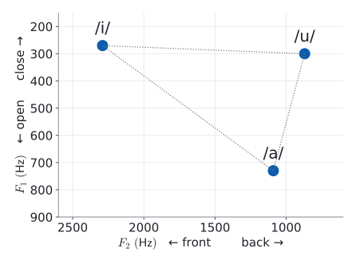
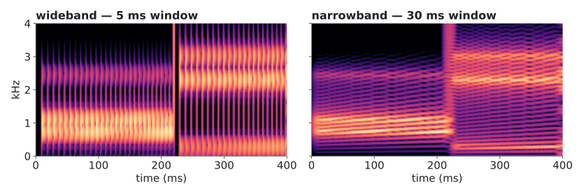
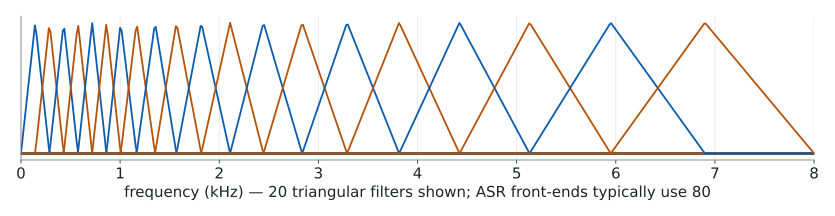
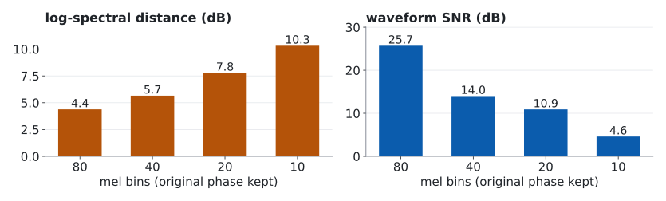

<!-- 此檔由 bin/publish_slides.py 從投影片正本產生（中文講稿區塊已剝除），請勿直接編輯。正本在 private repo 的 <course>/slides/。 -->

# From air to numbers {.section-title}

## Last week's $\Delta$ has to come from somewhere

Week 1 wrote algorithmic latency as $\ell \cdot \Delta$: a lookahead of $\ell$ frames, each $\Delta$ long. We never said who chooses $\Delta$.

Today we find out. Along the way we fix the vocabulary every later week depends on.

| Axis | This week's question |
|:--|:--|
| **Representation** | What do we keep when we turn a waveform into features — and what do we throw away? |
| **Latency** | Where do the frame shift $\Delta$ and the first few milliseconds of lookahead come from? |
| **Supervision** | None yet. Everything today is fixed signal processing. That changes in W5. |

## Sampling: a waveform becomes a list of numbers

$$x(n) = x_c(nT_s), \qquad f_s = 1/T_s$$

A sampled signal can represent frequencies only up to $f_s/2$ — the **Nyquist frequency**.

::: {.claim}
**16 kHz sampling means 8 kHz of bandwidth.** They are two different numbers, and they get mixed up constantly.
:::

- 8 kHz sampling → 4 kHz bandwidth: the telephone
- 16 kHz sampling → 8 kHz bandwidth: what most ASR models were trained on
- 24 or 48 kHz sampling: what TTS and audio-quality evaluation need

## Energy above $f_s/2$ does not disappear. It folds back.



A 7 kHz tone sampled at 8 kHz produces **exactly the same samples** as a 1 kHz tone — one line says why: at the sample instants $n$, $\cos\!\bigl(2\pi \tfrac{f}{f_s} n\bigr) = \cos\!\bigl(2\pi n - 2\pi \tfrac{f}{f_s} n\bigr) = \cos\!\bigl(2\pi \tfrac{f_s - f}{f_s} n\bigr)$. Nothing downstream can tell them apart.

So before lowering the sample rate, low-pass first. A good resampler does this for you; dropping every other sample does not.

::: {.footer}
Computed: alias $= f_s - f$ for $f_s/2 < f < f_s$ · w02-data.json → aliasing
:::

## Misconception — "a higher sample rate is always better"

The right sample rate depends on the task. The **wrong** one is whichever differs from what the model was trained on.

| What you did | What happens |
|:--|:--|
| Fed 44.1 kHz audio to a 16 kHz model without resampling | No error. Everything sounds slowed down to the model; accuracy collapses |
| Upsampled 8 kHz telephone speech to 16 kHz and called it wideband | No error. The top half of the spectrum is empty; the model has never seen that |
| Downsampled by dropping samples | No error. Aliasing, as on the last slide |

::: {.claim .warn}
None of these raises an exception. Sample-rate mismatch is the most common **silent** bug in a speech project.
:::

# How speech is made {.section-title}

## A tube and a buzzer

The vocal tract is a **tube whose shape you can change**, driven by a **periodic source** — the vocal folds.

- The buzzer sets how fast the pulses come: the fundamental frequency, $F_0$
- The tube decides which frequencies get through: its resonances are the **formants**
- Move your tongue and lips, and you reshape the tube. The buzzer does not care

We will stretch this picture all semester: a vocoder models the two parts separately (W8); voice cloning has to copy both (W9).

::: {.ask}
Every metaphor breaks somewhere. Keep a list of where this one does — we collect it in ten minutes.
:::

## The source–filter model in one line

$$s(n) = e(n) * h(n) \quad\Longleftrightarrow\quad S(\omega) = E(\omega)\,H(\omega)$$



::: {.claim}
**Convolution in time is multiplication in frequency.** We use this fact four times this semester; this is the first.
:::

::: {.footer}
Computed: synthetic /a/, $F_0 = 120$ Hz, idealised source tilt · w02-data.json → source_filter
:::

## Two formants are enough to tell vowels apart

::: {.columns}
::: {.column width="52%"}
{width="100%"}
:::
::: {.column width="48%"}
Vowels live in a two-dimensional space:

- $F_1$ tracks how **open** the mouth is
- $F_2$ tracks how far **forward** the tongue is

/i/, /a/, /u/ sit at the corners. Every other vowel is somewhere inside.

::: {.ask}
**Demo 1.** Say /a/ … /i/ … /u/. Then slide slowly from /i/ to /a/ and watch the dot.
:::
:::
:::

::: {.footer}
Reference points: Peterson & Barney, JASA 24:175–184, 1952 · adult male averages
:::

## The minimum phonetics you need for the next three weeks

| Term | What it means | Where it comes back |
|:--|:--|:--|
| **phone** | an acoustic event — what was physically produced | W5: what SSL units partly capture |
| **phoneme** | a contrastive unit *inside one language* — what distinguishes words | W3: what the HMM states model |
| **consonants** | three dimensions: **place**, **manner**, **voicing** | W3: decision-tree questions |
| **vowels** | two dimensions: height and backness → $F_1$, $F_2$ | today |

One phoneme, several phones: the /t/ in *top*, *stop* and *butter* are physically different sounds that English treats as the same unit.

::: {.claim}
A phone is physics. A phoneme is a decision made by a language. Confusing the two is why "discrete unit = phoneme" sounds plausible — and is wrong (W5).
:::

## Coarticulation: one fact, two weeks of the course

Articulators cannot jump. The gesture for each sound **overlaps** with its neighbours, so the same phone sounds different depending on what is next to it.

The /k/ in *key* and the /k/ in *coo* are made in different places — your tongue is already preparing the vowel.

| Week | What it does with this fact |
|:--|:--|
| **W3** HMM | writes the context into the unit itself: the **triphone** — /k/ between /s/ and /i/ is its own model |
| **W5** SSL | hides a stretch of audio and asks the model to predict it **from the context** — which works only because the context carries information about it |

::: {.claim}
The same physical fact is a nuisance for one generation of systems and the training signal for the next.
:::

## Anatomy of a stop: the shortest events in speech



- **closure** — the tract is shut; near silence, tens of milliseconds or more
- **burst** — the release; a few milliseconds
- **VOT** — from release until voicing starts; this is what separates ㄅ from ㄆ

::: {.claim .warn}
Look at the blue bar. One standard analysis window is longer than the burst and comparable to the VOT. Hold that thought.
:::

::: {.footer}
Schematic, synthetic signal · durations are illustrative, not measurements
:::

## Where the tube-and-buzzer picture breaks

1. **Fricatives and bursts have no periodic source.** /s/ is turbulence, not buzzing. Whisper has no $F_0$ at all
2. **The length of the tube belongs to the speaker.** A shorter vocal tract scales every formant up. So the filter carries *who*, not only *what*
3. **In a tone language, the source carries words.** Mandarin *mā / má / mǎ / mà* differ only in $F_0$

::: {.claim .warn}
"The source is who is speaking, the filter is what they say" is a simplification that quietly assumes English. For Mandarin, Taiwanese and Hakka it is wrong in both directions.
:::

Points 2 and 3 matter more than point 1, and they come back in W6, W9 and W12.

## LPC: the source–filter model you can actually compute

Model the tube as an **all-pole filter**, and predict each sample from the previous $p$:

$$H(z) = \frac{1}{1 - \sum_{i=1}^{p} a_i z^{-i}} \qquad\qquad \hat{s}(n) = \sum_{i=1}^{p} a_i\, s(n-i)$$

- The coefficients $a_i$ describe the **envelope** — the filter
- Whatever cannot be predicted, $s(n) - \hat{s}(n)$, is the **excitation** — the source
- The red dot in Demo 1 came from exactly this: solve for $a_i$, find the poles, read off the formants

It is the core of classical speech codecs (CELP, and the speech mode of Opus), and the starting point of LPCNet (W8).

# Seeing speech {.section-title}

## A spectrum is a set of inner products

Euler: $\; e^{j\theta} = \cos\theta + j\sin\theta$. A complex exponential is a cosine and a sine carried in one number.

The DFT asks, for each frequency $k$: **how much of this pattern is in my signal?**

$$X(k) = \langle \mathbf{x}, \mathbf{b}_k \rangle = \sum_{n=0}^{N-1} x(n)\, e^{-j2\pi kn/N}, \qquad \mathbf{b}_k(n) = e^{j2\pi kn/N}$$

The patterns are orthogonal, $\langle \mathbf{b}_k, \mathbf{b}_l \rangle = N\delta_{kl}$, so the $X(k)$ are coordinates in a new basis. Nothing is lost.

- $|X(k)|$ — the **magnitude**: how long the projection is
- $\angle X(k)$ — the **phase**: how far that pattern must be shifted to line up with the signal

## To analyse a moving signal, cut it into pieces

Speech changes every few tens of milliseconds, so one spectrum of the whole utterance is useless. Take short, overlapping pieces, and a spectrum of each:

$$X(m,k) = \sum_{n} x(n)\, w(n - mH)\, e^{-j2\pi kn/N}$$

| Symbol | Name | What it is |
|:--|:--|:--|
| $L$ | **window length** | how many samples $w$ covers — 25 ms is typical for ASR |
| $H$ | **hop** | how far the window moves each step — 10 ms is typical |
| $N$ | **FFT size** | how many frequency points we compute, $N \geq L$ |

::: {.claim}
Three knobs. They control three different things, and most confusion about spectrograms comes from mixing them up.
:::

## The window sets the frequency resolution

Cutting out a piece is **multiplying** by a window. Multiplication in time is **convolution in frequency** — our theorem again, the other way round. Every spectral line gets smeared into the shape below.



- Main-lobe width $\approx 2f_s/L$ (rectangular) or $4f_s/L$ (Hann): **longer window, finer resolution**
- Hann pays a main lobe **twice as wide** to push the side lobes from $-13$ dB down to $-31$ dB

::: {.footer}
Computed for a 25 ms window at 16 kHz, $L = 400$ · w02-data.json → window_mainlobe
:::

## Where $2f_s/L$ comes from

A rectangular window of $L$ samples is $L$ ones in a row. Its spectrum is a geometric sum:

$$W(f) = \sum_{n=0}^{L-1} e^{-j2\pi f n/f_s} \quad\Longrightarrow\quad |W(f)| = \left|\frac{\sin(\pi f L/f_s)}{\sin(\pi f/f_s)}\right|, \qquad \text{zero whenever } \tfrac{fL}{f_s} \in \{\pm 1, \pm 2, \dots\}$$

First zero at $f_s/L$, so the main lobe is $2f_s/L$ wide. Hann is $w(n) = \tfrac12 - \tfrac12\cos(2\pi n/L)$: the cosine is two complex exponentials, so its spectrum is **three copies** of $W$, shifted by $0$ and $\pm f_s/L$.



## Same sound, two window lengths

{width="100%"}

| | Wideband — 5 ms | Narrowband — 30 ms |
|:--|:--|:--|
| Main lobe (Hann) | 800 Hz | 133 Hz |
| You can see | **glottal pulses** as vertical stripes; **formants** as broad bands | individual **harmonics** as horizontal lines |

::: {.ask}
**Demo 1, again.** I freeze the display, then switch the window. It is the same two seconds of sound.
:::

::: {.footer}
Computed: synthetic /a/ → /i/, $F_0 = 105 \to 150$ Hz · w02-data.json → wide_narrow
:::

## What a 25 ms window cannot see

ASR's standard window sits toward the narrowband side, and it gives up something at **both** ends.

| Too slow for | Too coarse for |
|:--|:--|
| the **burst** of a stop — a few ms | two adjacent **harmonics** of a low voice: 160 Hz main lobe vs. $F_0 \approx 100$ Hz |
| **VOT** — the cue separating ㄅ from ㄆ | two **speakers** whose $F_0$ are close |

Remember the blue bar under the stop? That was this window.

::: {.claim}
25 ms is not the right answer. It is a compromise that happens to suit recognising words — and it quietly decides what every later layer is allowed to know.
:::

## Misconception — "a bigger `n_fft` gives better resolution"



Two tones 60 Hz apart. **Left → middle:** $N = 400 \to 4096$ — smoother, still one bump. **Middle → right:** $L = 25 \to 50$ ms — two peaks.

::: {.claim .warn}
Zero-padding samples the **same smeared spectrum** more densely. Only a longer window un-smears it.
:::

::: {.footer}
Computed: tones at 1000 and 1060 Hz, Hann window · w02-data.json
:::

## Hop sets the clock. The window sets the lookahead.



- The **hop** $H$ is the frame shift. Frame rate $= f_s / H$. **This is last week's $\Delta$**
- A frame stamped at time $t$ needs samples up to $t + L/2$. That is **lookahead**, paid before any model runs

| Knob | Decides |
|:--|:--|
| window $L$ | frequency resolution **and** lookahead |
| hop $H$ | frame rate — the clock every later layer ticks on |
| FFT size $N$ | spacing of the frequency points. Nothing else |

::: {.footer}
Schematic: 25 ms windows every 10 ms, time-stamped at their centre
:::

## Who decides the frame rate? The hop, times every stride after it



$$\text{frame rate} = \frac{f_s}{H \cdot \prod_i s_i}$$

::: {.claim}
Every stride $s_i$ slows the clock, and **nothing downstream can run faster than the clock it is given.** That is the first answer to *who decides the frame rate*.
:::

::: {.footer}
Arithmetic, not measurement · $4\times$ and 12.5 Hz are typical examples (W4, W6)
:::

## Why take the log

$$\log|S| = \log|E| + \log|H|$$

1. **Dynamic range.** Speech energy spans several orders of magnitude; perceived loudness is closer to logarithmic than linear
2. **Products become sums.** A microphone or a room multiplies the spectrum by some response $C(\omega)$. After the log, that is a **constant vector added to every frame**

Subtract each dimension's mean over the utterance, and most of the channel is gone. That is why mean normalisation (CMVN) works at all — it would be meaningless on a linear scale.

::: {.ask}
Third time today that a product turned into a sum. It will not be the last.
:::

## The ear is a filterbank, and mel is its engineering sketch

{width="100%"}

The cochlea analyses sound with filters that get **wider as frequency goes up**. Mel imitates that: narrow triangles at the bottom, wide ones at the top.

$$m = 2595 \log_{10}\!\left(1 + \frac{f}{700}\right) \qquad\qquad \mathbf{y}_m = \log\!\left(\mathbf{M}\,|\mathbf{X}_m|^2 + \epsilon\right)$$

- $\mathbf{M}$ is a fixed matrix, about $80 \times 257$: **257 frequency points in, 80 numbers out**
- The mel scale is a **psychoacoustic approximation**, fitted to listening experiments. It is not physics

::: {.footer}
Mel scale: Stevens, Volkmann & Newman, JASA 8(3):185–190, 1937 · 20 of 80 filters
:::

## Masking: what the ear cannot hear, codecs do not send



A strong component raises the hearing threshold around it: a weaker one nearby can be **present and inaudible**.

- **MP3, AAC, Opus** spend no bits on what is masked — a psychoacoustic model written by hand
- **Neural codecs (W6)** have no such model; their losses push them there **indirectly**

::: {.footer}
Schematic · curve shapes are illustrative, not a psychoacoustic model
:::

## Misconception — "MFCC carries more information than log-mel"

MFCC is log-mel, plus **one more linear step that throws things away**:

$$\text{log-mel (80 dims)} \;\xrightarrow{\;\text{DCT}\;}\; \text{keep the first 13 coefficients} \;=\; \text{MFCC}$$

- The DCT **decorrelates** the dimensions. Truncating it keeps the smooth spectral envelope and drops the fine detail
- That was exactly right for GMMs with **diagonal covariance**, which assume uncorrelated dimensions
- A neural network does not need decorrelated inputs, and can use the detail MFCC discarded

::: {.claim}
MFCC did not lose to log-mel because it was worse. The classifier changed, and the reason for the last step disappeared.
:::

::: {.footer}
MFCC: Davis & Mermelstein, IEEE Trans. ASSP 28(4):357–366, 1980
:::

## Misconception — "a spectrogram is just an image"

It looks like one, and image models do work on it — up to a point.

| | Natural image | Spectrogram |
|:--|:--|:--|
| Shift a pattern **horizontally** | same object, elsewhere | same sound, later — **fine** |
| Shift a pattern **vertically** | same object, elsewhere | a **different** vowel, or a different speaker |
| The two axes | same kind of quantity | **time** and **frequency** — not interchangeable |
| Two objects overlap | one hides the other | they **add**; both are still there |

::: {.claim}
Translation invariance holds along time and **fails** along frequency. An architecture that treats both axes alike is assuming something false.
:::

# What the spectrogram throws away {.section-title}

## Listen first

One sentence, five seconds. I will play it three ways.

::: {.ask}
**Demo 2.** Do not try to explain what you hear yet. Just write down one word for each version.
:::

We kept $|X(m,k)|$ — the picture. We have not yet asked what happened to the other half of every complex number.

## Not every matrix is a spectrogram

Neighbouring frames **overlap**: with a 25 ms window and a 10 ms hop, each sample is analysed by two or three frames. So the STFT is **redundant** — a signal of $T$ samples becomes far more than $T$ numbers.

Redundant means constrained. Pick a complex matrix at random, and almost surely **no signal has it as its STFT**.

$$\mathcal{C} = \bigl\{\, \mathbf{X} \;:\; \mathbf{X} = \mathrm{STFT}\bigl(\mathrm{ISTFT}(\mathbf{X})\bigr) \bigr\} \qquad \text{the \textbf{consistent} spectrograms}$$

::: {.claim}
A real magnitude with a made-up phase is, in general, **not** in $\mathcal{C}$. Convert it to audio and analyse that audio again: you do not get back what you started with.
:::

## Griffin–Lim: bounce between two sets

::: {.columns}
::: {.column width="54%"}

:::
::: {.column width="46%"}
We want a matrix that is in **both** sets:

- $\mathcal{A}$ — it has the magnitude we were given
- $\mathcal{C}$ — it is the STFT of an actual signal

Start anywhere in $\mathcal{A}$. Then alternate:

1. go to the nearest point of $\mathcal{C}$: ISTFT, then STFT
2. go back to $\mathcal{A}$: keep the new phase, restore the magnitude
:::
:::

$$\hat{x}^{(i+1)} = \mathrm{ISTFT}\!\left(\mathbf{A} \odot e^{\,j\angle\, \mathrm{STFT}(\hat{x}^{(i)})}\right)$$

::: {.footer}
Griffin & Lim, IEEE Trans. ASSP, 1984 · the drawing is a two-dimensional cartoon
:::

## What Griffin and Lim proved — and what they did not

Define how far a magnitude-constrained matrix $\mathbf{C}$ is from being consistent:

$$\text{inconsistency} = \frac{\lVert \mathbf{C} - P(\mathbf{C}) \rVert_F^2}{\lVert \mathbf{C} \rVert_F^2}, \qquad P = \mathrm{STFT}\circ\mathrm{ISTFT}$$

- **Proved:** it **never increases** from one iteration to the next. So the algorithm converges
- **Not proved, and not true:** that it reaches zero. $\mathcal{A}$ is **not convex**, so it can settle where no small move helps — a local solution

::: {.claim .warn}
Griffin–Lim converges. It is **not guaranteed to converge to a consistent spectrogram.** That residual is what you hear as the metallic edge.
:::

## Why the inconsistency cannot go up

Write one round as two nearest-point moves. $\mathbf{C}_i \in \mathcal{A}$ is the magnitude-constrained matrix; $\mathbf{X}_i = P(\mathbf{C}_i) \in \mathcal{C}$ is its projection; $d_i = \lVert \mathbf{C}_i - \mathbf{X}_i \rVert_F$.

::: {.fragment fragment-index="1"}
**Back to $\mathcal{A}$ is a nearest-point move.** Keeping the phase of $\mathbf{X}_i$ and restoring the magnitude picks, entry by entry, the point on each circle closest to $\mathbf{X}_i$. So $\lVert \mathbf{C}_{i+1} - \mathbf{X}_i \rVert_F \leq \lVert \mathbf{C}_i - \mathbf{X}_i \rVert_F = d_i$.
:::

::: {.fragment fragment-index="2"}
**Back to $\mathcal{C}$ is a nearest-point move.** With the least-squares ISTFT, $P$ is the orthogonal projection onto $\mathcal{C}$, and $\mathbf{X}_i$ is already in $\mathcal{C}$. So $d_{i+1} = \lVert \mathbf{C}_{i+1} - P(\mathbf{C}_{i+1}) \rVert_F \leq \lVert \mathbf{C}_{i+1} - \mathbf{X}_i \rVert_F$.
:::

::: {.fragment fragment-index="3"}
$$d_{i+1} \;\leq\; \lVert \mathbf{C}_{i+1} - \mathbf{X}_i \rVert_F \;\leq\; d_i, \qquad \text{and } \lVert \mathbf{C}_i \rVert_F = \lVert \mathbf{A} \rVert_F \text{ for every } i$$

Bounded below by zero and never increasing: it converges.
:::

::: {.claim .warn}
The shape of $\mathcal{A}$ never entered. Two nearest-point moves guarantee the distance cannot grow — they promise nothing about it reaching zero, and for a non-convex $\mathcal{A}$ it usually does not.
:::

## Measured on the sentence you just heard



::: {.metrics}
::: {.metric}
[0.698]{.num}[inconsistency with random phase]{.lab}
:::
::: {.metric .good}
[monotone]{.num}[it went down at every one of 256 iterations]{.lab}
:::
::: {.metric .bad}
[0.0041]{.num}[after 256 iterations — still not zero]{.lab}
:::
:::

::: {.footer}
One 5 s utterance · 25 ms / 10 ms, no momentum · orders of magnitude, not benchmarks
:::

## Turn the knob

::: {.ask}
**Demo 2, again.** Same magnitude every time. The only thing that changes is how many times we bounced.
:::

| Key | Iterations | Listen for |
|:--|:--|:--|
| `3` | 0 — random phase | what total inconsistency sounds like |
| `[` `]` then `2` | $1 \to 4 \to 16 \to 64 \to 256$ | the metallic edge fading — **and not quite going away** |
| `0` | — | the original, for reference |

Then press `c`: the curve you just saw, computed live.

::: {.claim}
After 256 iterations you can still tell it from the original on laptop speakers. The remaining error is small in the numbers and audible in the room.
:::

## The information was there all along

If throwing away phase destroyed information, no algorithm could recover it. But the overlap that makes the STFT redundant also means the magnitudes of neighbouring frames **constrain each other**.

::: {.claim}
With enough overlap, and under mild conditions on the signal, the STFT magnitude **determines the signal uniquely — up to a global sign.**
:::

So Griffin–Lim does not fail because the answer is missing. It fails because finding it is a **non-convex search**, and alternating projection is a weak way to search.

That distinction matters: an information-theoretic loss cannot be fixed. An algorithmic one can — by a better algorithm, or by a network trained to do the search (W8).

::: {.footer}
Nawab, Quatieri & Lim, IEEE Trans. ASSP 31(4):986–998, 1983
:::

## The second loss: mel is a wide matrix

$$\underbrace{\mathbf{y}_m}_{80} = \underbrace{\mathbf{M}}_{80 \times 257}\; \underbrace{|\mathbf{X}_m|^2}_{257}$$

257 numbers in, 80 out: many spectra give the same $\mathbf{y}_m$. The pseudo-inverse returns the smoothest — at high frequencies **the harmonics are gone for good**.

{width="100%"}

::: {.ask}
**Demo 2.** Keys `4`, then `a` `s` `d` `f`. The phase is the **original**, so phase did not do it.
:::

::: {.footer}
Same 5 s utterance, original phase kept · w02-data.json → demo2
:::

## Two factors, pulled apart

Log-spectral distance from the original, in dB. Same utterance throughout.

::: {.prose}
| Magnitude ╲ Phase | original | Griffin–Lim $\times 256$ | random |
|:--|:-:|:-:|:-:|
| **linear** | 0.00 | 1.74 | 8.47 |
| **mel-80 → linear** | 4.38 | 6.35 | 9.07 |
:::

- Read **across** a row: that is what phase costs
- Read **down** a column: that is what mel costs
- The old three-way demo — original, Griffin–Lim, random — only ever showed you the top row

::: {.claim}
A TTS system that predicts a mel-spectrogram and then runs Griffin–Lim lives in the **bottom-middle cell**. It pays both costs at once, and you cannot tell which one you are hearing.
:::

::: {.footer}
One utterance · LSD compares magnitudes only, so it understates the cost of phase
:::

## A free preview: waveform SNR does not track what you hear



As Griffin–Lim iterates, the spectrum gets closer to the original and the sound gets better. The **waveform SNR stays below 0 dB the whole time** — the "noise" has more energy than the signal.

::: {.claim .warn}
SNR compares waveforms sample by sample, so it is extremely sensitive to phase. The ear is not. A metric can be precise, well-defined, and measuring the wrong thing.
:::

::: {.footer}
Same utterance · w02-data.json → demo2.lin_lsd_db, demo2.lin_snr_db
:::

## Misconception — "a vocoder exists to put the phase back"

That is one third of the job. A neural vocoder that takes a **predicted mel-spectrogram** has to do three things at once:

| | What is wrong with the input | Kind of loss |
|:--|:--|:--|
| **1** | no phase | **algorithmic** — the information is mostly there; finding it is hard |
| **2** | mel, not linear: fine structure above a few kHz is gone | **informational** — it must be *invented* plausibly |
| **3** | the mel was **predicted**, so it is over-smoothed — an average of many plausible outputs | **statistical** — it must be *sharpened* (W8) |

::: {.claim}
Griffin–Lim addresses only the first, and only partly. That is why it sounds metallic even on a perfect magnitude, and why it was replaced — not because phase is unrecoverable.
:::

## The same idea, twice more this semester

**W10 — enhancement by masking.** A network predicts a mask and multiplies the noisy STFT by it. The result is a matrix that nobody checked for consistency. In general it is **not** the STFT of any signal, and the ISTFT quietly averages the contradiction away.

**W8 — vocoders built on the inverse STFT.** One family of neural vocoders predicts a magnitude **and** a phase for each frame, then applies a plain ISTFT. Predicting phase directly is awkward because phase **wraps** — $-\pi$ and $+\pi$ are the same angle but far apart as numbers — and much of the design is about getting around that.

::: {.claim}
"Is this matrix actually a spectrogram?" is a question you can now ask of any system that edits or generates in the time–frequency domain.
:::

# Above the segment {.section-title}

## Prosody has three acoustic handles

Everything so far described **segments**: this vowel, that stop. Some properties stretch across many segments — hence **suprasegmental**.

| Handle | What you measure | What it carries |
|:--|:--|:--|
| **$F_0$** | rate of vocal-fold vibration, per frame | lexical tone, intonation, emphasis, emotion |
| **duration** | how long each segment lasts | stress, phrase boundaries, speaking rate, hesitation |
| **energy** | amplitude per frame | stress, emphasis, how a phrase trails off |

::: {.claim}
When a later week says "prosody" — controlling it (W9), or using it to predict the end of a turn (W12) — it means these three curves and nothing more mysterious.
:::

## Misconception — "$F_0$ and pitch are the same thing"

| | $F_0$ | pitch |
|:--|:--|:--|
| What it is | a **physical** quantity: the rate at which the vocal folds open and close | a **perceptual** quantity: how high a sound seems to a listener |
| Where it lives | in the signal | in the listener |
| When there is no voicing | **undefined** — there is nothing to measure | can still be perceived |

Whisper has no $F_0$ at all. Listeners still hear a question as a question.

::: {.claim}
Algorithms estimate $F_0$. Papers often call the result "pitch". When the two come apart — whisper, creaky voice, a missing fundamental on a telephone line — it matters which one was meant.
:::

## Cepstrum: pulling source and filter apart

After the log, source and filter **add**. The envelope varies slowly along the frequency axis; the harmonics ripple quickly. So take a Fourier transform *of the log-spectrum* and they land in different places:

$$c(n) = \mathrm{IDFT}\bigl\{\log|X(k)|\bigr\}$$



::: {.footer}
Computed: synthetic /a/, true $F_0 = 125$ Hz, peak at $8.0$ ms $= 1/125$ s · w02-data.json
:::

## $F_0$ estimation fails in two characteristic ways

Three families of method: the **cepstral peak**, the **autocorrelation peak**, and refinements of autocorrelation such as YIN. All share the same two failure modes.



1. **Octave error.** A signal with period $T$ also repeats every $2T$. Pick the wrong peak and you report $F_0/2$ — or $2F_0$
2. **Voicing decision.** Is there an $F_0$ in this frame at all? Every tracker hides a threshold

::: {.footer}
Same frame: $220.2$ Hz with a 400 Hz ceiling, $110.1$ Hz with 150 Hz · w02-data.json
:::

## See it: tones, and then a question

::: {.ask}
**Demo 1, third time.** Watch the blue dots — that is the $F_0$ track.
:::

1. One syllable, four tones: **mā má mǎ mà**
2. A short sentence as a **statement**. Then the same words as a **question**
3. Switch to narrowband (`n`): the harmonics fan out and close up as $F_0$ moves — the same information, seen a second way

Look for two things: does each tone keep its **shape** when the sentence becomes a question? And what happens to the **last syllable**?

## Tone and intonation share one curve



In English, $F_0$ is almost entirely free to carry **intonation** — statement or question, emphasis, attitude. In Mandarin, Taiwanese and Hakka, $F_0$ is **already taken** by the words. Intonation has to ride on top.

- Taiwanese adds **tone sandhi**: a syllable's tone changes with its position in the phrase
- One number per frame carries the **word**, the **sentence type**, the **emphasis** and the **mood**

::: {.footer}
Schematic · left: Chao tone numerals (Mandarin) · right: a cartoon, not data
:::

## Misconception — "the source is the speaker, the filter is the content"

Two counter-examples, one in each direction. You have now seen both on screen.

| Claim | Counter-example | Where you saw it |
|:--|:--|:--|
| "The filter carries **what** is said" | Vocal-tract **length** scales every formant — and it belongs to the **speaker** | Demo 1: a different speaker's dot lands elsewhere for the same vowel |
| "The source carries **who** and **how**" | **Lexical tone** lives in $F_0$ — and it is **content** | Demo 1: mā / má / mǎ / mà |

::: {.claim .warn}
Source and filter are separate **mechanisms**. They are not separate **kinds of information**. Any method that "disentangles content from speaker" by splitting along this line is making an assumption — check it against your language.
:::

## Three predictions for later weeks

If $F_0$ carries words, methods that grew up on English may behave differently on Mandarin, Taiwanese and Hakka:

| Week | The English-default statement | What it might mean for a tone language |
|:--|:--|:--|
| **W6** | "Semantic tokens flatten the intonation; content survives" | Flattening $F_0$ may remove **lexical content**, not just expressiveness |
| **W9** | "Prosody control: move $F_0$ freely" | $F_0$ cannot move freely without **changing the words** |
| **W12** | "Falling pitch signals the end of a turn" | The final syllable's own tone is **mixed into** that cue |

::: {.claim .warn}
These are **predictions to check**, not established results. Each is a possible project, and together they give concrete shape to the research gap from Week 1.
:::

# Same name, different features {.section-title}

## "Log-mel" is not one thing



Two "80-dim log-mel" front-ends can differ in the **mel scale** (HTK, or Slaney — `librosa`'s default), the **filter normalisation**, power vs. magnitude, the log **floor**, **dither**, **pre-emphasis**, and how the result is **normalised**.

::: {.claim .warn}
Feed a pretrained model features built with the wrong recipe and nothing crashes. It just gets quietly worse.
:::

::: {.footer}
Computed: 80 filters, 0–8 kHz · largest gap 262 Hz, at filter 64 · w02-data.json
:::

## An experiment we have not run yet

**Demo 3, as a plan.** Same audio, same pretrained recogniser. Change only the front-end recipe — swap the mel scale, or drop the filter normalisation — and measure the word error rate.

::: {.ask}
Predict before anyone measures: does WER move a little, or a lot? Does it depend on which knob?
:::

This is the first of the four questions from Week 1, in its most concrete form:

::: {.claim}
**Is the input the same?** Two papers that both report "80-dim log-mel, 25 ms / 10 ms" have not told you enough to know.
:::

We will run it once the toolchain for this laptop is settled, and bring the numbers back.

## SNR, and the metric W10 will use instead

$$\mathrm{SNR} = 10\log_{10}\frac{\lVert \mathbf{s} \rVert^2}{\lVert \mathbf{s} - \hat{\mathbf{s}} \rVert^2}$$

**Segmental SNR** computes this per short frame and averages the dB values, so a loud vowel cannot hide a ruined consonant.

Both punish any change of overall gain. Separation papers use a version that does not:

$$\mathrm{SI\text{-}SDR} = 10\log_{10}\frac{\lVert \alpha\mathbf{s} \rVert^2}{\lVert \alpha\mathbf{s} - \hat{\mathbf{s}} \rVert^2}, \qquad \alpha = \frac{\hat{\mathbf{s}}^{\top}\mathbf{s}}{\lVert \mathbf{s} \rVert^2}$$

$\alpha\mathbf{s}$ is the **projection** of the estimate onto the reference: the $\alpha$ that minimises $\lVert \alpha\mathbf{s} - \hat{\mathbf{s}} \rVert^2$ satisfies $\alpha \lVert \mathbf{s} \rVert^2 = \hat{\mathbf{s}}^{\top}\mathbf{s}$. Inner products and projections — for the third time today.

::: {.claim}
None of these predicts word error rate, and you have already heard why: they compare waveforms, and neither ears nor recognisers do.
:::

## Three ways to represent the same half second



| | Size $\times$ rate | Values | Where it comes from |
|:--|:--|:--|:--|
| **log-mel** | $80 \times 100$ Hz | continuous | fixed — **today** |
| **SSL feature** | hundreds $\times\ 50$ Hz | continuous | learned — **W5** |
| **codec tokens** | a few $\times$ 12.5–50 Hz | **discrete** | learned, quantised — **W6** |

## What this week put on the three axes

::: {.prose}
| Axis | What we now know |
|:--|:--|
| **Representation** | The spectrogram drops phase; mel drops fine detail. The first loss is algorithmic and recoverable. The second is informational and is not. |
| **Latency** | The hop sets the clock, $\Delta = H$. The window adds $L/2$ of lookahead. Every later stride slows the clock further. |
| **Supervision** | None. Every number today was chosen by a person — which is why "log-mel" is not one thing. |
:::

::: {.claim}
The front-end decides what every later layer is allowed to know. It is the cheapest part to compute, and the most expensive to get wrong.
:::

## Reading, and next week

**Read this week**

- Jurafsky & Martin, *Speech and Language Processing*, 3rd ed. draft, **Ch 15** *Phonetics and Speech Feature Extraction* — both halves
- Huang, Acero & Hon, *Spoken Language Processing*, **Ch 2, 5, 6** — if you want the derivations we skipped: cepstrum, LPC, source–filter

**If one thing today was new to you, make it this one**

- Griffin & Lim, *Signal Estimation from Modified Short-Time Fourier Transform*, IEEE Trans. ASSP, 1984 — short, readable, and the alternating-projection idea outlives the application

**Next week — the alignment problem: from HMM to CTC**

We have 100 frames per second. A sentence has perhaps a dozen phonemes per second. Nobody tells us which frames belong to which phoneme. That gap is the subject of Week 3.
