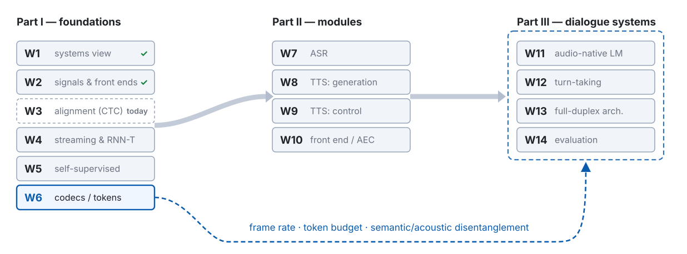

<!-- 此檔由 bin/publish_slides.py 從投影片正本產生（中文講稿區塊已剝除），請勿直接編輯。正本在 private repo 的 <course>/slides/。 -->

# The gap between frames and symbols {.section-title}

## Where we are: week 3 of 14

{width="100%"}

## Last week, in one picture



::: {.claim}
**Week 2 gave us the clock.** Nobody gave us what each tick belongs to — and that gap is the whole of this week.
:::

::: {.footer}
Settings from W2 · 16 kHz · 25 / 10 ms · 80 mel · phone rate is an order of magnitude
:::

## The same gap, in symbols — and on the three axes

Week 2 left us with **100 feature vectors per second**, $\mathbf{X} = (\mathbf{x}_1, \dots, \mathbf{x}_T)$. The training data gives each clip **one line of text**, $\ell = (\ell_1, \dots, \ell_U)$ — and nothing in between.

| Axis | This week's question |
|:--|:--|
| **Supervision** | How do you train on $(\mathbf{X}, \ell)$ when nobody says which frames belong to which symbol? |
| **Representation** | The label unit and the frame rate now constrain each other. Who gives way? |
| **Latency** | If every frame emits on its own, streaming is free — what did we pay for it? |

## Demo 1 — the same sentence, twice as fast



::: {.ask}
**Demo 1.** One volunteer, one sentence, normal speed and then double speed. Before the plots appear: which numbers change, and which stay the same?
:::

::: {.footer}
Demo 1 · two takes, starts aligned · one spectrogram column = one 10 ms frame
:::

## The problem this week handles, in one picture



::: {.claim}
Speech recognition is **sequence supervision under an unknown alignment**. Every method this week is a way of handling that hidden variable.
:::

::: {.footer}
Today's route: remedial → HMM (road 1) → CTC (road 2) · attention (road 3) is W4
:::

## Five things to leave with today

1. **HMM forward and Viterbi are one recursion in two semirings** — sum gives the probability of the sequence, max gives one best alignment, and they are not interchangeable.
2. **CTC in full**: the extended sequence $\ell'$, the collapsing map $\mathcal{B}$, the recursion and its third term, the boundaries, $P(\ell \mid \mathbf{X}) = \alpha_T(S) + \alpha_T(S-1)$, and the exact condition for zero probability, $T < U + r$.
3. **The gradient is $y^t_k - \gamma_t(k)$**: a per-frame cross-entropy whose target is a soft alignment posterior. That one line explains the link to hybrid training and where peaky outputs come from.
4. **Conditional independence** — what the encoder sees versus what the outputs share are two different things.
5. **CTC is an HMM with a special topology**, and the three alignment families differ in inductive bias, not in kind.

# Remedial: probability in four lines {.section-title}

## Marginalisation: sum out what you cannot see

$$P(\ell \mid \mathbf{X}) \;=\; \sum_{\pi} P(\ell, \pi \mid \mathbf{X})$$

$\pi$ is the thing we never observe — **the alignment**. If we cannot know it, we add up every value it could take.

::: {.claim}
Every equation today has this shape: a probability we want, written as a **sum over a hidden alignment**. The only question is how to do the sum without enumerating it.
:::

- A hidden variable is not a nuisance to be guessed away; it is a dimension to be summed.
- The sum has exponentially many terms. Dynamic programming is what makes today possible.

## Chain rule, then conditional independence

$$P(\pi \mid \mathbf{X}) \;=\; \prod_{t=1}^{T} P(\pi_t \mid \pi_{1:t-1}, \mathbf{X}) \;\;\xrightarrow{\;\text{assume}\;}\;\; \prod_{t=1}^{T} P(\pi_t \mid \mathbf{X}) \;=\; \prod_{t=1}^{T} y^t_{\pi_t}$$

The chain rule is exact. The arrow is an **assumption**: given $\mathbf{X}$, the symbol at frame $t$ does not depend on the symbols at other frames.

::: {.claim .warn}
**This line is the whole assumption of CTC.** Every pathology in the last hour of today — no output language model, homophones, peaky spikes — comes back to this arrow.
:::

$y^t_k$ is the network's softmax output for symbol $k$ at frame $t$. The network sees all of $\mathbf{X}$; the outputs see nothing of each other.

## Log domain: products become sums, sums become log-sum-exp

$$\ln \prod_t y^t_{\pi_t} = \sum_t \ln y^t_{\pi_t}, \qquad \ln \sum_i e^{a_i} \;=\; a^{*} + \ln \sum_i e^{a_i - a^{*}}, \quad a^{*} = \max_i a_i$$

- A product of $T$ probabilities shrinks like $c^T$. In float64 it reaches **zero** long before $T$ reaches a sentence.
- Subtracting $a^{*}$ first keeps every exponent $\leq 0$: no overflow, and the largest term is computed exactly.
- **Example.** Two paths with $\ln p = -1000$ and $-1001$. Naively: $e^{-1000} = 0$ in float64, so $\ln(0 + 0) = -\infty$. With $a^{*} = -1000$: $-1000 + \ln(1 + e^{-1}) = -1000 + 0.313 = -999.687$.

::: {.claim}
Two operations cover every algorithm today: **$(+, \times)$ in probability space is $(\operatorname{logsumexp}, +)$ in log space**, and $(\max, \times)$ is $(\max, +)$.
:::

## Notation for today

| Symbol | Meaning |
|:--|:--|
| $\mathbf{x}_t \in \mathbb{R}^d$, $\mathbf{X} = (\mathbf{x}_1, \dots, \mathbf{x}_T)$ | frame vectors from the W2 front-end; $T$ frames |
| $\ell = (\ell_1, \dots, \ell_U)$, $U = \lvert \ell \rvert$ | the transcript, over vocabulary $\mathcal{V}$ |
| $\varnothing$, $\mathcal{V}' = \mathcal{V} \cup \{\varnothing\}$ | the blank, and the output alphabet with it |
| $\ell'$, $S = 2U + 1$ | $\ell$ with a blank before, between and after every label |
| $\pi \in \mathcal{V}'^{\,T}$ | a path: one output symbol per frame |
| $\mathbf{u}^t$, $\mathbf{y}^t = \operatorname{softmax}(\mathbf{u}^t)$, $y^t_k$ | logits, softmax, and one entry of it at frame $t$ |
| $\mathcal{L}_{\text{CTC}} = -\ln P(\ell \mid \mathbf{X})$, $\gamma_t(k)$ | the loss, and the alignment posterior $P(\pi_t = k \mid \ell, \mathbf{X})$ |
| $q_t \in \{1, \dots, N\}$, $\pi_i$, $a_{ij}$, $b_j(\mathbf{x}_t)$ | HMM side: state, initial, transition, emission |
| $m$ | encoder lookahead in frames when streaming (W1 wrote it $\ell$; today $\ell$ is the transcript) |

::: {.footer}
Logs are $\ln$ throughout · $L$ is not used today: W2 gave it to the window length
:::

# The HMM in forty minutes {.section-title}

## One model, three problems, one lattice

$$P(\mathbf{X} \mid W) \;=\; \sum_{q} \pi_{q_1}\, b_{q_1}(\mathbf{x}_1) \prod_{t=2}^{T} a_{q_{t-1} q_t}\, b_{q_t}(\mathbf{x}_t)$$

$q = (q_1, \dots, q_T)$ is the hidden state sequence — **it is the alignment**. $W$ fixes the topology: a chain of states per phone, left to right.

| Rabiner's problem | Question | Algorithm |
|:--|:--|:--|
| Evaluation | How likely is $\mathbf{X}$ under this $W$? | forward |
| Decoding | Which state sequence best explains $\mathbf{X}$? | Viterbi |
| Learning | Which $a_{ij}$, $b_j$ make the data most likely? | Baum–Welch (forward–backward) |

::: {.footer}
Rabiner, *Proc. IEEE* 1989 · generative: the model explains the audio, given the words
:::

## Forward: add every way of arriving



$$\alpha_t(j) = b_j(\mathbf{x}_t) \sum_{i} \alpha_{t-1}(i)\, a_{ij}, \qquad \alpha_1(j) = \pi_j\, b_j(\mathbf{x}_1), \qquad P(\mathbf{X} \mid W) = \sum_j \alpha_T(j)$$

::: {.footer}
$O(TN^2)$ instead of $N^T$ · the lattice is the alignment space drawn as a grid
:::

## Viterbi is forward with the sum replaced by max

$$\delta_t(j) = b_j(\mathbf{x}_t)\, \max_{i}\, \delta_{t-1}(i)\, a_{ij}, \qquad \text{then backtrack the argmax.}$$

| Space | "add every way" | "keep the best way" | Gives |
|:--|:--|:--|:--|
| probability | $(+, \times)$ | $(\max, \times)$ | forward / Viterbi |
| log | $(\operatorname{logsumexp}, +)$ | $(\max, +)$ | what the code actually runs |

::: {.claim}
**Same lattice, same recursion, different semiring.** This week: HMM and CTC. W4: the RNN-T lattice. W7: prefix beam search. You will see this table three more times.
:::

## Misconception 1 — "forward gives the probability of the best alignment"

Forward is a **sum** over every alignment. Viterbi is a **max** over them. The two numbers answer different questions:

- $\sum_q P(\mathbf{X}, q \mid W)$ — how likely is the audio under the *words*
- $\max_q P(\mathbf{X}, q \mid W)$ — how likely is the audio under the *single best state sequence*

::: {.claim .warn}
The best single alignment usually carries a **small fraction** of the total. And the argmax over paths need not agree with the argmax over label sequences — many weak paths can outvote one strong one.
:::

## Why triphones, and why tying

Week 2's fact: articulators cannot jump, so a phone sounds different depending on its neighbours.

**The HMM's answer**: write the neighbours into the unit. A **triphone** /s-k+i/ is its own model, distinct from /u-k+o/.

- The count explodes: with $\sim$ 40 phones, $40^3 = 64{,}000$ triphones, each with several states — most never seen in training.
- **Tying** shares parameters across states that behave alike. A decision tree asks phonetic questions ("is the left neighbour a nasal?") and groups the leaves.

::: {.claim}
The unit absorbs the context because the model cannot: an HMM state sees one frame, and the outputs are conditionally independent given the state. Remember that sentence — it returns for CTC.
:::

::: {.footer}
Gales & Young, *FnT Signal Processing* 2008 · tying: Young, Odell & Woodland 1994
:::

## The hybrid recipe, and the bootstrap it needs

| Step | What happens | Where the alignment comes from |
|:--|:--|:--|
| 1 | Train a GMM–HMM on $(\mathbf{X}, W)$ | summed out (Baum–Welch) |
| 2 | Run **forced alignment**: Viterbi through the known words | one hard path per utterance |
| 3 | Train a DNN with **per-frame cross-entropy** against those state labels | fixed, from step 2 |
| 4 | Use DNN posteriors as scaled emissions $b_j(\mathbf{x}_t) \propto P(j \mid \mathbf{x}_t) / P(j)$ | — |
| 5 | Optionally realign with the DNN and repeat step 3 | new hard path |

::: {.claim .warn}
You need a working recogniser before you can train the recogniser. The targets are **hard** — one state per frame — and they are only as good as the model that produced them.
:::

::: {.footer}
Hybrid DNN–HMM · YD Ch 3–6 · the bootstrap is what CTC removes
:::

## Misconception 2 — "HMMs are obsolete, skip them"

- **W4** — the RNN-T lattice is a two-dimensional version of today's grid, and its forward is the same recursion.
- **W7** — prefix beam search for CTC is forward over *label prefixes* instead of paths.
- **W13** — the finite-state route to full duplex is a decoding problem on a state machine: which state is the conversation in, given the audio so far?
- **W10 / W12** — a semantic endpoint decision is a Viterbi-style question with a latency constraint.

::: {.claim}
The HMM is not a system you will deploy. It is the **grammar of every alignment algorithm** you will read for the rest of this course.
:::

# CTC: marginalise the alignment {.section-title}

## The trick: one extra symbol, and a collapsing map



$\mathcal{B}$ maps a path of length $T$ to a label sequence: **merge adjacent repeats, then delete every $\varnothing$.**

::: {.footer}
Graves et al., ICML 2006 · the blank is bookkeeping: "no new label at this frame"
:::

## Paths: write them out before the program does

::: {.ask}
**Demo 2, first half — on paper first.** Vocabulary $\{a, b\}$ plus $\varnothing$. Write every path of length $T = 3$ that collapses to **"aa"**, and every one that collapses to **"aba"**. Then $T = 4$ for "aa".
:::

::: {.fragment}
| $\ell$ | $T$ | paths in $\mathcal{B}^{-1}(\ell)$ | count |
|:--|:--|:--|:--|
| aa | $2$ | — | $0$ |
| aa | $3$ | $\mathsf{a}\varnothing\mathsf{a}$ | $1$ |
| aba | $3$ | $\mathsf{aba}$ | $1$ |
| aa | $4$ | $\mathsf{aa}\varnothing\mathsf{a}$ · $\mathsf{a}\varnothing\mathsf{aa}$ · $\mathsf{a}\varnothing\mathsf{a}\varnothing$ · $\mathsf{a}\varnothing\varnothing\mathsf{a}$ · $\varnothing\mathsf{a}\varnothing\mathsf{a}$ | $5$ |
| ab | $4$ | $\mathsf{aaab}$ · $\mathsf{aabb}$ · $\mathsf{aab}\varnothing$ · … · $\varnothing\varnothing\mathsf{ab}$ | $15$ of $3^4 = 81$ candidates |
:::

::: {.footer}
Demo 2 · pure numpy, live · counts: w03-data.json → paths
:::

## Two equations that are the same equation

| | HMM | CTC |
|:--|:--|:--|
| what is modelled | $P(\mathbf{X} \mid W)$ — generative | $P(\ell \mid \mathbf{X})$ — discriminative |
| the hidden alignment | state sequence $q$ | path $\pi$ |
| the sum | $\displaystyle\sum_{q} \pi_{q_1} b_{q_1}(\mathbf{x}_1) \prod_{t=2}^{T} a_{q_{t-1}q_t} b_{q_t}(\mathbf{x}_t)$ | $\displaystyle\sum_{\pi \in \mathcal{B}^{-1}(\ell)} \prod_{t=1}^{T} y^t_{\pi_t}$ |
| per-frame factor | transition $\times$ emission | softmax output, nothing else |

::: {.claim}
Both are **a sum over alignments of a product over frames**. CTC has no transition term and a discriminative emission. Everything else — the lattice, the recursion, the semiring — carries over.
:::

## The extended sequence $\ell'$: where a path is allowed to go



$\ell' = (\varnothing, \ell_1, \varnothing, \ell_2, \dots, \ell_U, \varnothing)$, length $S = 2U + 1$. A path is a walk on this graph, one node per frame.

::: {.footer}
Three moves per frame: stay · advance one · advance two, between *different* labels
:::

## Forward on the CTC lattice



$$\alpha_t(s) = y^t_{\ell'_s}\Bigl(\alpha_{t-1}(s) + \alpha_{t-1}(s-1) + [\ell'_s \neq \varnothing \,\wedge\, \ell'_s \neq \ell'_{s-2}]\;\alpha_{t-1}(s-2)\Bigr)$$

::: {.footer}
$\alpha_t(s)$: total probability of paths at position $s$ of $\ell'$ after $t$ frames
:::

## Boundaries, the end, and what the table cost

| Quantity | Value | Why |
|:--|:--|:--|
| $\alpha_1(1)$ | $y^1_{\varnothing}$ | the path may open with a blank |
| $\alpha_1(2)$ | $y^1_{\ell_1}$ | or with the first label |
| $\alpha_1(s),\; s > 2$ | $0$ | unreachable in one frame |
| $\alpha_t(s),\; s < S - 2(T-t) - 1$ | $0$ | cannot reach the end in the frames left |
| $P(\ell \mid \mathbf{X})$ | $\alpha_T(S) + \alpha_T(S-1)$ | the last frame is a blank, or the last label |

::: {.claim}
Exponentially many paths, **$O(TS)$ cells**. The same idea as the HMM forward, $O(TN^2)$ — here every cell has at most three predecessors, so the $N^2$ becomes $3S$.
:::

::: {.footer}
"ab", $T = 4$: 15 legal paths of 81, one $4 \times 5$ table · w03-data.json → paths
:::

## Misconception 3 — "you need $T \geq 2U + 1$ frames"



$$T < U + r \;\Rightarrow\; \mathcal{B}^{-1}(\ell) = \varnothing \;\Rightarrow\; P(\ell \mid \mathbf{X}) = 0 \;\Rightarrow\; \mathcal{L}_{\text{CTC}} = \infty, \qquad r = \bigl|\{u : \ell_u = \ell_{u+1}\}\bigr|$$

## Where the `inf` comes from in practice

**Who eats the frames**: a 10 ms hop gives 100 per second; a $4\times$ subsampling encoder leaves **25**. A fast talker with character-level labels can push $U + r$ past that.

**Who inflates $U$**: character-level Mandarin (one symbol per character), letter-level English, any label unit finer than the encoder's clock can afford.

::: {.claim .warn}
`zero_infinity=True` replaces an infinite loss by zero and a gradient by nothing. It **hides** the utterance; it does not fix it. Count $U + r$ against $T$ first.
:::

| When the loss is `inf` | Check, in this order |
|:--|:--|
| 1 | $U + r$ against $T$ — the label is too long for the frames |
| 2 | a label symbol that is not in $\mathcal{V}$ (mapped to blank or to an unknown id) |
| 3 | only then, numerics: are you summing in the log domain? |

## Check the recursion against brute force

With **every** $y^t_k = 1/3$ (vocabulary $\{a, b, \varnothing\}$), each path has probability $3^{-T}$, so $P(\ell \mid \mathbf{X})$ must equal $\lvert \mathcal{B}^{-1}(\ell) \rvert \cdot 3^{-T}$ — a number you can check by hand.

| $\ell$ | $T$ | brute force | forward table | match |
|:--|:--|:--|:--|:--|
| aa | $2$ | $0 / 9$ | $0$ | ✓ |
| aa | $3$ | $1 / 27$ | $0.037037$ | ✓ |
| aba | $3$ | $1 / 27$ | $0.037037$ | ✓ |
| aa | $4$ | $5 / 81$ | $0.061728$ | ✓ |
| ab | $4$ | $15 / 81$ | $0.185185$ | ✓ |

::: {.ask}
**Demo 2, live version.** Same script, random $\mathbf{y}^t$: enumeration and forward agree to floating-point error. Then $T = 500$ with $\lvert \mathcal{V}' \rvert = 32$.
:::

::: {.footer}
Uniform-$\mathbf{y}$ rows: w03-data.json → forward_uniform · random-$\mathbf{y}^t$ run: Demo 2, live
:::

## Backward: the same recursion, run from the end



$$\beta_t(s) = \beta_{t+1}(s)\, y^{t+1}_{\ell'_s} + \beta_{t+1}(s+1)\, y^{t+1}_{\ell'_{s+1}} + [\,\cdot\,]\; \beta_{t+1}(s+2)\, y^{t+1}_{\ell'_{s+2}}, \qquad \beta_T(S) = \beta_T(S-1) = 1$$

::: {.footer}
$\beta_t(s)$ covers frames $t+1 \dots T$, so it excludes $y^t$ · same $[\,\cdot\,]$ condition, read at $s+2$
:::

## The gradient: soft targets, per frame

$$\gamma_t(k) \;=\; \frac{1}{P(\ell \mid \mathbf{X})} \sum_{s:\, \ell'_s = k} \alpha_t(s)\, \beta_t(s) \;=\; P(\pi_t = k \mid \ell, \mathbf{X})$$

::: {.fragment}
$$\frac{\partial \mathcal{L}_{\text{CTC}}}{\partial u^t_k} \;=\; y^t_k - \gamma_t(k)$$
:::

::: {.claim}
The softmax output minus the alignment posterior. Ordinary cross-entropy against a one-hot target $\mathbf{e}$ gives $y_k - e_k$; this is the same line with the one-hot replaced by $\gamma_t(\cdot)$.
:::

::: {.footer}
Graves (2012) convention · positions of $\ell'$ with the same symbol pool into one $\gamma_t(k)$
:::

## Where $y^t_k - \gamma_t(k)$ comes from: three lines

::: {.fragment}
**1.** $\mathcal{L}_{\text{CTC}} = -\ln P$ with $P = P(\ell \mid \mathbf{X})$, and $P = \sum_s \alpha_t(s)\,\beta_t(s)$ holds for **this** $t$ (the backward slide).
:::

::: {.fragment}
**2.** Inside $\alpha_t(s)$ only the factor $y^t_{\ell'_s}$ involves $\mathbf{y}^t$; $\beta_t(s)$ does not (that is what the convention bought). So
$$\frac{\partial P}{\partial y^t_k} = \frac{1}{y^t_k}\sum_{s:\, \ell'_s = k} \alpha_t(s)\,\beta_t(s) \qquad\Rightarrow\qquad \frac{\partial \mathcal{L}}{\partial y^t_k} = -\frac{\gamma_t(k)}{y^t_k}$$
:::

::: {.fragment}
**3.** Softmax Jacobian $\dfrac{\partial y^t_j}{\partial u^t_k} = y^t_j\,(\delta_{jk} - y^t_k)$, then chain rule over $j$:
$$\frac{\partial \mathcal{L}}{\partial u^t_k} = \sum_j \Bigl(-\frac{\gamma_t(j)}{y^t_j}\Bigr)\, y^t_j\,(\delta_{jk} - y^t_k) = -\gamma_t(k) + y^t_k \underbrace{\sum_j \gamma_t(j)}_{=\,1} = y^t_k - \gamma_t(k)$$
:::

::: {.footer}
The $1/y^t_k$ cancels against the Jacobian; $\sum_j \gamma_t(j) = 1$ because $\gamma_t(\cdot)$ is a posterior
:::

## Read it as a cross-entropy

| | Hybrid DNN–HMM (step 3 of the recipe) | CTC |
|:--|:--|:--|
| loss per frame | cross-entropy | cross-entropy |
| gradient on logits | $y^t_k - e_k$ | $y^t_k - \gamma_t(k)$ |
| the target | **hard**: one state, from a forced alignment | **soft**: a posterior over symbols |
| who made the target | the previous model, once | the current model, **every step** |
| needs a bootstrap | yes | no |

::: {.claim}
CTC is per-frame cross-entropy against a **soft alignment recomputed at every update**. That is the whole difference from hybrid training — and it is also where the pathologies begin.
:::

::: {.footer}
W7: sequence-discriminative training softens the hybrid target the same way
:::

## Numbers underflow before you notice



$$y^{T} < 5 \times 10^{-324} \iff T > \frac{-323.3}{\log_{10} y}, \qquad y = 0.1:\; T > 323.3, \text{ so the product is } 0 \text{ from } T = 324$$

::: {.footer}
Demo 2, second half · float64 floors, not a measurement · w03-data.json → underflow
:::

## One $\beta$, two conventions — read the paper you cite

| | Graves et al., ICML 2006 | Graves, *Supervised Sequence Labelling*, 2012 (this deck) |
|:--|:--|:--|
| $\beta_t(s)$ runs over frames | $t, \dots, T$ — **includes** $y^t$ | $t+1, \dots, T$ — excludes $y^t$ |
| $P(\ell \mid \mathbf{X})$ at frame $t$ | $\sum_s \alpha_t(s)\beta_t(s) / y^t_{\ell'_s}$ | $\sum_s \alpha_t(s)\beta_t(s)$ |
| gradient on the logits | carries an extra $1/y^t_k$ inside the sum | $y^t_k - \gamma_t(k)$ |

::: {.claim .warn}
Neither is wrong. Mixing them is. If your code's $\beta$ starts at $t$ and your gradient formula came from the book, you have a bug that only shows up as slow, strange training.
:::

# When CTC goes wrong {.section-title}

## Demo 3 — a blank heat-map

::: {.ask}
**Demo 3.** One LibriSpeech sentence through a character-level CTC model. Before the plot: in a sentence with no pauses, what fraction of frames will the **blank** win? Write down a number.
:::

| Measured on the sentence | value |
|:--|:--|
| frames $T$ (after the model's own subsampling) | 292 (5.86 s, one frame per 20 ms) |
| characters $U$, repeats $r$, $U + r$ | 89 (73 letters + 16 `\|`), 2, 91 |
| frames where $\varnothing$ is the argmax | 149 / 292 = 51 % |
| frames inside speech where $\varnothing$ is the argmax | 94 / 232 = 41 % |

::: {.footer}
Demo 3 · `facebook/wav2vec2-base-960h` (94.4 M params) via transformers 5.17, CPU · LibriSpeech dev-clean 1272-128104-0000 · measured 2026-09-26
:::

## Misconception 4 — "the blank is silence"

The blank is the symbol for **"no new label at this frame."** It is bookkeeping, not acoustics.

- Inside a vowel that lasts 100 ms, one frame emits the label and the other nine emit $\varnothing$. They are not silent.
- A silent frame can also be $\varnothing$ — but so can nearly every voiced one. Silence is a *sufficient* reason for blank, never a *necessary* one.

::: {.claim .warn}
If you ever find yourself "explaining" a blank-dominated posterior by pauses, look at Demo 3's last row again: **blank wins 4 frames in 10 inside speech.** W1's $\varnothing$ — "say nothing this frame" — is the same kind of object.
:::

## Peaky: one spike per label, blanks everywhere else



::: {.footer}
schematic — Demo 3 shows a real one · Zeyer, Schlüter & Ney, arXiv:2105.14849
:::

## Why peaky: the target chases the model

From the gradient, $\partial \mathcal{L}_{\text{CTC}} / \partial u^t_k = y^t_k - \gamma_t(k)$, with $\gamma$ recomputed **from the current model** at every step:

1. A frame leans slightly towards label $k$ → its $\gamma_t(k)$ rises → the gradient pushes $y^t_k$ up further.
2. Neighbouring frames now explain the label less well → their $\gamma$ shifts to $\varnothing$ → they are pushed towards blank.
3. Nothing pushes back: there is **no transition probability** that rewards a label for lasting.

::: {.claim}
Zeyer, Schlüter & Ney (2021) give a formal analysis of this as a **convergence property of the CTC loss under gradient descent**; on a toy example they prove a feed-forward network from uniform initialisation converges to peaky behaviour, and show a related loss with a label prior does not.
:::

::: {.footer}
arXiv:2105.14849, abstract level · same localisation in full-sum HMM training (2017)
:::

## Misconception 5 — "CTC's argmax gives you the boundaries"

**Phone level: no.** The spike is where the model chose to *emit*, not where the sound starts or ends. Peaky outputs put spikes systematically off the segment edges. For phone boundaries use a hybrid forced alignment or a dedicated aligner.

**Word level: yes, routinely.** A CTC forced alignment — Viterbi through $\ell'$ with the known transcript — gives word timestamps good enough for subtitles and for training data:

- **MMS** ships a CTC forced aligner (the backbone of the `torchaudio` alignment tutorial)
- **WhisperX** aligns Whisper's output with a wav2vec 2.0 CTC model to get word-level times

::: {.claim .warn}
"CTC cannot align" overshoots as badly as "CTC alignments are ground truth." The right statement is about **granularity**.
:::

::: {.footer}
MMS: Pratap et al., arXiv:2305.13516 · WhisperX: Bain et al., Interspeech 2023
:::

## Forcing too much text: `inf`, and what `zero_infinity` hides

::: {.ask}
**Demo 3, second half.** Same logits, correct transcript → a finite loss. Now append text until $U + r > T$.
:::

| | loss | gradient | what you learn |
|:--|:--|:--|:--|
| correct transcript | finite | $y^t_k - \gamma_t(k)$ | the sentence trains normally |
| too long, `zero_infinity=False` | `inf` | `nan` | the batch is poisoned — you notice |
| too long, `zero_infinity=True` | `0` | `0` | the sentence silently contributes nothing |

::: {.claim .warn}
Row three is the dangerous one. A data pipeline that trims audio but not text, or an encoder with one stride too many, produces a training set that looks fine and trains on a fraction of itself.
:::

::: {.footer}
Demo 3 · `torch.nn.functional.ctc_loss`, batch of one, `reduction="sum"` · torch 2.14.0: identical on CPU and MPS (forward + backward, measured 2026-09-26)
:::

## Conditional independence: what the encoder sees, what the outputs share

| Statement | Verdict |
|:--|:--|
| "The encoder sees the whole utterance" | **true** — $\mathbf{y}^t$ is computed from all of $\mathbf{X}$, or $\mathbf{x}_{1:t+m}$ when streaming with $m$ frames of lookahead |
| "The outputs are conditionally independent" | **true** — $P(\pi \mid \mathbf{X}) = \prod_t y^t_{\pi_t}$: no output is conditioned on another |
| "CTC has no language model at all" | **overshoots** — acoustic context carries linguistic information, and the encoder uses it |
| "CTC needs no language model" | **overshoots** — nothing at the output couples one symbol to the next; fusion gains are large |

::: {.claim}
The assumption is about **the output layer**, not about the network. Whatever the acoustics can support, the encoder can learn; whatever needs the *previous symbol*, it cannot.
:::

## Misconception 6 — "CTC needs no LM" / "CTC has no LM"

Both overshoot; the previous slide has the precise version. Here is why it matters more for this room:

- In Mandarin, the acoustic form of a syllable underdetermines the character far more often than in English: **homophones are dense**, and a **tone error is a different character**, not a mispronunciation.
- With outputs conditionally independent, a greedy CTC decode picks each character on acoustics alone. The context that would disambiguate is *textual* — exactly what the output layer cannot see.

::: {.claim}
**My judgement, not consensus**: the conditional-independence cost bites harder in Mandarin than in English, so the gain from an external LM should be larger. W7 will test this with numbers.
:::

::: {.footer}
Tone as lexical content: W2 · shallow fusion and internal-LM estimation: W7
:::

## The vocabulary is decided before the loss

CTC needs a **fixed, finite** $\mathcal{V}$. Everything downstream follows from that choice:

| Choice of $\mathcal{V}$ | $U$ for one second of speech | Subsampling you can afford |
|:--|:--|:--|
| characters | large | little |
| phones | medium | some |
| BPE / word pieces | small | more |

**Taiwanese has no single orthography** — Hàn-jī, Tâi-lô and Pe̍h-ōe-jī coexist. "Which symbols are in $\mathcal{V}$" must be decided before the first line of training code, and it fixes $U$, hence the floor on $T$, hence the encoder's stride.

::: {.claim}
W1's orthography gap for local languages has its first engineering consequence here: **the label set is a modelling decision that precedes the loss**, not a preprocessing detail.
:::

# CTC is an HMM {.section-title}

## CTC as an HMM with a special topology

| | HMM (GMM or hybrid) | CTC |
|:--|:--|:--|
| states | phone states, $N$ of them, tied | the $S = 2U + 1$ positions of $\ell'$ |
| allowed transitions | as the topology says, with $a_{ij}$ | stay · $+1$ · $+2$ under the condition, **all with weight 1** |
| emission | generative $b_j(\mathbf{x}_t)$, or scaled posterior | discriminative $y^t_k$, shared across positions with the same symbol |
| training | Viterbi (hybrid) or full-sum (Baum–Welch) | **full-sum** (forward), always |
| alignment | hard (hybrid) or soft (full-sum) | soft, every step |
| direction | $P(\mathbf{X} \mid W)$ | $P(\ell \mid \mathbf{X})$ |

::: {.claim}
Zeyer, Beck, Schlüter & Ney (2017) formulate generalised full-sum hybrid HMM training and **identify CTC as a special case**. Raissi et al. (SLT 2022) compare the two under one from-scratch full-sum setup.
:::

::: {.footer}
Zeyer et al., Interspeech 2017 · Raissi et al., IEEE SLT 2022 · abstract level
:::

## Misconception 7 — "CTC is a loss, an HMM is a model; you cannot compare them"

The previous table *is* the comparison. Put the two sums side by side once more:

$$\sum_{q} \pi_{q_1} b_{q_1}(\mathbf{x}_1) \prod_{t=2}^{T} a_{q_{t-1}q_t}\, b_{q_t}(\mathbf{x}_t) \qquad\text{vs.}\qquad \sum_{\pi \in \mathcal{B}^{-1}(\ell)} \prod_{t=1}^{T} y^t_{\pi_t}$$

::: {.claim}
Drop the transition probabilities, replace the generative emission by a softmax, fix the topology to $\ell'$, and train full-sum: the left sum **becomes** the right one. A loss that sums over alignments *is* a model of alignments.
:::

- What CTC removed: the bootstrap, and the duration model.
- What it kept: the lattice, the recursion, the semiring, the forward–backward gradient.

## Three families of alignment, three inductive biases



| | frame-level (hybrid) | CTC | attention (W4) |
|:--|:--|:--|:--|
| alignment | hard, contiguous | monotonic, many-to-one, blank-padded | soft, learned, need not be monotonic |
| duration model | yes ($a_{ij}$) | none | none, but no blank either |
| streaming | yes | yes, encoder permitting | not without extra machinery |

## Misconception 8 — "blank means the same thing in every loss"

| | CTC (today) | RNN-T (W4) |
|:--|:--|:--|
| what $\varnothing$ means | *this frame emits no new label* | *consume one frame; advance time* |
| labels per frame | exactly one symbol from $\mathcal{V}'$ | zero, one, or several labels, then a blank |
| the lattice | $T \times S$, one axis is $\ell'$ | $T \times (U+1)$, two independent axes |
| output dependency | none | yes — a prediction network sees the previous labels |

::: {.claim}
Same word, same glyph, different semantics. Next week the blank stops meaning "nothing" and starts meaning "next frame, please" — and that change is what buys back the output dependency CTC gave up.
:::

# Back to the three axes {.section-title}

## Representation: $T \geq U + r$ is a floor on the frame rate



::: {.claim}
W2 asked *who decides the frame rate* and answered "the hop, times every stride." Today adds the other side: **the label unit sets how slow the clock is allowed to get.** Stride and vocabulary are one decision.
:::

::: {.footer}
W2 p25 for the ladder · characters per second: order of magnitude, not measured
:::

## Latency and supervision: what CTC buys, what it costs

| Axis | What CTC does | The price |
|:--|:--|:--|
| **Latency** | every frame emits on its own, so a causal encoder streams with no extra decoder state; algorithmic latency is W1's $D_{\text{alg}}$ of the encoder alone — no decoder adds to it | no output dependency — the symbol you just emitted cannot inform the next |
| **Supervision** | $(\mathbf{X}, \ell)$ pairs are enough; the alignment is summed out and never annotated | no duration model; the target chases the model (peaky); the vocabulary must be fixed first |

::: {.claim}
CTC made streaming and alignment-free training almost free. **W4 pays for the output dependency (RNN-T); W7 pays for the language model (fusion).** Nothing today was free — it was deferred.
:::

## What this week put on the three axes

::: {.prose}
| Axis | What we now know |
|:--|:--|
| **Supervision** | Audio plus a transcript is enough: the alignment is summed out. The gradient is a per-frame cross-entropy against a soft alignment, recomputed every step. |
| **Representation** | $T \geq U + r$: label unit and encoder stride are one decision, and the vocabulary is fixed before the loss exists. |
| **Latency** | Per-frame emission makes CTC streamable for the encoder's lookahead alone. The output dependency it gives up returns next week. |
:::

::: {.claim}
Every alignment method handles one hidden variable. HMM and CTC sum it out on the same lattice; they differ in what each refuses to model.
:::

## Reading, and next week

**Read this week**

- Graves, *Supervised Sequence Labelling with Recurrent Neural Networks*, Springer 2012, **Ch 7** — the derivation you saw, in the notation you saw
- Jurafsky & Martin, *Speech and Language Processing*, 3rd ed. draft, **App A** (HMMs) and the CTC section of **Ch 16**

**If one thing today was new to you, make it this one**

- Hannun, *Sequence Modeling with CTC*, Distill 2017 — an interactive walkthrough of the path set and the collapsing map. Editorially reviewed, **not a peer-reviewed paper**; read it for the pictures

**Next week — sequence models and streaming architectures**

The blank changes meaning, the lattice gains a second axis, and the encoder learns to look ahead by exactly as much as the latency budget allows: Transformer, Conformer, RNN-T.
