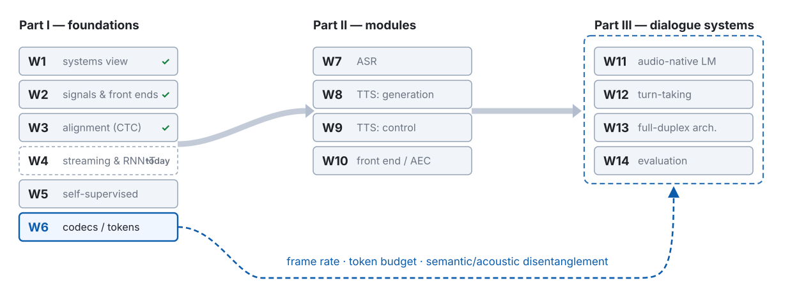
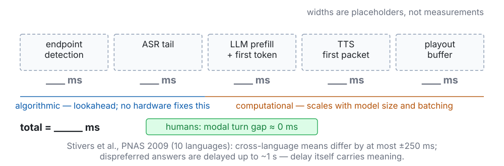

<!-- 此檔由 bin/publish_slides.py 從投影片正本產生（中文講稿區塊已剝除），請勿直接編輯。正本在 private repo 的 <course>/slides/。 -->

# Two holes, and one constraint {.section-title}

## Where we are: week 4 of 14

{width="100%"}

## Last week, in one picture



::: {.claim}
**Week 3 gave us a loss and a gradient.** It also left two holes: the outputs never see each other, and we never opened the box that makes them.
:::

::: {.footer}
W3 p27 lattice · p33 gradient · p45 conditional independence · p57 what was deferred
:::

## The problem this week handles, in one picture



::: {.claim}
Open the box, give the output a memory, meet the third alignment — and through all three: **how much of the future may the model see before it answers?**
:::

::: {.footer}
Route: the box → make it causal → RNN-T → attention ≠ alignment → the state that grows
:::

## Notation for today

| Symbol | Meaning |
|:--|:--|
| $\mathbf{x}_t$, $\mathbf{X}$, $T$ | W2 frames; **$T$ is now the frame count *after* subsampling** |
| $\ell = (\ell_1, \dots, \ell_U)$, $\mathcal{V}$, $\varnothing$, $\mathcal{V}' = \mathcal{V} \cup \{\varnothing\}$, $\mathcal{L}$ | as in W3: labels, vocabulary, blank, loss |
| $\mathbf{f}_t \in \mathbb{R}^d$ | encoder output at frame $t$ |
| $\mathbf{g}_u = g(\ell_{1:u})$, $u = 0, \dots, U$ | prediction-network output after $u$ labels ($\mathbf{g}_0$: empty prefix) |
| $\mathbf{z}^{t,u}$, $\mathbf{y}^{t,u} = \operatorname{softmax}(\mathbf{z}^{t,u})$, $y^{t,u}_k$ | joint logits, softmax, one entry — **per lattice node** |
| $y(t,u) = y^{t,u}_{\ell_{u+1}}$, $\varnothing(t,u) = y^{t,u}_{\varnothing}$ | emit the next label / consume a frame (Graves 2012) |
| $\mathbf{Q}, \mathbf{K}, \mathbf{V}$, $d_k$, $h$, $\mathbf{M}$, $n_{\text{layer}}$ | attention: projections, head width, head count, mask, depth |
| $\Delta$, $s$, $C$, $H$, $r_k$, $m = \sum_k r_k$, $\alpha$ | W2 hop; subsampling; chunk and history (W1); right context per layer; lookahead (W1 wrote $\ell$); chunk-wait coefficient (W1) |

::: {.footer}
Logs are $\ln$ · no $L$ (W2's window): left context is $H$ · lookahead is $m$, never $\ell$
:::

## Five things to leave with today

1. **Attention's dimension flow and its $T \times T$ score** — and the Conformer block: convolution gives the local bias attention lacks; relative positions because chunks make absolute ones meaningless.
2. **Two mechanical delays**: right context per layer *stacks* ($m = \sum_k r_k$); the chunk wait does *not* ($\alpha C$). Both are in encoder frames: $D_{\text{alg}} = (m + \alpha C)\,s\Delta$.
3. **The RNN-T in full**: the $(t, u)$ lattice, $\alpha$, $\beta$, $P = \alpha(T,U)\,\varnothing(T,U)$, and a gradient that reads as *occupancy × softmax − edge posterior* — W3's $y - \gamma$ with one factor in front.
4. **A third delay the architecture does not show**: emission delay, which the loss can be told to fight (FastEmit).
5. **Attention is not alignment**, and the state of a Transformer grows with $T$.

# The box: Transformer and Conformer {.section-title}

## Attention in one line: three matrices and a $T \times T$ score



$$\operatorname{Attn}(\mathbf{Q}, \mathbf{K}, \mathbf{V}) \;=\; \operatorname{softmax}\!\left(\frac{\mathbf{Q}\mathbf{K}^{\top}}{\sqrt{d_k}} + \mathbf{M}\right)\mathbf{V}, \qquad \mathbf{Q} = \mathbf{X}\mathbf{W}_Q,\ \mathbf{K} = \mathbf{X}\mathbf{W}_K,\ \mathbf{V} = \mathbf{X}\mathbf{W}_V$$

::: {.footer}
Vaswani et al., NeurIPS 2017 · JM3 Ch 7 has the walk-through; today only the shapes
:::

## Multi-head, and the mask as an addition

**Multi-head.** $h$ attentions in parallel, each of width $d_k = d/h$, concatenated and projected once: $\operatorname{MHA}(\mathbf{X}) = [\text{head}_1; \dots; \text{head}_h]\,\mathbf{W}_O$, $\mathbf{W}_O \in \mathbb{R}^{d \times d}$. Same cost as one head of width $d$; $h$ different ways to read the same frame.

**The mask is an addition, not a multiplication.** $M_{ij} \in \{0, -\infty\}$ is added *before* the softmax:

$$M_{ij} = 0 \;\text{(frame } i \text{ may read frame } j), \qquad M_{ij} = -\infty \;\Rightarrow\; e^{-\infty} = 0 \;\text{(it may not)}$$

| Mask | Rule | What it buys |
|:--|:--|:--|
| none | $M_{ij} = 0$ | the whole utterance, and the whole wait |
| causal | $M_{ij} = -\infty \iff j > i$ | zero lookahead, zero chunk wait, large quality cost |
| chunk + lookahead + history | $M_{ij} = 0 \iff j \leq c(i)\,C + R \;\wedge\; i - j \leq H$, $c(i) = \lceil i / C \rceil$ | the design space of streaming encoders — next section |

::: {.footer}
Chunk mask after Chen et al., ICASSP 2021 · $R$ = right context past the chunk edge
:::

## Conformer: four modules, one block



::: {.footer}
Gulati et al., Interspeech 2020 · kernel 32, $s = 4$ (10 → 40 ms) · Macaron: half an FFN each side
:::

## Misconception 1 — "the conv module just adds a bit of locality"

| Step (each removes one more thing — cumulative) | dev-other | test-other |
|:--|--:|--:|
| Conformer (M) | 4.4 | 4.3 |
| − Swish, + ReLU | 4.4 | 4.5 |
| − convolution module | 4.8 | 4.9 |
| − Macaron FFN | 5.1 | 5.0 |
| − relative positional encoding | 5.8 | 5.6 |

::: {.claim}
The paper's own conclusion: *"the convolution sub-block is the most important feature."* Read the table as **one path from Conformer to Transformer**, not as five independent experiments — the last step's jump is also the step that lands on a vanilla Transformer.
:::

::: {.footer}
Gulati et al. 2020, Table 3 · the paper's numbers · WER is not comparable across papers
:::

## Subsampling: $s$ decides $T$, and $T$ decides the rest

Two stride-2 convolutions at the front: $T_{\text{front}} = 100$ frames per second becomes $T = T_{\text{front}} / s$, $s = 4$ → **one encoder frame every 40 ms**.

| What $s$ touches | How |
|:--|:--|
| attention cost | $T^2$ shrinks by $s^2$: $16\times$ fewer scores per layer at $s = 4$ |
| W3's floor $T \geq U + r$ | **tighter** by $s$: characters per second vs. $100/s$ frames per second |
| every latency term | $r_k$ and $C$ are counted in encoder frames — **one frame is $s\Delta$, not $\Delta$** |
| the blank | one per encoder frame: this is the clock the RNN-T's $\varnothing$ advances |

::: {.claim}
W2's answer to *who decides the frame rate* was "the hop, times every stride." $s$ is that stride — the **first frame-rate choice that is a design parameter.**
:::

## Why relative positions: Transformer-XL's four terms

Absolute positional encoding adds a position vector to each input; the score between $i$ and $j$ then depends on **where in the sequence** each sits. Transformer-XL rewrites the score so that position enters only as the **distance** $i - j$:

$$A^{\text{rel}}_{ij} \;=\; \underbrace{\mathbf{q}_i^{\top}\mathbf{k}_j}_{\text{(a) content}} \;+\; \underbrace{\mathbf{q}_i^{\top}\mathbf{W}_{R}\,\mathbf{r}_{i-j}}_{\text{(b) content-dependent position}} \;+\; \underbrace{\mathbf{u}^{\top}\mathbf{k}_j}_{\text{(c) global content bias}} \;+\; \underbrace{\mathbf{v}^{\top}\mathbf{W}_{R}\,\mathbf{r}_{i-j}}_{\text{(d) global position bias}}$$

$\mathbf{r}_{i-j}$ is a sinusoid of the offset; $\mathbf{u}, \mathbf{v}$ are learned and shared across positions.

::: {.claim}
Under chunks or segment recurrence, a frame's **absolute** index inside the current piece is arbitrary: the same acoustic event would get a different representation at the head of a chunk than at its tail. Relative scores are shift-invariant, so the chunking stops leaking into the content.
:::

::: {.footer}
Dai et al., ACL 2019, §3.3 · Conformer's MHSA reuses it · skeleton only, not derived here
:::

# Making the box causal: four families {.section-title}

## Four ways to turn a non-causal encoder into a streaming one

| Family | Mechanism | Delay term | Stacks? | Example |
|:--|:--|:--|:--|:--|
| **causal mask** | $M_{ij} = -\infty$ for $j > i$ | none: $m = 0$, $C = 1$ | — | cheapest, worst quality |
| **chunk + lookahead** | read to the chunk end, $+R$ past it, $\leq H$ back | $\alpha C\,s\Delta$ (chunk) + $m\,s\Delta$ if $R$ is re-read per layer | chunk: **no** · $R$: **yes** | Transformer Transducer; Chen et al. 2021 |
| **memory / state carry-over** | attend to a compressed summary of past segments instead of $H$ raw frames | none: bounds the *history* | — | Transformer-XL; Emformer |
| **latency-controlled BLSTM** | backward LSTM over a short future window only | the window: $m\,s\Delta$ | **yes** if re-opened per layer | Zhang et al. 2016 |

::: {.claim}
Only two quantities change: **how far right** a layer reads, and **whether that compounds with depth.** The past costs memory, not time.
:::

## The mask, drawn: causal, chunk, $R$, $H$



::: {.footer}
$T = 12$, $C = 4$, $R = 1$, $H = 4$ · row $i$ reads the white columns · W1 p38: $H$ is not free either
:::

## Two delays, one picture: what stacks and what does not



::: {.footer}
Left: W1 p34 in encoder frames · right: W1 p35's chunk wait, seen through the layers
:::

## The two derivations, one line each

**(a) Right context stacks.** Layer $k$'s output at $t$ needs layer $k-1$'s output up to $t + r_k$. Apply it $n_{\text{layer}}$ times:

$$t^{(k)} = t^{(k-1)} + r_k \quad\Longrightarrow\quad t^{(n_{\text{layer}})} = t + \sum_{k=1}^{n_{\text{layer}}} r_k = t + m \qquad\text{(W1 p34, now in encoder frames)}$$

**(b) The chunk wait does not.** *Claim:* if every layer reads only up to the end of the current chunk, then layer $n_{\text{layer}}$'s output anywhere in chunk $c$ depends on the input only up to the end of chunk $c$. *Induction:* true for layer 1 by the mask; if true for layer $k-1$, then layer $k$ reads layer $k-1$ only within chunk $c$, whose values depend on input only up to the end of chunk $c$. $\square$

The last frame of the user's speech lands at position $j$ in its chunk and waits $(C - 1 - j)$ frames: mean $\tfrac{C-1}{2}$, worst $C - 1$ — W1's $\alpha \in [\tfrac12, 1]$.

::: {.claim}
Two mechanisms, two shapes: a **sum over layers** and a **single shared boundary.**
:::

## $D_{\text{alg}} = (m + \alpha C)\,s\Delta$: W1's formula, with the missing $s$

$$D_{\text{alg}} \;=\; \underbrace{m\,s\Delta}_{\text{right context, summed over layers}} \;+\; \underbrace{\alpha\,C\,s\Delta}_{\text{chunk wait, shared by all layers}}, \qquad m = \sum_{k=1}^{n_{\text{layer}}} r_k, \quad \alpha \in [\tfrac12, 1]$$

W1 wrote $\ell\Delta + \alpha C\Delta$ on the 10 ms grid — correct for a model with no subsampling. **The encoder's frame is $s\Delta$.**

::: {.ask}
**Compute it.** $r_k = 2$ at every layer, $n_{\text{layer}} = 12$, $s = 4$, $\Delta = 10$ ms. Chunk $C = 8$ encoder frames, $\alpha = \tfrac12$. How many milliseconds before the first symbol can even be computed?
:::

| | encoder frames | ms |
|:--|--:|--:|
| $m = 12 \times 2$ | 24 | **960** |
| $\alpha C = \tfrac12 \times 8$ | 4 | 160 |
| $D_{\text{alg}}$ (mean) | 28 | **1120** — worst case 1280 |

## Misconception 2 — "add lookahead to get the quality back"

Raising $r_k$ from $2$ to $8$ at every layer, with $s = 4$:

$$\text{per layer: } 2 \times 40 = 80 \text{ ms} \;\longrightarrow\; 8 \times 40 = 320 \text{ ms} \qquad\text{(not } 20 \to 80\text{: that forgot } s\text{)}$$

- **One layer** at $r_k = 8$ already spends the whole 300 ms budget of W1.
- Lookahead's benefit saturates quickly; its cost is linear, **per layer**, and in $s\Delta$ units.
- The budget is spent at the *sum*, so the only cheap right context is the kind that does not stack: put it in the chunk, or copy it per segment (Emformer, p23).

::: {.claim}
Before adding one frame of right context, ask three questions: **which layer, times how many layers, times what frame size.**
:::

## Misconception 3 — "streaming is just a causal mask"

| Setting | $m$ | $C$ | $D_{\text{alg}}$ | What you pay |
|:--|--:|--:|:--|:--|
| purely causal | 0 | 1 | $\approx 0$ | the largest quality loss of any setting; every frame answers with no future at all |
| chunk only | 0 | $C$ | $\alpha C\,s\Delta$ | a bounded wait that does not grow with depth |
| chunk + per-layer $R$ | $n_{\text{layer}} R$ | $C$ | $(n_{\text{layer}} R + \alpha C)\,s\Delta$ | quality back, latency summed over depth |
| chunk + copied $R$ (Emformer) | $R$ | $C$ | $(R + \alpha C)\,s\Delta$ | right context once, not per layer |

::: {.claim}
Streaming is a **three-number trade-off** — $m$, $C$, $H$ — not a switch. The causal mask is one corner of that space, and the corner nobody ships.
:::

::: {.footer}
W1's budget takes $D_{\text{alg}}$ with both terms · "nobody ships" is a field judgement
:::

## History: Transformer-XL recurrence, Emformer, LC-BLSTM

**Transformer-XL.** Layer $n$ of segment $\tau + 1$ attends to $[\,\operatorname{SG}(\mathbf{h}^{\,n-1}_{\tau})\,;\ \mathbf{h}^{\,n-1}_{\tau+1}\,]$: the previous segment's hidden states, **stop-gradient**, concatenated as extra keys and values. History costs memory, not waiting.

**Emformer.** Keys for segment $i$ at layer $n$: $\mathbf{K}^n_i = [\,\mathbf{W}_k \mathbf{M}^n_i,\ \mathbf{K}^n_{L,i},\ \mathbf{W}_k \mathbf{C}^n_i,\ \mathbf{W}_k \mathbf{R}^n_i\,]$ — a **memory bank** (one vector summarising each past segment), the cached left context, the centre chunk, and the right context. Two design points:

- the memory bank is carried over **from the lower layer**, so all segments of a layer can run in parallel;
- the right context $\mathbf{R}_i$ is a **hard copy** attached to its own segment, so it never leaks across layers — lookahead stays $R$ at every depth.

**LC-BLSTM.** The backward LSTM runs only over a short future window per chunk: the historical form of the same idea.

::: {.footer}
Dai et al. 2019 eq. 2 · Shi et al. 2021 §3 (read 2026-10-04) · Zhang et al. 2016, abstract
:::

## Refill W1's budget: the encoder row

{width="100%"}

| Cell | Fill with | Today's example |
|:--|:--|--:|
| ASR tail (encoder part) | $D_{\text{alg}} = (m + \alpha C)\,s\Delta$ — **write the $s$** | 1120 ms mean |
| …and a term W1 did not have | + emission delay (next section) | measured, not computed |

::: {.footer}
Same master as W1 p31 · the number is the p20 example, not a measurement · Demo 2 measures
:::

# RNN-T: a second axis on the lattice {.section-title}

## Three networks, one joint



::: {.claim}
The prediction network sees **only the labels emitted so far**. That is where the output dependency CTC gave up comes back — and it comes back without touching the monotonic lattice.
:::

::: {.footer}
Graves, arXiv:1211.3711 (2012) · $\mathbf{f}_t$ transcription, $\mathbf{g}_u$ prediction, $\psi$ joint
:::

## Misconception 4 — "the RNN-T blank is the CTC blank"

| | CTC (W3) | RNN-T (today) | W1's $\varnothing$ |
|:--|:--|:--|:--|
| what $\varnothing$ means | *this frame emits no new label* — a bookkeeping symbol | *consume one frame; advance $t$* — a **clock** | *the system is not speaking in this slot* |
| on the lattice | stay in the same row of $\ell'$ | move **right** one column | — |
| labels per frame | exactly one symbol of $\mathcal{V}'$ | zero, one, or several, then a blank | — |
| repeated labels | need a blank between them ($\mathcal{B}$ collapses) | need nothing: emit and emit | — |

::: {.claim}
Same glyph, three semantics. W3 p52 planted this; here it is paid: the RNN-T's blank is **time**, and that is exactly what lets labels pile up inside one frame.
:::

## The lattice: right is a frame, up is a label



::: {.footer}
$\ell = \text{ab}$, $T = 3$ · start at $(1, 0)$, reach $(T, U)$, then one last blank · counts: `w04-data.json`
:::

## Paths: write them out before the program does

::: {.ask}
**Demo 1, part 1.** On paper: $\ell = \text{ab}$, $T = 2$. List every RNN-T path as a sequence of *right* / *up* moves. How many? Then $\ell = \text{aa}$, $T = 1$.
:::

| $\ell$ | $T$ | RNN-T paths (E = emit, R = blank) | RNN-T count | $\binom{T+U-1}{U}$ | CTC count (W3) |
|:--|--:|:--|--:|--:|--:|
| ab | 1 | E E R | 1 | 1 | 0 |
| ab | 2 | E E R R · E R E R · R E E R | 3 | 3 | 1 |
| ab | 3 | 6 paths | 6 | 6 | 5 |
| aa | 1 | E E R | 1 | 1 | 0 |
| aa | 2 | 3 paths | 3 | 3 | **0** |
| aa | 3 | 6 paths | 6 | 6 | 1 |

::: {.footer}
Demo 1 · not built · counts from `w04-data.json` · "aa" at $T = 2$: CTC 0 paths, RNN-T 3
:::

## Counting paths: $\binom{T+U-1}{U}$, and no floor on $T$

$T$ blanks and $U$ emits in some order, **ending with a blank**: choose where the $U$ emits sit among the first $T + U - 1$ steps.

$$\#\,\text{paths} \;=\; \binom{T + U - 1}{U} \qquad\text{vs. CTC: } \lvert \mathcal{B}^{-1}(\ell) \rvert, \text{ which is } 0 \text{ whenever } T < U + r$$

| | CTC | RNN-T |
|:--|:--|:--|
| labels per frame | exactly one symbol of $\mathcal{V}'$ | any number, then a blank |
| repeated labels | a blank must separate them | nothing needed: emit, emit |
| minimum $T$ | $U + r$ | **1** |
| what replaces the floor | — | compute: one more joint evaluation per emit |

::: {.claim}
W3's floor on the frame rate is gone; in its place a **cost per emitted label** — the opening TDT exploits by predicting durations too.
:::

## Misconception 5 — "RNN-T also needs $T \geq U + r$"

…and its twin, *"an RNN-T emits at most one label per frame."* Both wrong, for the same reason: **emitting does not consume a frame.** A path may go up as many times as it likes before it goes right; $T = 1$ already has a path for any $\ell$.

But every decoder you will meet has a line like

```python
max_symbols_per_step = 5   # stop emitting, force a blank, move on
```

- That cap is an **engineering limit** on greedy / beam search — it bounds the number of joint evaluations per frame and prevents a runaway loop of emits.
- It is **not a property of the model**: the training sum includes paths that emit more than that in one frame.
- Remove the cap (Demo 1, part 3) and watch what a badly calibrated $\varnothing(t,u)$ does.

## Forward on the RNN-T lattice



$$\alpha(t,u) \;=\; \alpha(t-1,u)\,\varnothing(t-1,u) \;+\; \alpha(t,u-1)\,y(t,u-1), \qquad \alpha(1,0) = 1, \qquad P(\ell \mid \mathbf{X}) = \alpha(T,U)\,\varnothing(T,U)$$

::: {.footer}
Graves 2012 eq. 16–17 · $\alpha(t,u)$: emitted $\ell_{1:u}$ while consuming frames $1 \dots t{-}1$ · $O(TU)$
:::

## Check the recursion against brute force

::: {.ask}
**Demo 1, part 2.** Random $\mathbf{y}^{t,u}$ for $\ell = \text{ab}$, $T = 2$. First multiply out the 3 paths and add. Then fill $\alpha(t,u)$ cell by cell. Same number?
:::

| | $\ell = \text{ab}$, $T = 2$ | computed where |
|:--|:--|:--|
| uniform $y^{t,u}_k = \tfrac13$: enumeration $= 3 \times 3^{-(T+U)}$ | $0.037037\ldots$ | `w04-data.json` |
| uniform: $\alpha(T,U)\,\varnothing(T,U)$ | $0.037037\ldots$ — equal | `w04-data.json` |
| random $\mathbf{y}^{t,u}$ (seed 20261004): enumeration vs. forward | $0.0081738\ldots$, difference $0.0$ | `w04-data.json` |
| live, your random $\mathbf{y}^{t,u}$ | (read from the screen) | Demo 1 — not built |

::: {.claim}
Same lesson as W3: the sum over exponentially many paths and the $O(TU)$ recursion are **the same number**. This time the lattice has two axes and the recursion has two terms.
:::

## Backward, and the diagonal



$$\beta(t,u) \;=\; \beta(t+1,u)\,\varnothing(t,u) \;+\; \beta(t,u+1)\,y(t,u), \qquad \beta(T,U) = \varnothing(T,U), \qquad \textstyle\sum_{t+u=n} \alpha(t,u)\,\beta(t,u) = P(\ell \mid \mathbf{X})\ \text{ for every } n$$

## The gradient: occupancy × softmax − edge posterior

With $\mathcal{L} = -\ln P(\ell \mid \mathbf{X})$, at node $(t,u)$ — $\alpha$ and $\beta$ without arguments mean $\alpha(t,u)$, $\beta(t,u)$:

$$\frac{\partial \mathcal{L}}{\partial z^{t,u}_k} \;=\; \underbrace{\frac{\alpha\beta}{P}}_{\text{occupancy}}\, y^{t,u}_k \;-\; \frac{\alpha}{P}\Bigl([k = \ell_{u+1}]\,y(t,u)\,\beta(t,u{+}1) \;+\; [k = \varnothing]\,\varnothing(t,u)\,\beta(t{+}1,u)\Bigr)$$

| Piece | Meaning |
|:--|:--|
| $\alpha\beta/P$ | posterior that a path passes through $(t,u)$ |
| $\alpha\,y(t,u)\,\beta(t,u+1)/P$ | posterior that a path leaves $(t,u)$ by the **emit** edge |
| $\alpha\,\varnothing(t,u)\,\beta(t+1,u)/P$ | posterior that it leaves by the **blank** edge |
| everything else ($k$ not the next label, not blank) | occupancy × $y^{t,u}_k$ — pushed down, nothing pulls it up |

## Where it comes from: two lines

**Line 1 — Graves's two branches.** Differentiate $\mathcal{L} = -\ln P$ through the sum over paths that use the edge leaving $(t,u)$:

$$\frac{\partial \mathcal{L}}{\partial y^{t,u}_k} \;=\; -\frac{\alpha(t,u)}{P}\; b_k, \qquad b_{\ell_{u+1}} = \beta(t,u+1), \quad b_{\varnothing} = \beta(t+1,u), \quad b_k = 0 \text{ otherwise}$$

. . .

**Line 2 — through the softmax.** $\partial y^{t,u}_j / \partial z^{t,u}_k = y^{t,u}_j([j = k] - y^{t,u}_k)$, so

$$\frac{\partial \mathcal{L}}{\partial z^{t,u}_k} = \sum_j \frac{\partial \mathcal{L}}{\partial y^{t,u}_j}\,y^{t,u}_j\bigl([j = k] - y^{t,u}_k\bigr) = -\frac{\alpha}{P}\Bigl(y^{t,u}_k b_k - y^{t,u}_k \underbrace{\sum_j y^{t,u}_j b_j}_{=\ \beta(t,u)}\Bigr)$$

. . .

**The step that closes it:** $\sum_j y^{t,u}_j\,b_j = y(t,u)\,\beta(t,u+1) + \varnothing(t,u)\,\beta(t+1,u) = \beta(t,u)$ — the backward recursion itself. W3 closed the same gap with $\sum_j \gamma_t(j) = 1$.

## Read it next to W3: $y - \gamma$, with an occupancy in front

| | CTC (W3 p33) | RNN-T (today) |
|:--|:--|:--|
| gradient at the softmax input | $y^t_k - \gamma_t(k)$ | $\frac{\alpha\beta}{P}\,y^{t,u}_k - (\text{edge posterior})_k$ |
| "node occupancy" | $1$ — every path crosses every column | $\alpha(t,u)\beta(t,u)/P$ — a path may miss $(t,u)$ |
| the soft target | $\gamma_t(k)$, sums to 1 over $k$ | edge posteriors, sum to the occupancy over $k$ |
| reading | per-frame cross-entropy, soft target | per-**node** cross-entropy, soft target, **weighted by how much the node matters** |

::: {.claim}
Divide today's gradient by the occupancy and it is W3's line again: $y^{t,u}_k - \text{(posterior of leaving by edge } k\text{)}$. The transducer did not change the learning signal — it changed **where the nodes are.**
:::

## The memory wall: $B \times T \times U \times |\mathcal{V}'|$

One softmax per lattice node means the joint's logits are a four-way tensor. Order of magnitude for **character-level Mandarin** (assumptions, not a measurement):

::: {.metrics}
::: {.metric}
<span class="num">$1.25 \times 10^8$</span><span class="lab">numbers for one utterance: $T = 500 \times U = 50 \times |\mathcal{V}'| = 5000$</span>
:::
::: {.metric .bad}
<span class="num">0.5 GB</span><span class="lab">in fp32, one utterance of logits</span>
:::
::: {.metric .bad}
<span class="num">16 GB</span><span class="lab">batch of 32 — before activations, before gradients</span>
:::
:::

::: {.claim}
W3 said the vocabulary is decided before the loss. Here is its bill: $|\mathcal{V}'|$ multiplies **every node of the lattice**, and the lattice has $TU$ nodes. The pruned RNN-T paper names this case in its abstract.
:::

::: {.footer}
`w04-data.json` → `memory_wall` · Kuang et al., Interspeech 2022 · $T = 500$ at $s = 4$ ≈ 20 s
:::

## Pruned RNN-T: a linear joiner finds the band



::: {.footer}
Kuang et al. 2022, abstract: pruning bounds from a joiner linear in the encoder and decoder embeddings
:::

## Emission delay: the loss prefers to wait



::: {.footer}
Yu et al., ICASSP 2021 (FastEmit), eq. 11–12 · a third delay: learned, not designed
:::

## Misconception 6 — "computed latency is measured latency"

$$D_{\text{what you measure}} \;\geq\; \underbrace{(m + \alpha C)\,s\Delta}_{\text{architecture: a lower bound}} \;+\; \underbrace{D_{\text{emit}}}_{\text{learned; same encoder, different training}} \;+\; D_{\text{comp}}$$

- Two models with the **same** $m$, $C$, $s$ can differ by hundreds of milliseconds in when words appear — FastEmit exists because that gap is real.
- So the encoder row of the budget has two entries: the computed bound (p24) and the measured emission time (Demo 2).
- Measure the timeline, not the mask.

::: {.claim}
$D_{\text{alg}}$ is what the architecture *guarantees you cannot beat.* What you actually get is a property of the trained model.
:::

## Demo 2 — three chunk sizes: when does each word appear?

::: {.ask}
**Demo 2.** One LibriSpeech sentence, fed at real-time pace to a streaming transducer with three chunk settings. For each word: when does its acoustic evidence end, and when is it emitted? Predict the gap before the timeline appears.
:::

| chunk | $D_{\text{alg}}$ (mean, computed) | measured emit − acoustic end (median) | worst word |
|:--|--:|--:|--:|
| large (e.g. 640 ms) | — | — | — |
| medium (e.g. 320 ms) | — | — | — |
| small (e.g. 160 ms) | — | — | — |

::: {.footer}
Demo 2 · not built · candidates: sherpa-onnx streaming transducer, parakeet-mlx (TDT, not RNN-T)
:::

# Attention as the third alignment — and why it is not one {.section-title}

## The decoder attends: the attention-based encoder–decoder

The third column of W3's table. No lattice, no blank: the decoder emits **one label at a time** and, for each, computes a soft weighting over all encoder frames:

$$\mathbf{c}_u = \sum_{t=1}^{T} a_{u,t}\,\mathbf{f}_t, \qquad a_{u,\cdot} = \operatorname{softmax}_t\bigl(\text{score}(\mathbf{s}_{u}, \mathbf{f}_t)\bigr), \qquad P(\ell_{u+1} \mid \ell_{1:u}, \mathbf{X}) = \operatorname{softmax}\bigl(\mathbf{W}[\mathbf{s}_u; \mathbf{c}_u]\bigr)$$

| | CTC | RNN-T | AED (LAS and after) |
|:--|:--|:--|:--|
| alignment | monotonic, summed out | monotonic, summed out | **soft, inside the network, need not be monotonic** |
| output dependency | none | prediction network | full decoder state $\mathbf{s}_u$ |
| streaming | encoder permitting | encoder permitting | not without extra machinery (MoChA, triggered attention — keywords only) |
| what it learns about *where* | nothing explicit | nothing explicit | a weighting $a_{u,t}$ — **which is not the same thing** |

::: {.footer}
Chan et al. (LAS) · Chorowski et al. 2015 · Whisper is this family · $\mathbf{s}_u$ state, $\mathbf{c}_u$ context
:::

## Demo 3 — Whisper's cross-attention heads

::: {.ask}
**Demo 3.** Whisper transcribes the same LibriSpeech sentence — correctly. Before the heat-maps appear: of the decoder's cross-attention heads, what fraction will look like a monotonic band?
:::

| | your guess | what the screen shows |
|:--|--:|--:|
| heads that look like a monotonic band | — | — |
| heads that are flat, or stare at a few frames | — | — |
| transcript word error count | — | — |
| heads OpenAI's code actually uses for timestamps | — | — |

::: {.footer}
Demo 3 · not built · `transformers` Whisper, `output_attentions=True` · `_ALIGNMENT_HEADS` overlay
:::

## Misconception 7 — "attention weights are the alignment"



::: {.claim}
Attention is the **weights of a weighted average**; an alignment is a **seating chart**. The weights may be flat and the output still right, because the encoder already mixed the context into every position.
:::

## Where word timestamps actually come from

| Step | What OpenAI's `whisper` does | Why it matters here |
|:--|:--|:--|
| 1 | pick a **fixed subset** of cross-attention heads per model size (`_ALIGNMENT_HEADS`, a base85-encoded boolean array) | chosen offline because they correlate with word timing — the rest do not |
| 2 | average those heads' weights, smooth along time | attention from *selected* heads, not attention as a whole |
| 3 | run **dynamic time warping** over the $U \times T$ matrix | DTW *imposes* monotonicity that attention does not have |
| 4 | read word boundaries off the DTW path | the timestamp is a post-processing artefact, not a model output |

::: {.claim}
Even the authors treat attention as **raw material for an alignment**, not as one. The alignment is manufactured: a hand-picked subset, a smoothing, and a monotonic DP on top.
:::

::: {.footer}
`openai/whisper`, `whisper/__init__.py` — a source-code comment, **not peer-reviewed literature**
:::

## Long inputs: attention forced to align, and failing

Chorowski et al. (2015) concatenated TIMIT utterances **ten times** and fed the result to an attention decoder:

- **content-only attention** (score from $\mathbf{s}_u$ and $\mathbf{f}_t$ alone) degrades sharply on the long input — the same content appears at ten places, and nothing says *which* one is next;
- **location-aware attention** (the score also sees the previous step's weights $a_{u-1,\cdot}$) holds up — it is told *where it was*;
- the failure modes are repetition and skipping: the decoder re-reads or jumps.

::: {.claim}
Attention has no notion of *having consumed* a frame — that is what the blank gave CTC and the RNN-T. On long inputs the decoder must be *handed* a position. **Whisper's hallucinations (W7) are this failure wearing a bigger model.**
:::

::: {.footer}
Chorowski et al., NIPS 2015 — "10 times longer (repeated) utterances" is the abstract's wording
:::

## Three families, three inductive biases — the table completed

| | frame-level (hybrid) | CTC | RNN-T | attention (AED) |
|:--|:--|:--|:--|:--|
| alignment | hard, contiguous | monotonic, many-to-one, blank-padded | monotonic, **several labels per frame** | soft, learned, need not be monotonic |
| what "consumed a frame" means | one label per frame | one symbol per frame | one blank per frame | nothing — the decoder is handed a position, or not |
| output dependency | none | none | prediction network | full decoder |
| duration model | yes ($a_{ij}$) | none | none | none, and no blank either |
| streaming | yes | encoder permitting | encoder permitting | not without extra machinery |
| where it breaks | needs a bootstrap | peaky; homophones | memory wall; emission delay | long inputs; attention mistaken for alignment |

::: {.footer}
W3 p51 had three columns; this is the fourth, and the row W3 could not fill
:::

# The state that grows {.section-title}

## KV cache: the state of a Transformer



::: {.footer}
`w04-data.json`: $n_{\text{layer}} = 12$, $d = 512$, $T = 1500$ (≈ 60 s) → $1.8 \times 10^7$ numbers, 37 MB fp16
:::

## Misconception 8 — "the KV cache is a serving detail"

| Claim (two of them) | What is actually true |
|:--|:--|
| "a Transformer always beats an RNN" | on quality with full context, usually; under strict streaming and on-device, a **constant-memory state** (RNN, SSM) is a structural advantage |
| "the cache is an engineering detail" | the cache *is* the model's state; its linear growth decides whether a full-duplex model survives twenty minutes |
| "Zipformer solves this" | no — Zipformer is an *encoder-efficiency* design (U-Net-style downsampling); it does not bound the decoder's state |

Three ways to bound the state: **truncate** (sliding window), **compress** (memory bank), or **replace** (recurrent / state-space, constant $O(d)$ — W11, keywords only).

::: {.claim}
W11 and W13 will ask every architecture one question first: **how is the state kept bounded?** Today is where the question comes from.
:::

# Back to the three axes {.section-title}

## Representation: $s$ sets $T$, and the floor is gone

| | W3 | today |
|:--|:--|:--|
| who decides the frame rate | the hop, times every stride (W2) | **$s$, the first stride that is a design choice** |
| the constraint on $T$ | $T \geq U + r$ — a floor | gone for the RNN-T: emit, emit, then blank |
| what replaces it | — | compute per emitted label, and the $T \times U \times \lvert\mathcal{V}'\rvert$ memory |
| the vocabulary | decided before the loss | decided before the loss — **and now billed per lattice node** |

::: {.claim}
The frame rate stopped being a constant and became a knob; the label unit stopped bounding it and started **pricing** it. W6 turns the knob an order of magnitude further.
:::

## Latency and supervision: three delays, one inside the loss

| Axis | What today added | The price, or the lesson |
|:--|:--|:--|
| **Latency** | $D_{\text{alg}} = (m + \alpha C)\,s\Delta$: right context stacks, the chunk wait does not; $s$ multiplies both | the architecture gives a **bound**; emission delay sits on top; the KV cache grows with $T$ |
| **Supervision** | same data as CTC — audio and a transcript — and the alignment is still summed out | **latency can be written into the objective** (FastEmit): the first time in this course that *when to speak* is a training signal |

::: {.claim}
W1 declared $D_{\text{alg}}$; today derived it, found a term it could not contain, and showed that term can be trained away. **W12 will do to turn-taking exactly what FastEmit did to emission.**
:::

## What this week put on the three axes

::: {.prose}
| Axis | What we now know |
|:--|:--|
| **Representation** | $s$ sets $T$ and is a design choice. The RNN-T trades W3's floor for a cost per emitted label. |
| **Latency** | Two mechanical delays (one stacks, one is shared), a learned one, and a state that grows with $T$. |
| **Supervision** | Audio and a transcript still suffice; the loss can be told *when* to emit. |
:::

::: {.claim}
A $T \times T$ block; three numbers to trade; one more axis on the lattice; and **attention is a computation, not an alignment.**
:::

## Reading, and next week

**Read this week**

- Graves, *Sequence Transduction with Recurrent Neural Networks*, arXiv:1211.3711 (2012) — §2 is the lattice, forward–backward and gradient you saw, in the notation you saw
- Gulati et al., *Conformer*, Interspeech 2020 — §2 for the block, §3.4 for the ablation (read it as a path, not as five experiments)
- Jurafsky & Martin, *Speech and Language Processing*, 3rd ed. draft, **Ch 7** (Transformers) and the encoder–decoder / streaming parts of **Ch 16**

**If one thing today was new to you, make it this one**

- Yu et al., *FastEmit*, ICASSP 2021 — four pages; the gradient reweighting is eq. 11–12 and the whole idea of "latency in the loss" is there

**Next week — self-supervised representation learning**

The box is open; now where does its ability come from? Masked prediction over audio, discrete targets, and why every SSL comparison is confounded by data: wav2vec 2.0, HuBERT, and what "pretrained encoder" means for W7.
